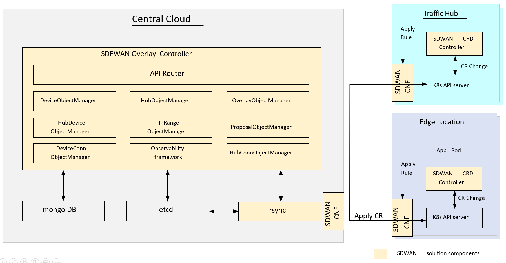
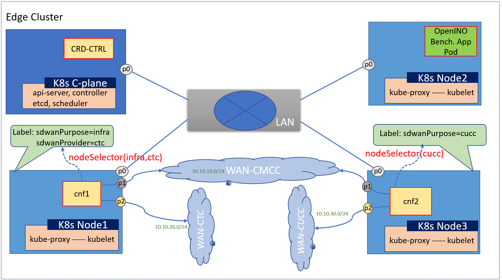
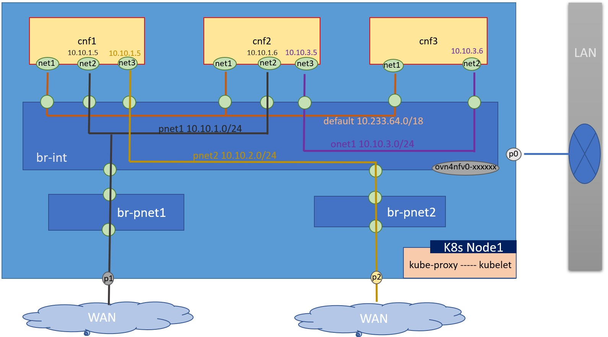

```text
SPDX-License-Identifier: Apache-2.0
Copyright (c) 2020-2021 Intel Corporation
```
<!-- omit in toc -->
# Edge WAN Overlay (EWO)

- [Background](#background)
- [EWO Introduction](#ewo-introduction)
  - [EWO Terminology](#ewo-terminology)
  - [EWO Architecture](#ewo-architecture)
  - [EWO Installation With OpenNESS Flavor](#ewo-installation-with-openness-flavor)
  - [EWO Configuration](#ewo-configuration)
    - [NodeSelector For CNF](#nodeselector-for-cnf)
    - [Network and CNF Interface](#network-and-cnf-interface)
    - [Tunnel](#tunnel)
    - [SNAT](#snat)
    - [DNAT](#dnat)
- [EWO Examples](#ewo-examples)
  - [Three Clusters E2E Scenario](#three-clusters-e2e-scenario)
  - [One Clusters E2E Scenario](#one-clusters-e2e-scenario)

## Background
Edge WAN Overlay(EWO), an OpenNESS Building Block, is a solution for WAN as infrastructure in Kubernetes\*.  Emerging SD-WAN is a choice of WAN management among Edge and Cloud clusters, but there are some limitations, such as:
-  Number of edge clusters could be in tens of thousands, so more cost-effective, scalable and higher automation solution is needed.
-  Edge clusters may have not public IP address, thus there will be inbound connection issue for inter micro services traffic between edge and cloud.
-  How to conduct traffic sanitization for untrusted edge location, for example: simple DDOS attacks.

EWO is a good solution to resolve these problems for cloud native clusters.  Its main purpose is automation. It can help to create secure overlays where each overlay connects application and hub clusters together. It configures CNFs of various application and hub clusters to allow application connectivity with external entities and entities of other clusters.

## EWO Introduction

### EWO Terminology

| Term | Description |
|:-----: | ----- |
| EWO | <p> Edge WAN Overlay</p>|
| Overlay controller | <p> is a Central Controller provides central control of SDEWAN overlay networks by automatically configuring the SDEWAN CNFs through SDEWAN CRD controller located in edge location clusters and hub clusters</p>|
| EWO Controller | <p>To represent central overlay controller</p>|
| EWO Operator | <p>To represent CRD controller</p>|
| EWO CNF | <p>To represent OpenWRT based CNF. </p>|
| EWO VPPCNF | <p>To represent VPP based CNF. </p>|
| SDEWAN CRD Controller | <p>is implemented as k8s CRD Controller, it manages CRDs (e.g. Firewall related CRDs, Mwan3 related CRDs and IpSec related CRDs etc.) and internally calls SDEWAN Restful API to do CNF configuration. And a remote client (e.g. SDEWAN Central Controller) can manage SDEWAN CNF configuration through creating/updating/deleting SDEWAN CRs. </p>|
| OpenWRT based CNF | <p>The CNF is implemented based on OpenWRT, it enhances OpenWRT Luci web interface with SDEWAN controllers to provide Restful API for network functions configuration and control.</p>|


### EWO Architecture


EWO can provides:
- IPsec tunnel secures the traffic between edge and cloud.
- Traffic hub for traffic sanitization.
- Deployed as CNF and configured by leveraging Kubernetes custom resource definition.
- Scalable and replicable with deployment automated.

EWO Operator provides:
- Exposure SD-WAN configuration as Kubernetes custom resource.
- Configuration and control network resource like native Kubernetes object.

EWO CNF provides these collection of services:
- IPSec: security tunnels across clusters.
- SNAT/DNAT: Source/Destination NAT for clusters if subnets are overlapping.
- MWAN3: multiple WAN links management.
- Firewall: Stateful inspection firewall for inbound and outbound connections.
The services are configurable by EWO Operator.

More details please refer [Converged Edge Reference Architecture for SD-WAN](https://github.com/otcshare/ido-specs/blob/master/doc/reference-architectures/openness_sdwan.md)

### EWO Installation With OpenNESS Flavor
EWO supports [kubectl deployment](https://github.com/otcshare/ewo/tree/main/platform/crd-ctrlr/examples). [OpenNESS Experience Kit](https://github.com/otcshare/ido-specs/blob/master/doc/flavors.md) offers the `sdewan-edge` and `sdewan-hub` flavor to automate edge and hub cluster deployment separately.
- The first step is to prepare one server environment which needs to fulfill the [preconditions](https://github.com/otcshare/specs/blob/master/doc/getting-started/network-edge/controller-edge-node-setup.md#preconditions).
- Then place the EWO server hostname in `[controller_group]` and `[edgenode_group]` group in `inventory/default/inventory.ini` file of ido-converged-edge-experience-kits.
> **NOTE**: `[edgenode_group]` and `[edgenode_vca_group]` are not required for EWO overlay configuration, since EWO overlay micro services just need to be deployed on the Kubernetes* control plane node.
- Setup configurations for EWO networks/cnfs/rules in `inventory/default/host_vars/${NODE_NAME}/30-ewo.yml` as as mentioned below [EWO Configuration](#ewo-configuration) section.
> **NOTE**: The configurations are node per node. If only deploy cnfs on one node in the cluster, these configurations can be in `flavors/sdewan-hub/all.yml` or `flavors/sdewan-edge/all.yml`
- Run script `./deploy_ne.sh -f sdewan-edge` or `./deploy_ne.sh -f sdewan-hub` for edge and hub cluster. Deployment should complete successfully. In the flavor, harbor registry is deployed to provide images services as well.

```shell
# kubectl get pods -n cnf
NAME                          READY   STATUS    RESTARTS   AGE
sdewan-cnf-567c57549c-l69mt   1/1     Running   0          18h

# kubectl get pods -n sdewan-system
NAME                                    READY   STATUS    RESTARTS   AGE
sdewan-crd-controller-c498844c5-8bj4m   2/2     Running   0          18h
```

### EWO Configuration
#### NodeSelector For CNF


This configuration is used to choose a node to install CNFs.
For this example, we want to setup a cnf on node1 and another cnf on node3, the configurations snippet as below:

`inventory/default/host_vars/node1/30-ewo.yml`
```bash
sdwan_labels: '{"sdwanPurpose": "infra", "sdwanProvider": "ctc"}'

```

and
`inventory/default/host_vars/node3/30-ewo.yml`
```bash
sdwan_labels: '{"sdwanProvider": "cucc"}'

```

If we will deploy cnfs only on node3, we can just define the sdwan_labels in `inventory/default/inventory.ini`.

```bash
[edgenode_group]
node01
node02
node03 sdwan_labels='{"sdwanProvider": "ctcc"}'
```


#### Network and CNF Interface

This configuration is used to setup ovn WAN or cluster networks and attach the cnfs to the network.
For this example, we want to setup 4 networks, 4 colors (black/yellow/orage/purple) for different networks. The balck and yellow are 2 different WAN networks. The configurations snippet as below:


in `inventory/default/host_vars/node1/30-ewo.yml`, `flavors/sdewan-edge/all.yml`(edge cluster as example) if only set cnfs on one node.
```bash
pnet1_name: pnetwork1
pnet2_name: pnetwork2
onet1_name: onetwork1

## a list for networks define. It can be provider network or ovn4nfv network.
## ovn4nfv network can be consider as the second cluster network, how many netowrks
## let deployer confirm, it can be any netowrks.
networks:
  - networkname: "{{ pnet1_name }}"
    subnname: "pnet1_subnet"
    subnet: 10.10.1.0/24
    gateway: 10.10.1.1
    excludeIps: 10.10.1.2..10.10.1.9
    providerNetType: "DIRECT"
    providerInterfaceName: "p1"
  - networkname: "{{ pnet2_name }}"
    subnname: "pnet2_subnet"
    subnet: 10.10.2.0/24
    gateway: 10.10.2.1
    excludeIps: 10.10.2.2..10.10.2.9
    providerNetType: "DIRECT"
    providerInterfaceName: "p2"
  - networkname: "{{ onet1_name }}"
    subnname: "onet1_subnet"
    subnet: 10.10.3.0/24
    gateway: 10.10.3.1
    excludeIps: 10.10.3.2..10.10.3.9
    providerNetType: "NONE"

# Container info
cnf_config:
 - name: "cnf1"
   interfaces:
     - ipAddress: "10.10.1.5"
       name: "net2"
       belongto: "{{ pnet1_name }}"
     - ipAddress: "10.10.1.6"
       name: "net3"
       belongto: "{{ pnet2_name }}"
     - ipAddress: "10.10.3.5"
       name: "net4"
       belongto: "{{ onet1_name }}"
```

#### Tunnel

This configuration is used to setup an tunnel between 2 clusters.
The configurations snippet for the edge cluster(left) as below:

in `inventory/default/host_vars/node1/30-ewo.yml`, or `flavors/sdewan-edge/all.yml`(edge cluster as example) if only set cnfs on one node.
```bash

pnet1_name: pnetwork1
## a list for networks define. It can be provider network or ovn4nfv network.
## ovn4nfv network can be consider as the second cluster network, how many netowrks
## let deployer confirm, it can be any netowrks.
networks:
  - networkname: "{{ pnet1_name }}"
    subnname: "pnet1_subnet"
    subnet: 10.10.1.0/24
    gateway: 10.10.1.1
    excludeIps: 10.10.1.2..10.10.1.9
    providerNetType: "DIRECT"
    providerInterfaceName: "p1"

#overlay network
O_TUNNEL_NET: 172.16.30.0/24

# Container info
cnf_config:
 - name: "cnf1"
   interfaces:
     - ipAddress: "10.10.1.5"
       name: "net2"
       belongto: "{{ pnet1_name }}"
   rules:
     - name: tunnel1
       type: tunnelhost
       local_identifier: 10.10.1.5
       remote: 10.10.2.5
       remote_subnet: "{{ O_TUNNEL_NET }},10.10.2.5/32"
       remote_sourceip:
       local_subnet:
```

The configurations snippet for the hub cluster(right) as below:
in `inventory/default/host_vars/node1/30-ewo.yml`, or `flavors/sdewan-edge/all.yml`(edge cluster as example) if only set cnfs on one node.
```bash
pnet1_name: pnetwork1

## a list for networks define. It can be provider network or ovn4nfv network.
## ovn4nfv network can be consider as the second cluster network, how many netowrks
## let deployer confirm, it can be any netowrks.
networks:
  - networkname: "{{ pnet1_name }}"
    subnname: "pnet2_subnet"
    subnet: 10.10.2.0/24
    gateway: 10.10.2.1
    excludeIps: 10.10.2.2..10.10.2.9
    providerNetType: "DIRECT"
    providerInterfaceName: "p1"

#overlay network
O_TUNNEL_NET: 172.16.30.0/24

# Container info
cnf_config:
 - name: "cnf1"
   interfaces:
     - ipAddress: "10.10.2.5"
       name: "net2"
       belongto: "{{ pnet1_name }}"
   rules:
     - name: tunnel1
       type: tunnelsite
       local_identifier:
       local_sourceip:
       remote_sourceip: "{{ O_TUNNEL_NET }}"
       local_subnet: "{{ O_TUNNEL_NET }},10.10.2.5/32"
```

#### SNAT

This configuration is used to setup an SNAT when an app pod in clusters whant to access the out network, for example it wants to access the service on internet.
The configurations snippet as below:

in `inventory/default/host_vars/node1/30-ewo.yml`, or `flavors/sdewan-edge/all.yml`(edge cluster as example) if only set cnfs on one node.
```bash
pnet1_name: pnetwork1
pnet2_name: pnetwork2

## a list for networks define. It can be provider network or ovn4nfv network.
## ovn4nfv network can be consider as the second cluster network, how many netowrks
## let deployer confirm, it can be any netowrks.
networks:
  - networkname: "{{ pnet1_name }}"
    subnname: "pnet1_subnet"
    subnet: 10.10.1.0/24
    gateway: 10.10.1.1
    excludeIps: 10.10.1.2..10.10.1.9
    providerNetType: "DIRECT"
    providerInterfaceName: "p1"
  - networkname: "{{ pnet2_name }}"
    subnname: "pnet2_subnet"
    subnet: 10.10.2.0/24
    gateway: 10.10.2.1
    excludeIps: 10.10.2.2..10.10.2.9
    providerNetType: "DIRECT"
    providerInterfaceName: "p2"

# Container info
cnf_config:
 - name: "cnf1"
   interfaces:
     - ipAddress: "10.10.1.5"
       name: "net2"
       belongto: "{{ pnet1_name }}"
     - ipAddress: "10.10.1.6"
       name: "net3"
       belongto: "{{ pnet2_name }}"
     - name: snat1
       type: snat
       network: 10.10.1.0/24
       private: 10.10.2.6
       via: 10.10.1.5
       provider: "{{ pnet1_name }}"
```

#### DNAT

This configuration is used to setup an DNAT when outer traffic come into the cluster, for example, when an app pod expose an service to internet.
The configurations snippet as below:

in `inventory/default/host_vars/node1/30-ewo.yml`, or `flavors/sdewan-edge/all.yml`(edge cluster as example) if only set cnfs on one node.
```bash
pnet1_name: pnetwork1
pnet2_name: pnetwork2

## a list for networks define. It can be provider network or ovn4nfv network.
## ovn4nfv network can be consider as the second cluster network, how many netowrks
## let deployer confirm, it can be any netowrks.
networks:
  - networkname: "{{ pnet1_name }}"
    subnname: "pnet1_subnet"
    subnet: 10.10.1.0/24
    gateway: 10.10.1.1
    excludeIps: 10.10.1.2..10.10.1.9
    providerNetType: "DIRECT"
    providerInterfaceName: "p1"
  - networkname: "{{ pnet2_name }}"
    subnname: "pnet2_subnet"
    subnet: 10.10.2.0/24
    gateway: 10.10.2.1
    excludeIps: 10.10.2.2..10.10.2.9
    providerNetType: "DIRECT"
    providerInterfaceName: "p2"

# Container info
cnf_config:
 - name: "cnf1"
   interfaces:
     - ipAddress: "10.10.1.5"
       name: "net2"
       belongto: "{{ pnet1_name }}"
     - ipAddress: "10.10.1.6"
       name: "net3"
       belongto: "{{ pnet2_name }}"
     - name: dnat1
       type: dnat
       from: 10.10.1.6
       ingress: 10.10.2.5
       network: 10.10.2.0/24
       provider: "{{ pnet1_name }}"
```

## EWO Examples
Currently, there are 2 typical E2E scenarios as examples. And there will be more scenarios later, such as ewo as network infrastructure for cloud & edge collaboration and uCPE deployment with ewo.

### Three Clusters E2E Scenario
In this scenario, there are 2 UEs connected to two separate edges which are connected via a hub cluster. It shows the traffic flow from one UE to the other UE via hub. Currently it is just a basic connectivity function without SFC.
For more details please ref [Three Clusters E2E Scenario](https://github.com/otcshare/edgeapps/blob/master/network-functions/sdewan_cnf/e2e-scenarios/three-single-node-clusters/E2E-Overview.md), we also support an automation deployment for this scenario [E2E Scenario Automation Deployment](https://github.com/otcshare/x-test/blob/master/test_plans/ned/integration/ts35-sdwan.md#itpned3501-scenario-a)

### One Clusters E2E Scenario
In this scenario, there are 1 UEs connected to an edge cluster. It demonstrates E2E traffic transfer from Iperf3 running on a pod deployed on Edge Node to an external UE connected to Node by SNAT.

For more details please ref [One Clusters E2E Scenario](https://github.com/otcshare/edgeapps/blob/master/network-functions/sdewan_cnf/e2e-scenarios/one-single-node-cluster/README.md), we also support an automation deployment for this scenario [E2E Scenario Automation Deployment](https://github.com/otcshare/x-test/blob/master/test_plans/ned/integration/ts35-sdwan.md#itpned3502-scenario-c)
