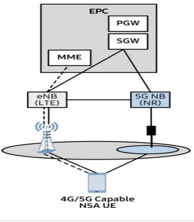
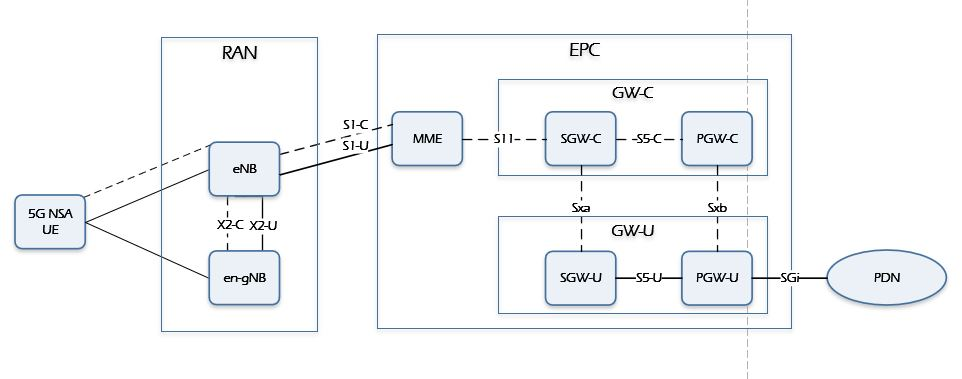
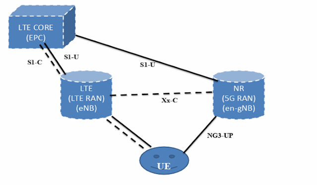

Edge Cloud Deployment with 3GPP 5G Non Stand Alone
==

- [Edge Cloud Deployment with 3GPP 5G Non Stand Alone](#edge-cloud-deployment-with-3gpp-5g-non-stand-alone)
- [Introduction](#introduction)
- [5G NSA Option-3 Architecture aspects](#5g-nsa-option-3-architecture-aspects)
  - [Option-3](#option-3)
  - [Option-3A](#option-3a)
  - [Option-3x](#option-3x)
- [5G NSA Integration with Edge Platforms](#5g-nsa-integration-with-edge-platforms)
  - [Open Network Edge Services Software (OpenNESS)](#open-network-edge-services-software-openness)
  - [5G NAS Deployment Models and Integration with Edge Platforms](#5g-nas-deployment-models-and-integration-with-edge-platforms)
- [OpenNESS integration with 5G NSA systems](#openness-integration-with-5g-nsa-systems)
  - [OpenNESS scope](#openness-scope)
  - [OpenNESS implementation](#openness-implementation)
  - [OpenNESS functional elements](#openness-functional-elements)
- [Summary](#summary)
- [References](#references)

# Introduction

5G can be deployed in five different deployment options as described in [3GPP 23.799][3GPP_23799], where SA (standalone) options consist of only one generation of radio access technology and NSA (non stand alone) options consist of two generations of radio access technologies (4G LTE and 5G). The early deployments will be adopting either NSA option 3 or standalone option 2 as the standardization of these two options have
already been completed.

Non-standalone option 3 is where radio access network is composed of eNBs (eNode Bs) as the master node and gNBs (gNode Bs) as the secondary node. The radio
access network is connected to EPC (Evolved Packet Core). The NSA option 3, as it leverages existing 4G deployment, can be brought to market quickly with minor modification to the 4G network. This option also supports legacy 4G devices and the 5G devices only need to support NR (New Radio) protocols so device can also be developed quickly. On the other hand, NSA option 3 does not introduce 5GC and therefore may not be optimized for new 5G use cases beyond mobile broadband.

The focus of this paper is towards the edge deployment using the **5G NSA Option-3 deployment**.

# 5G NSA Option-3 Architecture aspects

Option 3 represents a network having both LTE and NR radio access, but using only the EPC core of LTE to route the Control signals. In this option, LTE is used as the control plane anchor for NR, and both LTE and NR are used for user data traffic.(user plane). The UE can connect to the LTE and 5G NR base station. In this option, the operators do not need a 5G Core. To support EN-DC, the legacy LTE network needs to be upgraded to 3GPP release 15 which will be called **eLTE**. 

The following figure hows a 5G gNodeB connected to the 4G EPC at the data plane level. The 5G gNodeB does not connect to the MME. NAS Signaling is still the same as that of LTE. The gNodeB does connect to the LTE eNodeB over the X2 interface to receive requests to activate and deactivate 5G bearers.

A basic setup for such a scheme is:

1. The UE attaches to the LTE network. The UE signals to the network that it can simultaneously connect to the 4G and 5G networks.
2. The Core Network checks if the UE is authorized to connect to 4G and 5G networks. The 4G eNodeB is notified that the UE is permitted to connect to the 5G network.
3. The eNodeB then takes a decision to activate a bearer on the 5G gNodeB.
4. The 4G eNodeB and 5G gNodeB communicate to set up the bearer on the 5G gNodeB.
5. The UE is notified about the 5G bearer via the RRC Connection Reconfiguration message.
6. The UE then connects to the 5G network while maintaining the connectivity to the 4G network.

The standardised NSA EPC networking architecture includes Option 3, Option 3a, and Option 3x as described here.

## Option-3
In the Option 3 networking mode, the X2 interface traffic between eNB and gNB has NSA user plane traffic. This traffic is huge. The core network needs to increase the bandwidth of the S1-U interface to meet the LTE/NSA transmission requirements.

## Option-3A
In the Option 3a networking mode, there is only control plane traffic in the X2 interface. So the X2 traffic is very small.

## Option-3x
In the Option 3x networking mode, there is a little LTE user plane traffic in the X2 interface. From the perspective of the impact on the existing network, the Option 3x is relatively small and has become the mainstream choice for NSA networking. By using 4G as the anchor point of the control plane, it can meet good service continuity and support rapid network construction in the initial stage of 5G deployment

# 5G NSA Integration with Edge Platforms

## Open Network Edge Services Software (OpenNESS)

## 5G NAS Deployment Models and Integration with Edge Platforms

# OpenNESS integration with 5G NSA systems

## OpenNESS scope

## OpenNESS implementation

## OpenNESS functional elements

# Summary

# References

[3GPP_23799]: <https://www.3gpp.org/DynaReport/23799.htm> "3GPP 23.799 Study on Architecture for Next Generation System(Release 14) Annex J: Deployment Scenarios"

[ETSI_MEC003]: <https://www.etsi.org/deliver/etsi_gs/MEC/001_099/003/02.01.01_60/gs_mec003v020101p.pdf> "ETSI GS MEC 003 V2.1.1, “Mobile Edge Computing (MEC); Framework and Reference Architecture” (2019-01)

[GSMA_5G_NSA]: <https://www.gsma.com/futurenetworks/wp-content/uploads/2019/03/5G-Implementation-Guidelines-NSA-Option-3-v2.1.pdf> "GSMA 5G Implementation Guidelines: NSA Option 3 February 2020"  

[3]: [ETSI_2018] ETSI White Paper #24, "MEC Deployments in 4G and Evolution Towards 5G", First Edition, February 2018, <https://www.etsi.org/images/files/ETSIWhitePapers/etsi_wp24_MEC_deployment_in_4G_5G_FINAL.pdf.>

[4]: [3GPP_23214] TS 23.214 3rd Generation Partnership Project; Technical Specification Group Services and System Aspects; Architecture enhancements for control and user plane separation of EPC nodes; Stage 2.

[5]: [3GPP_29244] TS 29.244 Interface between the Control Plane and the User Plane of EPC Nodes.

[6]: [3GPP_29303] TS 29.303 DNS procedures for UP function selection  

[7]: [3GPP_23501] 3GPP TS 23.501 V15.1.0, “3rd Generation Partnership Project; Technical Specification Group Services and System Aspects; System Architecture for the 5G System; Stage 2 (Release 15)” (2018-03)

[8]: [3GPP_CUPS] "Control and User Plane Separation of EPC Nodes (CUPS)", <https://www.3gpp.org/cups>

