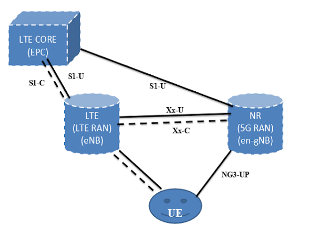
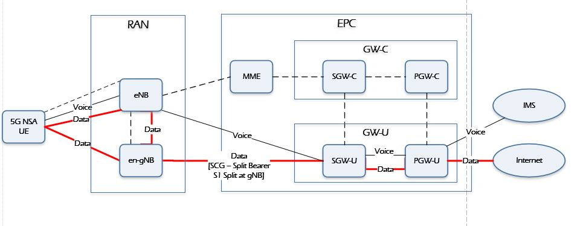
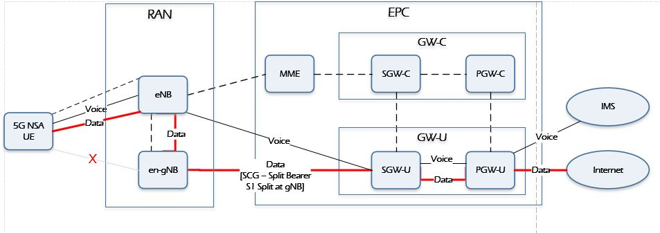
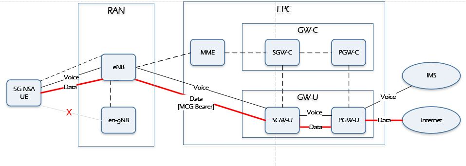
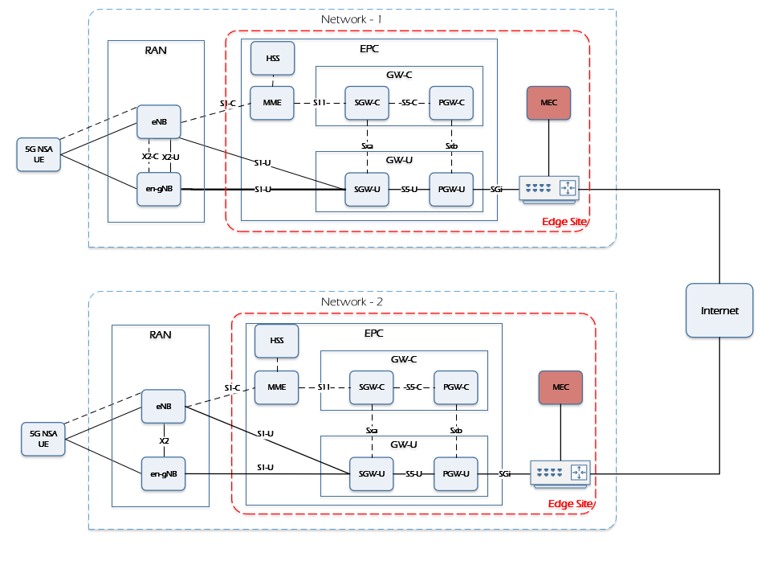
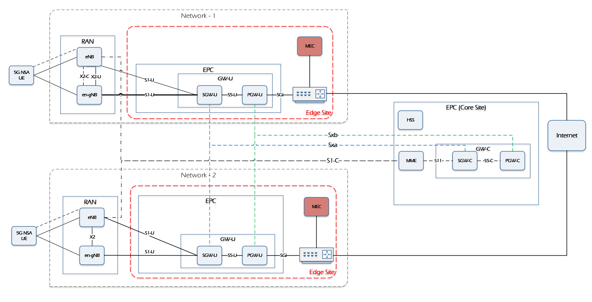
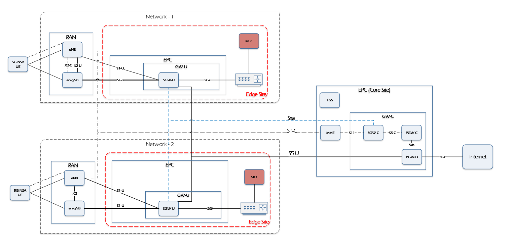

Edge Cloud Deployment with 3GPP 5G Non Stand Alone
=========

- [Edge Cloud Deployment with 3GPP 5G Non Stand Alone](#edge-cloud-deployment-with-3gpp-5g-non-stand-alone)
- [Introduction](#introduction)
- [5G NSA Option-3 Architecture aspects](#5g-nsa-option-3-architecture-aspects)
  - [Option-3](#option-3)
  - [Option-3a](#option-3a)
  - [Option-3x](#option-3x)
- [5G NSA Integration with Edge Platforms](#5g-nsa-integration-with-edge-platforms)
  - [UE is in both 4G & 5G Coverage](#ue-is-in-both-4g--5g-coverage)
  - [UE is in only in 4G coverage](#ue-is-in-only-in-4g-coverage)
    - [Data flows through the SCG Split Bearer, S1-U Split](#data-flows-through-the-scg-split-bearer-s1-u-split)
    - [Data flows through the MCG Bearer, S1-U Path Switch.](#data-flows-through-the-mcg-bearer-s1-u-path-switch)
  - [Distributed EPC](#distributed-epc)
  - [Distributed S/PGW](#distributed-spgw)
  - [Distributed SGW with Local Breakout (SGW-LBO)](#distributed-sgw-with-local-breakout-sgw-lbo)
    - [Open Network Edge Services Software (OpenNESS)](#open-network-edge-services-software-openness)
  - [OpenNESS integration with 5G NSA systems](#openness-integration-with-5g-nsa-systems)
    - [OpenNESS scope](#openness-scope)
    - [OpenNESS implementation](#openness-implementation)
    - [OpenNESS functional elements](#openness-functional-elements)
  - [Summary](#summary)

# Introduction

5G can be deployed in five different deployment options as described in [3GPP 23.799][3GPP_23799], where SA (standalone) options consist of only one generation of radio access technology and NSA (non stand alone) options consist of two generations of radio access technologies (4G LTE and 5G). The early deployments will be adopting either NSA option 3 or standalone option 2 as the standardization of these two options have
already been completed.

Non-standalone option 3 is where radio access network is composed of LTE eNBs (eNode Bs) as the master node and 5G gNBs (gNode Bs) as the secondary node. The radio
access network is connected to EPC (Evolved Packet Core). The NSA option 3, as it leverages existing 4G deployment, can be brought to market quickly with minor modification to the 4G network. This option also supports legacy 4G devices and the 5G devices only need to support NR (New Radio) protocols so device can also be developed quickly. On the other hand, NSA option 3 does not introduce 5GC and therefore may not be optimized for new 5G use cases beyond mobile broadband.

The focus of this paper is towards the edge deployment using the **5G NSA Option-3 deployment**.

# 5G NSA Option-3 Architecture aspects

Option 3 represents a network having both LTE and NR radio access, but using only the EPC core of LTE to route the Control signals. In this option, LTE is used as the control plane anchor for NR, and both LTE and NR are used for user data traffic.(user plane). The UE can connect to the LTE and 5G NR base station. To support EN-DC (E-UTRAN New Radio Dual Connectivity), the legacy LTE network needs to be upgraded to 3GPP release 15 which will be called **eLTE**.

The following figure hows a 5G gNodeB connected to the 4G EPC at the data plane level. The 5G gNodeB does not connect to the MME. NAS Signaling is still the same as that of LTE. The gNodeB connects to the LTE eNodeB over the X2 interface to receive requests to activate and deactivate 5G bearers.

A basic setup for such a scheme is:

1. The UE attaches to the LTE network. The UE signals to the network that it can simultaneously connect to the 4G and 5G networks.
2. The Core Network checks if the UE is authorized to connect to 4G and 5G networks. The 4G eNodeB is notified that the UE is permitted to connect to the 5G network.
3. The eNodeB then takes a decision to activate a bearer on the 5G gNodeB.
4. The 4G eNodeB and 5G gNodeB communicate to set up the bearer on the 5G gNodeB.
5. The UE is notified about the 5G bearer via the RRC Connection Reconfiguration message.
6. The UE then connects to the 5G network while maintaining the connectivity to the 4G network.

The standardised NSA EPC networking architecture includes Option 3, Option 3a, and Option 3x as described here.

## Option-3

In the plain option 3, all uplink/downlink data flows to and from the LTE part of the LTE/NR base station, i.e. to and from the eNB. The eNB then decides which part of the data it wants to forward to the 5G gNB part of the base station over the Xx interface. In simple terms, the 5G gNB never communicates with the 4G core network directly.

In this option, the X2 interface traffic between eNB and gNB has control plane traffic and  user plane traffic. This traffic is huge. 

## Option-3a

In this option, both the LTE eNB and the 5G gNB can directly talk to the EPS core network but they cannot directly talk with each other over the Xx (X2) interface. This means that a single data bearer cannot share the load over LTE and NR. For example, VoLTE voice traffic for a user is handled by LTE while the users Internet traffic is handled by the 5G part of the base station. It would be difficult to implement this scenario if the devices keep moving in and out of 5G network coverage continuously.

In this option, the X2 interface traffic between eNB and gNB has only control plane traffic. So the X2 traffic is very small.

## Option-3x

Option 3X is a combination of 3 and 3A. In this configuration, user data traffic will flow directly to the 5G gNB part of the base station. From there, it is delivered over the air to the mobile device. A part of the data can also be forwarded over the X2 interface to the 4G eNB part of the base station and from there to the UE. Slow data streams (Low Data), e.g. VoLTE bearers with a different IP address than that used for Internet access can be directly delivered from the core network to the 4G eNB part of the 4G/5G base station. The advantage is that the 5G upgrade of the base station is likely to have the much better performing IP interface so it is better suited to handle the higher data rates that can only be reached with a 4G/5G Non-Standalone network deployment.

In the Option 3x networking mode, there is a little LTE user plane traffic in the X2 interface. From the perspective of the impact on the existing network, the Option 3x is relatively small and has become the mainstream choice for NSA networking. By using 4G as the anchor point of the control plane, it can meet good service continuity and support rapid network construction in the initial stage of 5G deployment

In this configuration, the LTE eNB will act as the Master and will have control over which S1-U bearers are handled by radio of LTE or NR. Based on instructions from LTE eNB, MME will inform S-GW where to establish S1-U bearers, i.e. LTE or NR. If NR radio quality falls below a certain threshold,  S1-U bearer towards NR may be either split at NR and sent entirely over Xx to LTE or a PATH SWITCH may be triggered where all S1- U will go to LTE eNB.

# 5G NSA Integration with Edge Platforms

The focus of this chatper would be considering the 5G NAS Option - 3x. Before the Edge platform location and integration is described its important to understand the traffic flows considering two different PDN's ( Data and Voice) and along with the UE being in 4G only coverage and both dual coverage. The figures here show the traffic flows for the different coverage scenarios: 

## UE is in both 4G & 5G Coverage 

## UE is in only in 4G coverage

There are two possible flows

### Data flows through the SCG Split Bearer, S1-U Split

### Data flows through the MCG Bearer, S1-U Path Switch.

For the 5G NSA, steering traffic to/from MEC applications is achieved by configuring the MEC’s local DNS and the MEC host’s data plane accordingly. The edge deployment options for 5G NSA follow the ones described in [ETSI_4G_WP] and are described here.

## Distributed EPC

In this deployment the MEC host logically includes all or part of the 3GPP Evolved Packet Core (EPC) components, as specified in the 4G system architecture in ETSI TS
23.401, and the MEC data plane sits on the SGi interface. By doing so, in order to steer U-plane traffic towards the MEC system, two elements, the local DNS of MEC and the PDN Gateway (PGW) of a distributed EPC, play critical roles. In fact, as the UE subscribes to the distributed EPC co-located with the MEC host, the PGW there upon terminates the PDN connection and assigns the IP address and local DNS information to resolve the MEC applications’ IP address. This scenario requires less changes to the
operator’s network as standard 3GPP entities and interfaces are leveraged for operations such as session management, charging, etc.

## Distributed S/PGW

The distributed S/PGW deployment option is similar to the previous one, except that only SGW and PGW entities are deployed at the edge site, whereas the control plane functions such as the Mobility Management Entity (MME) and HSS are located at the operator’s core site. Still, the MEC host’s data plane connects to the PGW over the SGi interface.

The local SGW selection is performed by the central MME according to the 3GPP standard DNS procedures and based on the Tracking Area Code (TAC) of the radio where the UE attaches to. This architecture allows offloading the traffic based on the APN, which means, for example, that the IMS for VoLTE APN and roaming APNs
may not be offloaded

The diagram above shows the deployment with the SGW and PGW co-located at the network edge, which requires the operator to extend the S5 interface to the MEC site. This type of deployment allows the operator to retain full control over the MME.

## Distributed SGW with Local Breakout (SGW-LBO)

Local breakout at the SGWs is a new architecture for MEC that originates from operators’ desire to have a greater control on the granularity of the traffic that needs to be steered. This principle is dictated by the to have the users able to reach both the MEC applications and the operator’s core site application in
a selective manner over the same APN.

With the Distributed SGW deployment, one of the optional MEC deployment scenarios is to co-locate MEC hosts with the SGW. Both the SGW-LBO and the MEC application may be hosted as VNFs in the same MEC platform. The following figure describes co-locating MEC hosts with the SGW in a mobile network where the MEC system and the distributed SGW are co-located at the edge

The traffic steering uses the SGi - Local Break Out interface which supports traffic separation and allows the same level of security as the operator expects from a 3GPP-compliant solution. This solution allows the operator to specify traffic filters similar to the uplink classifiers in 5G, which are used for traffic steering. This architecture also supports MEC host mobility, extension to the edge of CDN, push
applications that requires paging and ultra-low latency use cases. The SGW selection process performed by MMEs is according to the 3GPP standard and based on the geographical location of UEs (Tracking Areas) as provisioned in the operator’s DNS.

The SGW-LBO offers the possibility to steer traffic based on any operator-chosen combination of the policy sets, such as APN and user identifier, packet’s 5-tuple, and other IP level parameters including IP version and DSCP marking.

### Open Network Edge Services Software (OpenNESS)

## OpenNESS integration with 5G NSA systems

### OpenNESS scope

### OpenNESS implementation

### OpenNESS functional elements

## Summary

[3GPP_23799]: <https://www.3gpp.org/DynaReport/23799.htm> "3GPP 23.799 Study on Architecture for Next Generation System(Release 14) Annex J: Deployment Scenarios"

[ETSI_MEC]: <https://www.etsi.org/deliver/etsi_gs/MEC/001_099/003/02.01.01_60/gs_mec003v020101p.pdf> "ETSI GS MEC 003 V2.1.1, “Mobile Edge Computing (MEC); Framework and Reference Architecture (2019-01)"

[GSMA_5G_NSA]: <https://www.gsma.com/futurenetworks/wp-content/uploads/2019/03/5G-Implementation-Guidelines-NSA-Option-3-v2.1.pdf> "GSMA 5G Implementation Guidelines: NSA Option 3 February 2020"  

[ETSI_4G_WP]: <https://www.etsi.org/images/files/ETSIWhitePapers/etsi_wp24_MEC_deployment_in_4G_5G_FINAL.pdf.> "ETSI White Paper #24 - MEC Deployments in 4G and Evolution Towards 5G, First Edition, February 2018"

[3GPP_23214]: <https://www.3gpp.org/DynaReport/23214.htm> "TS 23.214 3rd Generation Partnership Project; Technical Specification Group Services and System Aspects; Architecture enhancements for control and user plane separation of EPC nodes; Stage 2."

[3GPP_29244]: <https://www.3gpp.org/DynaReport/29244.htm> "TS 29.244 Interface between the Control Plane and the User Plane of EPC Nodes"

[3GPP_29303]: <https://www.3gpp.org/dynareport/29303.htm> "TS 29.303 DNS procedures for UP function selection"

[3GPP_23501]: <https://www.3gpp.org/DynaReport/23501.htm> "3GPP TS 23.501 V15.1.0, “3rd Generation Partnership Project; Technical Specification Group Services and System Aspects; System Architecture for the 5G System; Stage 2 (Release 15)” (2018-03)"

[3GPP_CUPS]: <https://www.3gpp.org/cups> "Control and User Plane Separation of EPC Nodes (CUPS) Control and User Plane Separation of EPC Nodes (CUPS)"
