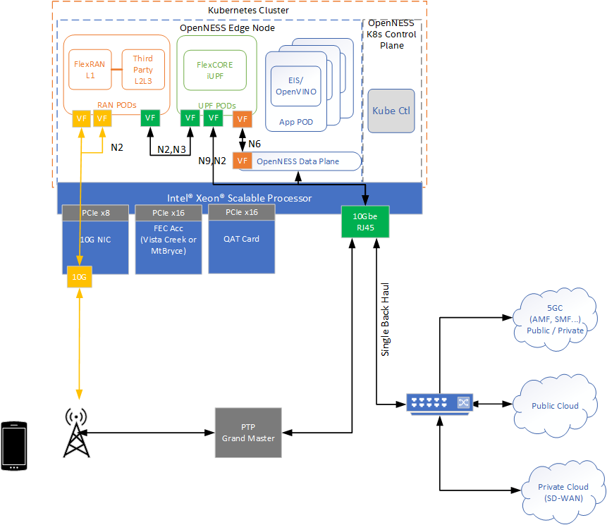
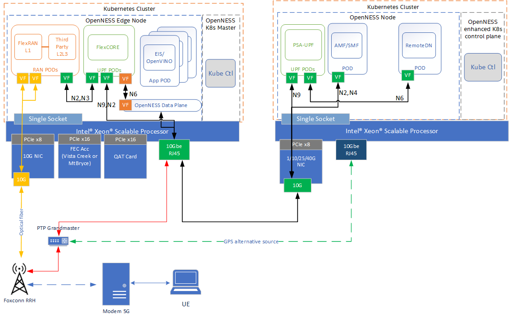

```text
SPDX-License-Identifier: Apache-2.0
Copyright (c) 2020-2021 Intel Corporation
```
<!-- omit in toc -->
# Converged Edge Reference Architecture 5G On Premises Edge
The Converged Edge Reference Architectures (CERA) are a set of pre-integrated HW/SW reference architectures based on OpenNESS to accelerate the development of edge platforms and architectures. This document describes the CERA 5G On Premises Edge, which combines wireless networking and high performance compute for IoT, AI, video and other services.

- [CERA 5G On Prem](#cera-5g-on-prem)
  - [CERA 5G On Prem Experience Kit](#cera-5g-on-prem-experience-kit)
    - [CERA 5G On Prem OpenNESS Configuration](#cera-5g-on-prem-openness-configuration)
    - [CERA 5G On Prem Deployment Architecture](#cera-5g-on-prem-deployment-architecture)
    - [CERA 5G On Prem Experience Kit Deployments](#cera-5g-on-prem-experience-kit-deployments)
  - [Edge Service Applications Supported by CERA 5G On Prem](#edge-service-applications-supported-by-cera-5g-on-prem)
    - [OpenVINO](#openvino)
    - [Edge Insights Software](#edge-insights-software)
  - [CERA 5G On Prem Hardware Platform](#cera-5g-on-prem-hardware-platform)
    - [Hardware Acceleration](#hardware-acceleration)
  - [CERA 5G On Prem OpenNESS Deployment](#cera-5g-on-prem-openness-deployment)
    - [Setting up Target Platform Before Deployment](#setting-up-target-platform-before-deployment)
  - [BIOS Setup](#bios-setup)
  - [Setting up Machine with Ansible](#setting-up-machine-with-ansible)
    - [Steps to be performed on the machine, where the Ansible playbook is going to be run](#steps-to-be-performed-on-the-machine-where-the-ansible-playbook-is-going-to-be-run)
- [5G Core Components](#5g-core-components)
  - [dUPF](#dupf)
    - [Overview](#overview)
    - [Deployment](#deployment)
      - [Prerequisites](#prerequisites)
      - [Settings](#settings)
      - [Configuration](#configuration)
  - [UPF](#upf)
    - [Overview](#overview-1)
    - [Deployment](#deployment-1)
      - [Prerequisites](#prerequisites-1)
      - [Settings](#settings-1)
      - [Configuration](#configuration-1)
  - [AMF-SMF](#amf-smf)
    - [Overview](#overview-2)
    - [Deployment](#deployment-2)
      - [Prerequisites](#prerequisites-2)
      - [Settings](#settings-2)
      - [Configuration](#configuration-2)
  - [Remote-DN](#remote-dn)
    - [Overview](#overview-3)
      - [Prerequisites](#prerequisites-3)
  - [Local-DN](#local-dn)
    - [Overview](#overview-4)
    - [Prerequisites](#prerequisites-4)
  - [OpenVINO](#openvino-1)
    - [Settings](#settings-3)
    - [Deployment](#deployment-3)
    - [Streaming](#streaming)
  - [EIS](#eis)
  - [gNodeB](#gnodeb)
    - [Overview](#overview-5)
    - [Deployment](#deployment-4)
    - [Prerequisites](#prerequisites-5)
    - [Settings](#settings-4)
    - [Configuration](#configuration-3)
  - [Time synchronization over PTP for node server](#time-synchronization-over-ptp-for-node-server)
    - [Overview](#overview-6)
    - [Prerequisites](#prerequisites-6)
    - [Settings](#settings-5)
    - [GMC configuration](#gmc-configuration)
- [Conclusion](#conclusion)
- [Learn more](#learn-more)
- [Acronyms](#acronyms)

## CERA 5G On Prem
CERA 5G On Prem deployment focuses on On Premises, Private Wireless and Ruggedized Outdoor deployments, presenting a scalable solution across the On Premises Edge. The assumed 3GPP deployment architecture is based on the figure below from 3GPP 23.501 Rel15 which shows the reference point representation for concurrent access to two (e.g. local and central) data networks (single PDU Session option). The highlighted yellow blocks - RAN, UPF and Data Network (edge apps) are deployed on the CERA 5G On Prem. 


> Figure 1 - 3GPP Network

### CERA 5G On Prem Experience Kit
The CERA 5G On Prem implementation in OpenNESS supports a single Orchestration domain, optimizing the edge node to support Network Functions (gNB, UPF) and Applications at the same time. This allows the deployment on small uCPE and pole mounted form factors.

#### CERA 5G On Prem OpenNESS Configuration 
CERA 5G On Prem is a combination of the existing OpenNESS Building Blocks required to run 5G gNB, UPF, Applications and their associated HW Accelerators. CERA 5G On Prem also adds CMK and RMD to better support workload isolation and mitigate any interference from applications affecting the performance of the network functions. The below diagram shows the logical deployment with the OpenNESS Building Blocks. 


> Figure 2 - CERA 5G On Prem Architecture

#### CERA 5G On Prem Deployment Architecture



> Figure 3 - CERA 5G On Prem Deployment

CERA 5G On Prem architecture supports a single platform (Xeon® SP and Xeon D) that hosts both the Edge Node and the Kubernetes* Control Plane. The UPF is deployed using SRIOV-Device plugin and SRIOV-CNI allowing direct access to the network interfaces used for connection to the gNB and back haul. For high throughput workloads such as UPF network function, it is recommended to use single root input/output (SR-IOV) pass-through the physical function (PF) or the virtual function (VF), as required. Also, in some cases, the simple switching capability in the NIC can be used to send traffic from one application to another, as there is a direct path of communication required between the UPF and the Data plane, this becomes an option. It should be noted that the VF-to-VF option is only suitable when there is a direct connection between PODs on the same PF with no support for advanced switching. In this scenario, it is advantageous to configure the UPF with three separate interfaces for the different types of traffic flowing in the system. This eliminates the need for additional traffic switching at the host. In this case, there is a separate interface for N3 traffic to the Access Network, N9 and N4 traffic can share an interface to the backhaul network. While local data network traffic on the N6 can be switched directly to the local applications, similarly gNB DU and CU interfaces N2 and N4 are separated. Depending on performance requirements, a mix of data planes can be used on the platform to meet the varying requirements of the workloads. 

The applications are deployed on the same edge node as the UPF and gNB.

The use of Intel® Resource Director Technology (Intel® RDT) ensures that the cache allocation and memory bandwidth are optimized for the workloads on running on the platform.

Intel® Speed Select Technology (Intel® SST) can be used to further enhance the performance of the platform.

The following Building Blocks are supported in OpenNESS

- <b>High-Density Deep Learning (HDDL)</b>: Software that enables OpenVINO™-based AI apps to run on Intel® Movidius Vision Processing Units (VPUs). It consists of the following components:
  - HDDL device plugin for K8s
  - HDDL service for scheduling jobs on VPUs
- <b>FPGA/eASIC/NIC</b>: Software that enables AI inferencing for applications, high-performance and low-latency packet pre-processing on network cards, and offloading for network functions such as eNB/gNB offloading Forward Error Correction (FEC). It consists of: 
  - FPGA device plugin for inferencing
  - SR-IOV device plugin for FPGA/eASIC
  - Dynamic Device Profile for Network Interface Cards (NIC)
- <b>Resource Management Daemon (RMD)</b>: RMD uses Intel® Resource Director Technology (Intel® RDT) to implement cache allocation and memory bandwidth allocation to the application pods. This is a key technology for achieving resource isolation and determinism on a cloud-native platform. 
- <b>Node Feature Discovery (NFD)</b>: Software that enables node feature discovery for Kubernetes*. It detects hardware features available on each node in a Kubernetes* cluster and advertises those features using node labels. 
- <b>Topology Manager</b>: This component allows users to align their CPU and peripheral device allocations by NUMA node.
- <b>Kubevirt</b>: Provides support for running legacy applications in VM mode and the allocation of SR-IOV ethernet interfaces to VMs. 
- <b>Precision Time Protocol (PTP)</b>: Uses primary-secondary architecture for time synchronization between machines connected through ETH. The primary clock is a reference clock for the secondary nodes that adapt their clocks to the primary node's clock. Grand Master Clock (GMC) can be used to precisely set primary clock.

#### CERA 5G On Prem Experience Kit Deployments
The CERA 5G On Prem experience kit deploys both the 5G On Premises cluster and also a second cluster to host the 5GC control plane functions and provide an additional Data Network POD to act as public network for testing purposes. Note that the Access network and UE are not configured as part of the CERA 5G On Prem Experience Kit. Also required but not provided is a binary iUPF, UPF and 5GC components. Please contact your local Intel® representative for more information. 



> Figure 4 - CERA Experience Kit

### Edge Service Applications Supported by CERA 5G On Prem
The CERA architectural paradigm enables convergence of edge services and applications across different market segments. This is demonstrated by taking diverse workloads native to different segments and successfully integrating within a common platform. The reference considers workloads segments across the following applications:

Smart city: Capture of live camera streams to monitor and measure pedestrian and vehicle movement within a zone.

Industrial: Monitoring of the manufacturing quality of an industrial line, the capture of video streams focuses on manufactured devices on an assembly line and the real-time removal of identified defect parts.

While these use cases are addressing different market segments, they all have similar requirements:

- Capture video either from a live stream from a camera, or streamed from a recorded file.

- Process that video using inference with a trained machine learning model, computer vision filters, etc.

- Trigger business control logic based on the results of the video processing.

Video processing is inherently compute intensive and, in most cases, especially in edge processing, video processing becomes the bottleneck in user applications. This, ultimately, impacts service KPIs such as frames-per-second, number of parallel streams, latency, etc.

Therefore, pre-trained models, performing numerical precision conversions, offloading to video accelerators, heterogeneous processing and asynchronous execution across multiple types of processors all of which increase video throughput are extremely vital in edge video processing. However these requirements can significantly complicate software development, requiring expertise that is rare in engineering teams and increasing the time-to-market.

#### OpenVINO
The Intel® Distribution of OpenVINO™ toolkit helps developers and data scientists speed up computer vision workloads, streamline deep learning inference and deployments, and enable easy, heterogeneous execution across Intel® architecture platforms from edge to cloud. It helps to unleash deep learning inference using a common API, streamlining deep learning inference and deployment using standard or custom layers without the overhead of frameworks.

#### Edge Insights Software
Intel® Edge Insights for Industrial offers a validated solution to easily integrate customers' data, devices, and processes in manufacturing applications, which helps enable near-real-time intelligence at the edge, greater operational efficiency, and security in factories.
Intel® Edge Insights for Industrial takes advantage of modern microservices architecture. This approach helps OEMs, device manufacturers, and solution providers integrate data from sensor networks, operational sources, external providers, and industrial systems more rapidly. The modular, product-validated software enables the extraction of machine data at the edge. It also allows that data to be communicated securely across protocols and operating systems managed cohesively, and analyzed quickly.
Allowing machines to communicate interchangeably across different protocols and operating systems eases the process of data ingestion, analysis, storage, and management. Doing so, also helps industrial companies build powerful analytics and machine learning models easily and generate actionable predictive insights at the edge.
Edge computing software deployments occupy a middle layer between the operating system and applications built upon it. Intel® Edge Insights for Industrial is created and optimized for Intel® architecture-based platforms and validated for underlying operating systems. It's capability supports multiple edge-critical Intel® hardware components like CPUs, FPGAs, accelerators, and Intel® Movidius Vision Processing Unit (VPU). Also, its modular architecture offers OEMs, solution providers, and ISVs the flexibility to pick and choose the features and capabilities that they wish to include or expand upon for customized solutions. As a result, they can bring solutions to market fast and accelerate customer deployments.

For more information on the supported EIS demos support, see [EIS whitepaper](https://github.com/open-ness/edgeapps/blob/master/applications/eis-experience-kit/docs/whitepaper.md) 

### CERA 5G On Prem Hardware Platform
CERA 5G On Prem is designed to run on standard, off-the-shelf servers with Intel® Xeon CPUs. Dedicated platform is [Single socket SP SYS-E403-9P-FN2T](https://www.supermicro.com/en/products/system/Box_PC/SYS-E403-9P-FN2T.cfm)


#### Hardware Acceleration
Based on deployment scenario and capacity requirements, there is option to utilize hardware accelerators on the platform to increase performance of certain workloads. Hardware accelerators can be assigned to the relevant container on the platform through the OpenNESS Controller, enabling modular deployments to meet the desired use case.

<b>AI Acceleration</b>  
Video inference is done using the OpenVINO™ toolkit to accelerate the inference processing to identify people, vehicles or other items, as required. This is already optimized for software implementation and can be easily changed to utilize hardware acceleration if it is available on the platform.

<b>Intel® Movidius Myriad X Vision</b>  
Intel® Movidius Myriad X Vision Processing Unit (VPU) can be added to a server to provide a dedicated neural compute engine for accelerating deep learning inferencing at the edge. To take advantage of the performance of the neural compute engine, Intel® has developed the high-density deep learning (HDDL) inference engine plugin for inference of neural networks.

In the current example when the HDDL is enabled on the platform, the OpenVINO™ toolkit sample application reduces its CPU requirements from two cores to a single core. 

In future releases additional media analytics services may be enabled e.g VCAC-A card, for more information refer to [OpenNESS VA Services](../applications/openness_va_services.md) 

<b>Intel® FPGA PAC N3000</b>  
The Intel® FPGA Programmable Acceleration Card (Intel® FPGA PAC) plays a key role in accelerating certain types of workloads, which in turn increases the overall compute capacity of a commercial, off-the-shelf platform. FPGA benefits include:
- Flexibility - FPGA functionality can change upon every power up of the device.
- Acceleration - Get products to market faster and increase your system performance.
- Integration - Modern FPGAs include on-die processors, transceiver I/Os at 28 Gbps (or faster), RAM blocks, DSP engines, and more.
- Total Cost of Ownership (TCO) - While ASICs may cost less per unit than an equivalent FPGA, building them requires a non-recurring expense (NRE), expensive software tools, specialized design teams, and long manufacturing cycles.

The Intel® FPGA PAC N3000 is a full-duplex, 100 Gbps in-system, re-programmable acceleration card for multi-workload networking application acceleration. It has an optimal memory mixture designed for network functions, with an integrated network interface card (NIC) in a small form factor that enables high throughput, low latency, and low power per bit for a custom networking pipeline.

For more references, see [<b>openness-fpga.md</b>: Dedicated FPGA IP resource allocation support for Edge Applications and Network Functions](https://github.com/open-ness/ido-specs/blob/master/doc/building-blocks/enhanced-platform-awareness/openness-fpga.md)

<b>Intel® QAT</b>  
The Intel® QuickAssist Adapter provides customers with a scalable, flexible, and extendable way to offer Intel® QuickAssist Technology (Intel® QAT) crypto acceleration and compression capabilities to their existing product lines. Intel® QuickAssist Technology (Intel® QAT) provides hardware acceleration to assist with the performance demands of securing and routing Internet traffic and other workloads, such as compression and wireless 4G LTE and 5G gnb algorithm offload, thereby reserving processor cycles for application and control processing.


### CERA 5G On Prem OpenNESS Deployment

#### Setting up Target Platform Before Deployment

Perform the following steps on the target machine before deployment:

1. Ensure that, the target machine gets IP address automatically on boot every time.  
Example command:  
`hostname -I`

2. Change target machine's hostname.
  * Edit file `vi /etc/hostname`. Press `Insert` key to enter Insert mode. Delete the old hostname and replace it with the new one. Exit the vi editor by pressing `Esc` key and then type `:wq` and press `Enter` key.
  * Edit file `vi /etc/hosts`. Press `Insert` key to enter Insert mode. Add a space at the end of both lines and write hostname after it. Exit the vi editor by pressing `Esc` key and then type `:wq` and press `Enter` key.

3. Reboot the target machine.

### BIOS Setup
The BIOS settings on the edge node must be properly set in order for the OpenNESS building blocks to function correctly. They may be set either during deployment of the reference architecture, or manually. The settings that must be set are:
* Enable Intel® Hyper-Threading Technology
* Enable Intel® Virtualization Technology
* Enable Intel® Virtualization Technology for Directed I/O
* Enable SR-IOV Support

### Setting up Machine with Ansible

#### Steps to be performed on the machine, where the Ansible playbook is going to be run

1. Copy SSH key from machine, where the Ansible playbook is going to be run, to the target machine. Example commands:
    > NOTE: Generate ssh key if is not present on the machine: `ssh-keygen -t rsa` (Press enter key to apply default values)

    Do it for each target machine.
    ```shell
    ssh-copy-id root@TARGET_IP
    ```
    > NOTE: Replace TARGET_IP with the actual IP address of the target machine.

2. Clone `ido-converged-edge-experience-kits` repo from `github.com/open-ness` using git token.
    ```shell
    git clone --recursive https://<GITHUB_TOKEN>@github.com:open-ness/ido-converged-edge-experience-kits.git
    ```
    > NOTE: Replace <GITHUB_TOKEN> with your GitHub token.

3. Update repositories by running following commands.
    ```shell
    cd ido-converged-edge-experience-kits
    git submodule foreach --recursive git checkout master
    git submodule update --init --recursive
    ```

4. Provide target machines IP addresses for CEEK deployment in `ido-converged-edge-experience-kits/inventory.yml`. For Singlenode setup, set the same IP address for both `controller` and `node01`. In the same file define the details for Central Office cluster deployment.
    Example:
    ```yaml
    all:
      vars:
        cluster_name: on_premises_cluster
        flavor: cera_5g_on_premise
        single_node_deployment: true
        limit:
    controller_group:
      hosts:
        controller:
          ansible_host: 172.16.0.1
          ansible_user: root
    edgenode_group:
      hosts:
        node01:
          ansible_host: 172.16.0.1
          ansible_user: root
    edgenode_vca_group:
      hosts:
    ptp_master:
      hosts:
    ptp_slave_group:
      hosts:

    ---
    all:
      vars:
        cluster_name: central_office_cluster  
        flavor: cera_5g_central_office
        single_node_deployment: true
        limit:
    controller_group:
      hosts:
        controller:
          ansible_host: 172.16.1.1
          ansible_user: root
    edgenode_group:
      hosts:
        node1:
          ansible_host: 172.16.1.1
          ansible_user: root
    edgenode_vca_group:
      hosts:
    ptp_master:
      hosts:
    ptp_slave_group:
      hosts:
      
    ```

5. Edit `ido-converged-edge-experience-kits/inventory/default/group_vars/all/10-open.yml` and provide some correct settings for deployment.  

    Git token.
    ```yaml
    git_repo_token: "your git token"
    ```
    Proxy if it is required.
    ```yaml
    # Setup proxy on the machine - required if the Internet is accessible via proxy
    proxy_enable: true
    # Clear previous proxy settings
    proxy_remove_old: true
    # Proxy URLs to be used for HTTP, HTTPS and FTP
    proxy_http: "http://proxy.example.org:3128"
    proxy_https: "http://proxy.example.org:3129"
    proxy_ftp: "http://proxy.example.org:3129"
    # Proxy to be used by YUM (/etc/yum.conf)
    proxy_yum: "{{ proxy_http }}"
    # No proxy setting contains addresses and networks that should not be accessed using proxy (e.g. local network, Kubernetes CNI networks)
    proxy_noproxy: "127.0.0.1,localhost,192.168.1.0/24"
    ```
    NTP server
    ```yaml
    ### Network Time Protocol (NTP)
    # Enable machine's time synchronization with NTP server
    ntp_enable: true
    # Servers to be used by NTP instead of the default ones (e.g. 0.centos.pool.ntp.org)
    ntp_servers: ['ntp.server.com']
    ```

6. Edit file `ido-converged-edge-experience-kits/flavors/cera_5g_on_premise/all.yml` and provide On Premise deployment configuration.

    Choose Edge Application that will be deployed:
    ```yaml
    # Choose which demo will be launched: `eis` or `openvino`
    # To do not deploy any demo app, refer to `edgeapps_deployment_enable` variable
    deploy_demo_app: "openvino"
    ```

     If OpenVINO was chosen as Edge Application, set the options:
    ```yaml
    model: "pedestrian-detection-adas-0002" # model name used by demo application
    display_host_ip: "" # update ip for visualizer HOST GUI.
    save_video: "enable"  # enable saving the output video to file
    target_device: "CPU"  # device which will be used for video processing, currently only CPU is supported
    ```

    Set interface name for fronthaul connection:
    ```yaml
    ## Interface logical name (PF) used for fronthaul
    fronthaul_if_name: "enp184s0f0"
    ```

    Set interface name for connection to UPF and AMF-SMF:
    ```yaml
    # PF interface name of N3, N4, N6, N9 created VFs
    host_if_name_cn: "eno1"
    ```


7. Edit file `ido-converged-edge-experience-kits/flavors/cera_5g_on_premise/controller_group.yml`

    Provide names of `network interfaces` that are connected to the Central Office cluster and number of VF's to be created.
    ```yaml
    sriov:
      network_interfaces: {eno1: 5, enp184s0f0: 10}
    ```

8. Edit file `ido-converged-edge-experience-kits/flavors/cera_5g_on_premise/edgenode_group.yml`

    Set up CPUs isolation according to your hardware
    ```yaml
    # Variables applied with the profile
    tuned_vars: |
      isolated_cores=1-16,25-40
      nohz=on
      nohz_full=1-16,25-40

    # CPUs to be isolated (for RT procesess)
    cpu_isol: "1-16,25-40"
    # CPUs not to be isolate (for non-RT processes) - minimum of two OS cores necessary for controller
    cpu_os: "0,17-23,24,41-47"
    ```

    Set up hugepages settings
    ```yaml
    # Size of a single hugepage (2M or 1G)
    hugepage_size: "1G"
    # Amount of hugepages
    hugepage_amount: "40"
    ```

9.  Set all necessary settings for `CERA 5G Central Office` node in `ido-converged-edge-experience-kits/flavors/cera_5g_central_office/all.yml`.

    ```yaml
    # PF interface name of N4, N6, N9 created VFs
    host_if_name_cn: "eno1"
    ```

10. Edit file `ido-converged-edge-experience-kits/flavors/cera_5g_central_office/controller_group.yml`

    Provide names of `network interfaces` that are connected to the Near Edge cluster and number of VF's to be created.
    ```yaml
    sriov:
      network_interfaces: {eno1: 5}
    ```

11. Edit file `ido-converged-edge-experience-kits/flavors/cera_5g_central_office/edgenode_group.yml`

    Set up CPUs isolation according to your hardware capabilities
    ```yaml
    # Variables applied with the profile
    tuned_vars: |
      isolated_cores=1-16,25-40
      nohz=on
      nohz_full=1-16,25-40

    # CPUs to be isolated (for RT procesess)
    cpu_isol: "1-16,25-40"
    # CPUs not to be isolate (for non-RT processes) - minimum of two OS cores necessary for controller
    cpu_os: "0,17-23,24,41-47"
    ```

    Set up hugepages settings
    ```yaml
    # Size of a single hugepage (2M or 1G)
    hugepage_size: "1G"
    # Amount of hugepages
    hugepage_amount: "8"
    ```

12. Deploy Converged Edge Experience Kit (Near Edge and Central Office clusters simultaneously)

    Silent deployment:
    ```shell
    python3 deploy.py
    ```

    > NOTE: In multicluster deployment logs are hidden by default. To check the logs `tail` tool can be used on deployment log files.

## 5G Core Components
This section describes in details how to build particular images and configure ansible for deployment.

### dUPF

#### Overview

The Distributed User Plane Function (dUPF) is a part of 5G Access Network, it is responsible for packets routing. It has 3 separate interfaces for `N3, N4/N9` and `N6` data lines. `N3` interface is used for connection with video stream source. `N4/N9` interface is used for connection with `UPF` and `AMF/SMF`. `N6` interface is used for connection with `EDGE-APP` (locally), `UPF` and `Remote-DN`

The `CERA dUPF` component is deployed on `CERA 5G Near Edge` node. It is deployed as a POD - during deployment of `cera_5g_on_premise` flavor automatically.

#### Deployment

##### Prerequisites

To deploy dUPF correctly, one needs to provide Docker image to Docker repository on the target node. There is a script on the `https://github.com/open-ness/edgeapps/tree/master/network-functions/core-network/5G/UPF` repo provided by CERA, which builds the image automatically.

```sh
./build_image.sh -b i-upf -i i-upf
```

##### Settings
The following variables need to be defined in `ido-converged-edge-experience-kits/flavors/cera_5g_on_premise/all.yml`
```yaml
## Interface logical name (PF) used for fronthaul
fronthaul_if_name: "enp184s0f0"

# PF interface name of N3, N4, N6, N9 created VFs
host_if_name_cn: "eno1"
```

##### Configuration
The dUPF is configured automatically during the deployment.

### UPF
#### Overview

The `User Plane Function (UPF)` is a part of 5G Core Network, it is responsible for packets routing. It has 2 separate interfaces for `N4/N9` and `N6` data lines. `N4/N9` interface is used for connection with `dUPF` and `AMF/SMF` (locally). `N6` interface is used for connection with `EDGE-APP`, `dUPF` and `Remote-DN` (locally).

The CERA UPF component is deployed on `CERA 5G Central Office` node. It is deployed as a POD - during deployment of `cera_5g_central_office` flavor automatically.

#### Deployment
##### Prerequisites

To deploy `UPF` correctly one needs to provide a Docker image to Docker Repository on target nodes. There is a script on the  `https://github.com/open-ness/edgeapps/tree/master/network-functions/core-network/5G/UPF` repo provided by CERA, which builds the image automatically.

```sh
./build_image.sh -b psa-upf -i psa-upf
```

##### Settings

Update interface name in file `ido-converged-edge-experience-kits/flavors/cera_5g_central_office/all.yml` that is used for connection to Near Edge cluster (dUPF).

```yaml
host_if_name_cn: "eno1"
```

##### Configuration
The `UPF` is configured automatically during the deployment.


### AMF-SMF
#### Overview

AMF-SMF is a part of 5G Core Architecture responsible for `Session Management(SMF)` and `Access and Mobility Management(AMF)` Functions - it establishes sessions and manages date plane packages.

The CERA `AMF-SMF` component is deployed on `CERA 5G Central Office` node and communicates with UPF and dUPF, so they must be deployed and configured before `AMF-SMF`.

#### Deployment
##### Prerequisites

To deploy `AMF-SMF` correctly, one needs to provide a Docker image to Docker Repository on target machine(CERA 5G Central Office node). There is a script on the `https://github.com/open-ness/edgeapps/tree/master/network-functions/core-network/5G/AMF_SMF` repository provided by CERA, which builds the image automatically.

```sh
./build_image.sh -b amf-smf
```

##### Settings
No special settings are required for AMF-SMF deployment.

##### Configuration
The `AMF-SMF` is configured automatically during the deployment.


### Remote-DN

#### Overview
Remote Data Network is component, which represents `“internet”` in networking. CERA Core Network manages which data should apply to `Near Edge Application(EIS/OpenVINO)` or go further to the network.


##### Prerequisites
Deployment of Remote-DN is completely automated, so there is no need to set or configure anything.


### Local-DN
#### Overview
Local Data Network is component, which is responsible for combining Core part with Edge applications. It can convert incoming video streaming protocol for acceptable format by EIS


#### Prerequisites
Deployment of Local-DN is completely automated, so there is no need to set or configure anything.

### OpenVINO

#### Settings
In the `ido-converged-edge-experience-kits/flavors/cera_5g_on_premise/all.yml` file can be chosen which application should be built and deploy. Set a proper value for the deploy_app variable.
```yaml
deploy_demo_app: "" - Type openvino if OpenVINO demo should be launched.
```

Several variables must be set in the file `ido-converged-edge-experience-kits/flavors/cera_5g_on_premise/all.yml`:
```yaml
model: "pedestrian-detection-adas-0002" - Model for which the OpenVINO demo will be run. Models which can be selected: pedestrian-detection-adas-0002, pedestrian-detection-adas-binary-0001, pedestrian-and-vehicle-detector-adas-0001, vehicle-detection-adas-0002, vehicle-detection-adas-binary-0001, person-vehicle-bike-detection-crossroad-0078, person-vehicle-bike-detection-crossroad-1016, person-reidentification-retail-0031, person-reidentification-retail-0248, person-reidentification-retail-0249, person-reidentification-retail-0300, road-segmentation-adas-0001

save_video: "enable" - For value "enable" the output will be written to /root/saved_video/ov-output.mjpeg file on CERA 5G On Premises node. This variable should not be changed.
```

#### Deployment
After running the `deploy.py` script, pod ov-openvino should be available on Near Edge cluster. The status of the ov-openvino pod can be checked by use:
```shell
kubectl -n openvino get pods -o wide
```
Immediately after creating, the ov-openvino pod will wait for input streaming. If streaming is not available, ov-openvino pod will restart after some time. After this restart, this pod will wait for streaming again.

#### Streaming
Video to OpenVINO™ pod should be streamed to IP `192.168.1.101` and port `5000`. Make sure that the pod with OpenVINO™ is visible from your streaming machine. In the simplest case, the video can be streamed from the same machine where pod with OpenVINO™ is available.

Output will be saved to the `saved_video/ov-output.mjpeg` file (`save_video` variable in the `ido-converged-edge-experience-kits/flavors/cera_5g_on_premise/all.yml` should be set to `"enable"` and should be not changed).

Streaming is possible from a file or from a camera. For continuous and uninterrupted streaming of a video file, the video file can be streamed in a loop. An example of a Bash file for streaming is shown below.
```shell
#!/usr/bin/env bash
while :
do
  ffmpeg -re -i Rainy_Street.mp4 -pix_fmt yuvj420p -vcodec mjpeg \
    -huffman 0 -map 0:0 -pkt_size 1200 -f rtp rtp://192.168.1.101:5000
done
```
Where:
* `ffmpeg` - Streaming software must be installed on the streaming machine.
* `Rainy_Street.mp4` - The file that will be streamed. This file can be downloaded by: 
    ```shell 
    wget https://storage.googleapis.com/coverr-main/zip/Rainy_Street.zip
    ```

The OpenVINO™ demo, saves its output to saved_video/ov-output.mjpeg file on the CERA 5G On Premises node.

- To stop the OpenVINO™ demo and interrupt creating the output video file - run on the CERA 5G On Premises node: kubectl delete -f /opt/openvino/yamls/openvino.yaml
- To start the OpenVINO™ demo and start creating the output video file (use this command if ov-openvino pod does not exist) - run on the CERA 5G On Premises node: kubectl apply -f /opt/openvino/yamls/openvino.yaml

### EIS
Deployment of EIS is completely automated, so there is no need to set or configure anything except providing release package archive.
```yaml
# provide EIS release package archive absolute path
eis_release_package_path: ""
```

For more details about `eis-experience-kit` check [README.md](https://github.com/open-ness/edgeapps/blob/master/applications/eis-experience-kit/README.md)

### gNodeB
#### Overview

`gNodeB` is a part of 5G Core Architecture and is deployed on `CERA 5G On Premises` node.

#### Deployment
#### Prerequisites

To deploy `gNodeB` correctly it is required to provide a Docker image to Docker Repository on target machine(CERA 5G On Premises node). There is a script on the `open-ness/eddgeapps/network-functions/ran/5G/gnb` repository provided by CERA, which builds the image automatically. For `gNodeB` deployment FPGA card is required PAC N3000 and also QAT card. 

#### Settings

The following variables need to be defined in `ido-converged-edge-experience-kits/flavors/cera_5g_on_premise/all.yml`
```yaml
## Interface logical name (PF) used for fronthaul
fronthaul_if_name: "enp101s0f0"
```

#### Configuration
The `gNodeB` is configured automatically during the deployment.

### Time synchronization over PTP for node server
#### Overview
The CERA 5G on Premises node must be synchronized with PTP to allow connection with the RRH.

#### Prerequisites
Not every NIC supports hardware timestamping. To verify if the NIC supports hardware timestamping, run the ethtool command for the interface in use.

Example:
```shell
ethtool -T eno3
```

Sample output:
```shell
Time stamping parameters for eno3:
Capabilities:
	hardware-transmit     (SOF_TIMESTAMPING_TX_HARDWARE)
	software-transmit     (SOF_TIMESTAMPING_TX_SOFTWARE)
	hardware-receive      (SOF_TIMESTAMPING_RX_HARDWARE)
	software-receive      (SOF_TIMESTAMPING_RX_SOFTWARE)
	software-system-clock (SOF_TIMESTAMPING_SOFTWARE)
	hardware-raw-clock    (SOF_TIMESTAMPING_RAW_HARDWARE)
PTP Hardware Clock: 0
Hardware Transmit Timestamp Modes:
	off                   (HWTSTAMP_TX_OFF)
	on                    (HWTSTAMP_TX_ON)
Hardware Receive Filter Modes:
	none                  (HWTSTAMP_FILTER_NONE)
	all                   (HWTSTAMP_FILTER_ALL)
```

For software time stamping support, the parameters list should include:
- SOF_TIMESTAMPING_SOFTWARE
- SOF_TIMESTAMPING_TX_SOFTWARE
- SOF_TIMESTAMPING_RX_SOFTWARE

For hardware time stamping support, the parameters list should include:
- SOF_TIMESTAMPING_RAW_HARDWARE
- SOF_TIMESTAMPING_TX_HARDWARE
- SOF_TIMESTAMPING_RX_HARDWARE

GMC must be properly configured and connected to the server's ETH port.

#### Settings
If the GMC has been properly configured and connected to the server then the node server can be synchronized.
In the `ido-converged-edge-experience-kits/inventory.yml` file, `node01` should be added to `ptp_slave_group` and the content inside the `ptp_master` should be empty or commented. 
```yaml
ptp_master:
  hosts:

ptp_slave_group:
  hosts:
    node01
```
Server synchronization can be enabled inside `ido-converged-edge-experience-kits/flavors/cera_5g_on_premise/edgenode_group.yml` file.
```yaml
ptp_sync_enable: true
```
Edit file `ido-converged-edge-experience-kits/flavors/cera_5g_on_premise/edgenode_group.yml` if a GMC is connected and the node server should be synchronized.

For single node setup (this is the default mode for CERA), `ptp_port` keeps the host's interface connected to Grand Master, e.g.:
```yaml
ptp_port: "eno3"
```

Variable `ptp_network_transport` keeps network transport for ptp. Choose `"-4"` for default CERA setup. The `gm_ip` variable should contain the GMC's IP address. The Ansible scripts set the IP on the interface connected to the GMC, according to the values in the variables `ptp_port_ip` and `ptp_port_cidr`.
```yaml
# Valid options:
# -2 Select the IEEE 802.3 network transport.
# -4 Select the UDP IPv4 network transport.
ptp_network_transport: "-4"
    
# Grand Master IP, e.g.:
#   gm_ip: "169.254.99.9"
gm_ip: "169.254.99.9"

# - ptp_port_ip contains a static IP for the server port connected to GMC, e.g.:
#   ptp_port_ip: "169.254.99.175"
# - ptp_port_cidr - CIDR for IP from, e.g.:
#   ptp_port_cidr: "24"
ptp_port_ip: "169.254.99.175"
ptp_port_cidr: "24"
```

#### GMC configuration

Important settings:
- Port State: Master
- Delay Mechanism: E2E
- Network Protocol: IPv4
- Sync Interval: 0
- Delay Request Interval: 0
- Pdelay Request Interval: 0
- Announce Interval: 3
- Announce Receipt Timeout: 3
- Multicast/Unicast Operation: Unicast
- Negotiation: ON
- DHCP: Enable
- VLAN: Off
- Profile: Default (1588 v2)
- Two step clock: FALSE
- Clock class: 248
- Clock accuracy: 254
- Offset scaled log: 65535
- Priority 1: 128
- Priority 2: 128
- Domain number: 0
- Slave only: FALSE

## Conclusion
CERA 5G On Premises deployment provides a reference implementation of how to use OpenNESS software to efficiently deploy, manage and optimize the performance of network functions and applications suited to running at the On Premises Network. With the power of Intel® architecture CPUs and the flexibility to add hardware accelerators, CERA systems can be customized for a wide range of applications. 

## Learn more
* [Building on NFVI foundation from Core to Cloud to Edge with Intel® Architecture](https://networkbuilders.intel.com/social-hub/video/building-on-nfvi-foundation-from-core-to-cloud-to-edge-with-intel-architecture)
* [Edge Software Hub](https://software.intel.com/content/www/us/en/develop/topics/iot/edge-solutions.html)
* [Solution Brief: Converged Edge Reference Architecture (CERA) for On-Premise/Outdoor](https://networkbuilders.intel.com/solutionslibrary/converged-edge-reference-architecture-cera-for-on-premise-outdoor#.XffY5ut7kfI)

## Acronyms

|             |                                                               |
|-------------|---------------------------------------------------------------|
| AI          | Artificial intelligence                                       |
| AN          | Access Network                                                |
| CERA        | Converged Edge Reference Architecture                         |
| CEEK        | Converged Edge Expierience Kits                               |
| CN          | Core Network                                                  |
| CNF         | Container Network Function                                    |
| CO          | Central Office                                                |
| CommSPs     | Communications Service Providers                              |
| DPDK        | Data Plane Developer Kit                                      |
| eNB         | e-NodeB                                                       |
| gNB         | g-NodeB                                                       |
| EPA         | Enhance Platform Awareness                                    |
| EPC         | Extended Packet Core                                          |
| FPGA        | Field Programmable Gate Array                                 |
| GMC         | Grand Master Clock                                            |
| IPSEC       | Internet Protocol Security                                    |
| MEC         | Multi-Access Edge Computing                                   |
| OpenNESS    | Open Network Edge Services Software                           |
| OpenVINO    | Open Visual Inference and Neural Network Optimization         |
| OpenVX      | Open Vision Acceleration                                      |
| OVS         | Open Virtual Switch                                           |
| PF          | Physical Function                                             |
| RAN         | Radio Access Network                                          |
| PTP         | Precision Time Protocol                                       |
| SD-WAN      | Software Defined Wide Area Network                            |
| uCPE        | Universal Customer Premises Equipment                         |
| UE          | User Equipment                                                |
| VF          | Virtual function                                              |
| VM          | Virtual Machine                                               |
