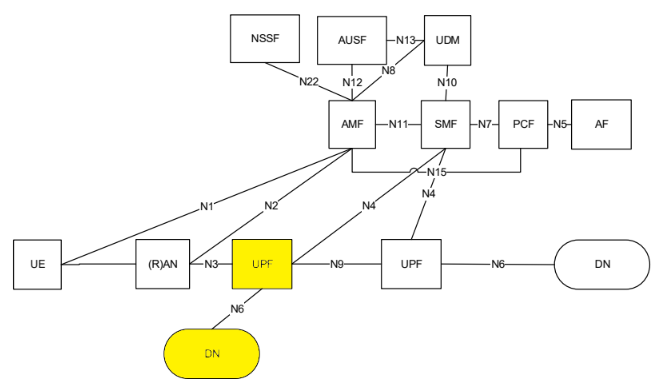
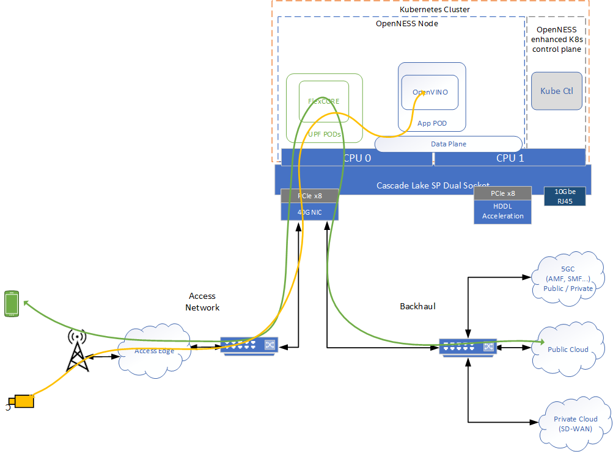

```text
SPDX-License-Identifier: Apache-2.0
Copyright (c) 2020 Intel Corporation
```
<!-- omit in toc -->
# Converged Edge Reference Architecture Near Edge
Reference architecture combines wireless and high performance compute for IoT, AI, video and other services.

- [Introduction](#introduction)
- [Smart Edge Open Converged Edge Reference Architectures](#smart-edge-open-converged-edge-reference-architectures)
- [Smart Edge Open Experience Kit Near Edge](#smart-edge-open-experience-kit-near-edge)
  - [Smart Edge Open Experience Kit Near Edge Experience Kit](#smart-edge-open-experience-kit-near-edge-experience-kit)
    - [Smart Edge Open Experience Kit Near Edge Smart Edge Open Configuration](#smart-edge-open-experience-kit-near-edge-smart-edge-open-configuration)
    - [Smart Edge Open Experience Kit Near Edge Deployment Architecture](#smart-edge-open-experience-kit-near-edge-deployment-architecture)
    - [Smart Edge Open Experience Kit Near Edge Experience Kit Deployments](#smart-edge-open-experience-kit-near-edge-experience-kit-deployments)
  - [Edge service applications supported on Smart Edge Open Experience Kit Near Edge](#edge-service-applications-supported-on-smart-edge-open-experience-kit-near-edge)
    - [OpenVINO](#openvino)
    - [Edge Insights Software](#edge-insights-software)
  - [Smart Edge Open Experience Kit Near Edge hardware platform](#smart-edge-open-experience-kit-near-edge-hardware-platform)
    - [Hardware acceleration](#hardware-acceleration)
  - [Data Flow](#data-flow)
  - [Smart Edge Open Experience Kit Near Edge Smart Edge Open deployment](#smart-edge-open-experience-kit-near-edge-smart-edge-open-deployment)
    - [Setting up target platform before deployment](#setting-up-target-platform-before-deployment)
  - [BIOS Setup](#bios-setup)
    - [Manual setup](#manual-setup)
  - [Setting up machine with Ansible](#setting-up-machine-with-ansible)
    - [Steps to be performed on the machine, where the Ansible playbook is going to be run](#steps-to-be-performed-on-the-machine-where-the-ansible-playbook-is-going-to-be-run)
- [5G Core Components](#5g-core-components)
  - [dUPF](#dupf)
    - [Overview](#overview)
    - [Deployment](#deployment)
    - [Prerequisites](#prerequisites)
    - [Settings](#settings)
    - [Configuration](#configuration)
  - [UPF](#upf)
    - [Overview](#overview-1)
    - [Deployment](#deployment-1)
    - [Prerequisites](#prerequisites-1)
    - [Settings](#settings-1)
    - [Configuration](#configuration-1)
  - [AMF-SMF](#amf-smf)
    - [Overview](#overview-2)
    - [Deployment](#deployment-2)
    - [Prerequisites](#prerequisites-2)
    - [Settings](#settings-2)
    - [Configuration](#configuration-2)
  - [Remote-DN](#remote-dn)
    - [Overview](#overview-3)
    - [Prerequisites](#prerequisites-3)
  - [Local-DN](#local-dn)
    - [Overview](#overview-4)
    - [Prerequisites](#prerequisites-4)
  - [OpenVINO](#openvino-1)
    - [Settings](#settings-3)
    - [Deployment](#deployment-3)
    - [Streaming](#streaming)
  - [EII](#eii)
- [Conclusion](#conclusion)
- [Learn more](#learn-more)
- [Acronyms](#acronyms)

## Introduction
5G and IoT convergence are transforming network infrastructure, paving the way to deliver unprecedented wireless compute power bandwidth and low latency to intelligent devices. Enterprises across many industries are looking to take advantage of 5G to avail of enhanced OTA security and reliability, improve ROI by adding connectivity and intelligence to existing services and making possible new use cases such as advanced automation and outdoor compute.

Intel® is a leader in the move to edge computing. The company has championed the development of the multi-access edge computing (MEC) standard and has fostered an ecosystem of hundreds of network functions software and services providers with solutions for edge computing. This technology innovation and ecosystem help with the challenges of building, testing, onboarding and managing the life cycle of services deployed various edge locations e.g., on a customer premises and network edge locations.

The Converged Edge Reference Architecture (Smart Edge Open Experience Kit) platform expands the cloud native platform in order to unify and converge networking, media and analytics workloads across various edge locations. The resulting platform simplifies workload convergence at the edge and adds base station density to wireless networks (see Figure 1). The Smart Edge Open Experience Kit platform abstracts network complexity and streamlines the solution go-to-market process from development to deployment, enabling solution providers to consume, deploy, and scale their services to offer new value to their customers. This reference architecture provides more detail on how to design, build and deploy Smart Edge Open Experience Kit Near Edge systems.


> Figure 1 - Converged workloads

Edge computing use cases's including artificial intelligence (AI), wireless and cloud native services have become more cost-effective to deploy as powerful universal customer premises equipment (uCPE) products facilitate advanced workload processing and services delivery. Cloud Native infrastructure combined with cloud native services and edge intelligence layered onto the uCPE provide agile and innovative workload processing and services with reasonable deployment and operational costs. 

Cloud native edge platforms based on Smart Edge Open Experience Kit offer a new value proposition to enterprise vertical market segments, such as smart city, transportation, industrial, and media (see Figure 2) by enabling new video and analytics use cases and delivering improvements in key performance indicators (KPIs) such as reduced latency, back haul savings, data privacy and reliability.

## Smart Edge Open Converged Edge Reference Architectures 
Converged Edge Reference Architectures manifest themselves as a collection of Ansible playbook, Helm charts and scripts which acts a single interface for users to deploy Smart Edge Open and optionally network functions and edge applications. The Reference Architecture organizes all the relevant Smart Edge Open microservices, Kubernetes extensions, enhancements and optimizations under easy to deploy solutions.

The Converged Edge Reference Architectures are categorized into the different edge network locations, each network location has its own unique set of HW and SW requirements that are implemented in the reference architecture. As described in the [Smart Edge Open Architecture](../architecture.md) the below diagram shows the different network locations.


> Figure 2 - Smart Edge Open Network locations

This paper will detail the Converged Edge Reference Architecture for Near Edge deployments. 

## Smart Edge Open Experience Kit Near Edge
The Smart Edge Open Experience Kit Near Edge deployment focuses on network edge aggregation points, mini central office and presents a scalable solution across the near edge network scaling from a single edge node to a multi cluster deployment services many edge nodes. The assumed 3GPP deployment architecture is based on below figure from 3GPP 23.501 Rel15 which shows the reference point representation for concurrent access to two (e.g. local and central) data networks (single PDU Session option). The highlighted yellow blocks - UPF and Data Network (edge apps) will be deployed on the Smart Edge Open Experience Kit Near Edge. 



> Figure 3 - 3GPP Network

The Smart Edge Open Experience Kit Near edge deployment can be designed in several ways but the biggest design impact is whether near edge deployments support a single or dual orchestration domains. In a single orchestration domain a single Kubernetes cluster is deployed that has edge nodes capable of hosting Network Functions (UPF in this case) and or Applications at the same time. In deployments with dual orchestration domains, network functions and applications are separated into two different Kubernetes clusters. Edge nodes are optimized for the specific type of deployment (network function or applications). 


> Figure 4 - Dual orchestration domains or single domain

### Smart Edge Open Experience Kit Near Edge Experience Kit
In order to support the most flexibility the first Smart Edge Open Experience Kit Near Edge implementation in Smart Edge Open supports a single Orchestration domain, optimizing the edge node to support Network Functions (UPF) and Applications at the same time. This is also useful for demonstration purposes as the Near Edge deployment can be scaled down to a single server reducing HW and cost associated with setup. 

#### Smart Edge Open Experience Kit Near Edge Smart Edge Open Configuration 
Smart Edge Open Experience Kit Near edge is a combination of the existing Smart Edge Open Reference Architecture [Smart Edge Open Experience Kit NGC](../flavors.md#smart-edge-open-experience-kit-core-control-plane-flavor), [Smart Edge Open Experience Kit UPF](../flavors.md#smart-edge-open-experience-kit-core-user-plane-flavor), [Smart Edge Open Experience Kit Apps](../flavors.md#smart-edge-open-experience-kit-minimal-flavor). Smart Edge Open Experience Kit Near edge takes the NGC Reference Architecture as a base and adds the additional service required to run applications and their associated HW Acceleration for AI workloads. Smart Edge Open Experience Kit Near edge also adds CMK and RMD to better support workload isolation and mitigate any interference from applications affecting the performance of the network functions. The below diagram shows the logical deployment with the Smart Edge Open micro services. 


> Figure 5 - Smart Edge Open Experience Kit Near Edge Architecture

#### Smart Edge Open Experience Kit Near Edge Deployment Architecture


> Figure 6 - Smart Edge Open Experience Kit Near Edge Deployment

The Smart Edge Open Experience Kit Near Edge architecture consists of a multi node (Xeon(R) SP based servers) cluster which can also be modified to support a single platform that hosts both the Edge Node and the Kubernetes Control Plane. The UPF is deployed using SRIOV-Device plugin and SRIOV-CNI allowing direct access to the network interfaces used for connection to the gNB and back haul. For high throughput workloads like UPF network function, it is recommended to use single root input/output (SR-IOV) pass through of the physical function (PF) or the virtual function (VF) as required. Also, in some cases, the simple switching capability in the NIC can be used to send traffic from one application to another as there is a direct path of communication required between the UPF and the Data plane this becomes an option. It should be noted the VF-to-VF option is only suitable when there is a direct connection between PODs on the same PF with no support for advanced switching. In this scenario it is advantageous to configure the UPF with three separate interfaces for the different types of traffic flowing in the system. This eliminates the need for additional traffic switching at the host. In this case there is a separate interface for N3 traffic to the Access Network, N9 and N4 traffic can share an interface to the backhaul network. While local data network traffic on the N6 can be switched directly to the local applications. Depending on performance requirements, a mix of data planes can be used on the platform to meet the varying requirements of the workloads. 

The applications are deployed on the same edge node as the UPF. Using CMK the applications can be deployed on the same CPU Socket or on separate CPU socket depending on the requirements. CPU pinning provides resource partitioning by pinning the workloads to specific CPU cores to ensure the low priority workloads don't interfere with the high priority NF workloads.

The use of Intel® Resource Director Technology (Intel® RDT) ensures the cache allocation and memory bandwidth are optimized for the workloads on running on the platform.

Intel® Speed Select Technology (Intel® SST) can be used to further enhance the performance of the platform.

The following EPA features are supported in Smart Edge Open

- <b>High-Density Deep Learning (HDDL)</b>: Software that enables OpenVINOâ„¢-based AI apps to run on Intel® Movidius Vision Processing Units (VPUs). It consists of the following components:
  - HDDL device plugin for K8s
  - HDDL service for scheduling jobs on VPUs
- <b>Visual Compute Acceleration - Analytics (VCAC-A)</b>: Software that enables OpenVINO-based AI apps and media apps to run on Intel® Visual Compute Accelerator Cards (Intel® VCA Cards). It is composed of the following components: 
  - VPU device plugin for K8s
  - HDDL service for scheduling jobs on VPU
  - GPU device plugin for K8s
- <b>FPGA/eASIC/NIC</b>: Software that enables AI inferencing for applications, high-performance and low-latency packet pre-processing on network cards, and offloading for network functions such as eNB/gNB offloading Forward Error Correction (FEC). It consists of: 
  - FPGA device plugin for inferencing
  - SR-IOV device plugin for FPGA/eASIC
  - Dynamic Device Profile for Network Interface Cards (NIC)
- <b>Resource Management Daemon (RMD)</b>: RMD uses Intel® Resource Director Technology (Intel® RDT) to implement cache allocation and memory bandwidth allocation to the application pods. This is a key technology for achieving resource isolation and determinism on a cloud-native platform. 
- <b>Node Feature Discovery (NFD)</b>: Software that enables node feature discovery for Kubernetes. It detects hardware features available on each node in a Kubernetes cluster and advertises those features using node labels. 
- <b>Topology Manager</b>: This component allows users to align their CPU and peripheral device allocations by NUMA node.
- <b>Kubevirt</b>: Provides support for running legacy applications in VM mode and the allocation of SR-IOV ethernet interfaces to VMs. 

#### Smart Edge Open Experience Kit Near Edge Experience Kit Deployments
The Smart Edge Open Experience Kit Near Edge Experience Kits deploys both the near edge cluster and also a second cluster to host the 5GC control plane functions and provide an additional Data Network POD to act as public network for testing purposed. Note the Access network and UE simulators are not configured as part of the Smart Edge Open Experience Kit Near Edge Experience Kit. Also required but not provided is a binary iUPF, UPF and 5GC components. Please contact local Intel® rep for more information. 


> Figure 7 - Smart Edge Open Experience Kit Experience Kit

### Edge service applications supported on Smart Edge Open Experience Kit Near Edge
The Smart Edge Open Experience Kit architectural paradigm enables convergence of edge services and applications across different market segments. This is demonstrated by taking diverse workloads native to different segments and successfully integrating within a common platform. The reference considers workloads segments across the following applications:

Security: Capture of video and facilitating facial recognition to identified bona fide individuals to determine access to a security perimeter

Smart city: Capture of live camera streams to monitor and measure both pedestrian and vehicle movement within a zone.

Industrial: Monitoring of the manufacturing quality of an industrial line, the capture of video streams focused on manufactured devices on an assembly line and the real-time removal of identified defect parts

While these use cases are addressing completely different market segments, they all have similar requirements:

Capture video either from a live stream from a camera, or streamed from a recorded file.

Process that video using inference with a trained machine learning model, computer vision filters, etc.

Trigger business control logic based on the results of the video processing.

Video processing is inherently compute intensive and, in most cases, especially in edge processing, video processing becomes the bottleneck in user applications. This, ultimately, impacts service KPIs such as frames-per-second, number of parallel streams, latency, etc.

Therefore, pre-trained models, performing numerical precision conversions, offloading to video accelerators, heterogeneous processing and asynchronous execution across multiple types of processors all of which increase video throughput are extremely vital in edge video processing. However these requirements can significantly complicate software development, requiring expertise that is rare in engineering teams and increasing the time-to-market.

#### OpenVINO
The Intel® Distribution of OpenVINO toolkit helps developers and data scientists speed up computer vision workloads, streamline deep learning inference and deployments, and enable easy, heterogeneous execution across Intel® architecture platforms from edge to cloud. It helps to unleash deep learning inference using a common API, streamlining deep learning inference and deployment using standard or custom layers without the overhead of frameworks.

#### Edge Insights Software
Intel's Edge Insights for Industrial offers a validated solution to easily integrate customers' data, devices, and processes in manufacturing applications, which helps enable near-real-time intelligence at the edge, greater operational efficiency, and security in factories.
Intel's Edge Insights for Industrial takes advantage of modern microservices architecture. This approach helps OEMs, device manufacturers, and solution providers integrate data from sensor networks, operational sources, external providers, and industrial systems more rapidly. The modular, product-validated software enables the extraction of machine data at the edge. It also allows that data to be communicated securely across protocols and operating systems managed cohesively, and analyzed quickly.
Allowing machines to communicate interchangeably across different protocols and operating systems eases the process of data ingestion, analysis, storage, and management. Doing so also helps industrial companies build powerful analytics and machine learning models easily and generate actionable predictive insights at the edge.
Edge computing software deployments occupy a middle layer between the operating system and applications built upon it. Intel's Edge Insights for Industrial is created and optimized for Intel® architecture-based platforms and validated for underlying operating systems. Its capability supports multiple edge-critical Intel® hardware components like CPUs, FPGAs, accelerators, and Intel® Movidius Vision Processing Unit (VPU). Also, its modular architecture offers OEMs, solution providers, and ISVs the flexibility to pick and choose the features and capabilities they wish to include or expand upon for customized solutions. As a result, they can bring solutions to market fast and accelerate customer deployments.

For more about the supported EII demos support see [EII whitepaper](https://github.com/smart-edge-open/edgeapps/blob/master/applications/eis-experience-kit/docs/whitepaper.md) 

### Smart Edge Open Experience Kit Near Edge hardware platform
Smart Edge Open Experience Kit is designed to run on standard, off-the-shelf servers with Intel® Xeon CPUs. Todays baseline requirements for servers are as follows:

Servers with Intel® Xeon Scalable processors or 2nd generation Intel® Xeon Scalable processors 

64 GB RAM recommended

At least 2x PCIe slots with Gen3 x8 or higher bandwidth

Much of Intel's development of the architecture has used rack-mount servers with a 20-core Intel® Xeon SP processor, 2 ports of at least 10 GbE connectivity, two solid state drives (SSD) of various capacities, and two full-height, full-length PCIe slots with x16 functionality.

See [Intel® Select Solutions](https://www.intel.com/content/www/us/en/products/docs/select-solutions/nfvi-forwarding-platform-brief.html) for more information.

#### Hardware acceleration
Based on deployment scenario and capacity requirements, there is the option to utilize hardware accelerators on the platform to increase performance of certain workloads. Hardware accelerators can be assigned to the relevant container on the platform through the Smart Edge Open Controller, enabling modular deployments to meet the desired use case.

AI acceleration
Video inference is done using the OpenVINO toolkit to accelerate the inference processing to identify people, vehicles or other items as needed. This is already optimized for software implementation and can be easily changed to utilize hardware acceleration if it is available on the platform.

Intel® Movidius Myriad X Vision Processing Unit (VPU) can be added to a server to provide a dedicated neural compute engine for accelerating deep learning inferencing at the edge. To take advantage of the performance of the neural compute engine, Intel® has developed the high-density deep learning (HDDL) inference engine plugin for inference of neural networks.

In the current example when the HDDL is enabled on the platform, the OpenVINO toolkit sample application reduces its CPU requirements from two cores to a single core. 

Note in future releases additional media analytics services will be enabled e.g VCAC-A card see for more info [Smart Edge Open VA Services](../applications/smartedge-open_va_services.md) 

### Data Flow
Both use cases scenarios involve traffic flowing in the uplink direction from the access network. The traffic depends on the use case - could be video traffic from industrial camera inspecting conveyor belt as per EII demo or traffic/pedestrian video as per OpenVINO demo. The below diagram shows the high level flow from an input video stream from a mobile device sent over the access network and processed by the OpenVINO toolkit sample application for inference. There are two types of traffic: one that is classified and sent to public cloud (green), and the other which is classified as video traffic and sent to the local data network where it is routed to OpenVINO toolkit sample application for inference and processing. Routing and classification is configured through the Smart Edge Open controller and CNCA micro service which request via AMF  to update the UL classification rules of the UPF and also the routing in the data plane. 



> Figure 8 - Smart Edge Open Experience Kit Near Edge Data flow


### Smart Edge Open Experience Kit Near Edge Smart Edge Open deployment

#### Setting up target platform before deployment

Steps to be performed on the target machine before deployment

1. Ensure that, the target machine gets IP address automatically on boot every time.  
Example command:  
`hostname -I`

2. Change target machine's hostname.
  * Edit file `vi /etc/hostname`. Press `Insert` key to enter Insert mode. Delete the old hostname and replace it with the new one. Exit the vi editor by pressing `Esc` key and then type `:wq` and press `Enter` key.
  * Edit file `vi /etc/hosts`. Press `Insert` key to enter Insert mode. Add a space at the end of both lines and write hostname after it. Exit the vi editor by pressing `Esc` key and then type `:wq` and press `Enter` key.

3. Reboot the target machine.

### BIOS Setup
There are two possibilities to change BIOS settings. The most important parameters to be set are:
* Disable Intel® Hyper-Threading Technology
* Enable Intel® Virtualization Technology
* Enable Intel® Virtualization Technology for Directed I/O
* Enable SR-IOV Support

#### Manual setup
Reboot platform, go to the BIOS setup during server boot process and set correct options.

### Setting up machine with Ansible

#### Steps to be performed on the machine, where the Ansible playbook is going to be run

1. Copy SSH key from machine, where the Ansible playbook is going to be run, to the target machines. Example commands:
    > NOTE: Generate ssh key if is not present on the machine: `ssh-keygen -t rsa` (Press enter key to apply default values)

    Do it for each target machine
    ```shell
    ssh-copy-id root@TARGET_IP
    ```
    > NOTE: Replace TARGET_IP with the actual IP address of the target machine.

2. Clone `ido-converged-edge-experience-kits` repo from `github.com/smart-edge-open` using git token.
    ```shell
    git clone --recursive GIT_TOKEN@github.com:smart-edge-open/ido-converged-edge-experience-kits.git
    ```
    > NOTE: Replace GIT_TOKEN with your git token.

3. Update repositories by running following commands.
    ```shell
    cd ido-converged-edge-experience-kits
    git submodule foreach --recursive git checkout master
    git submodule update --init --recursive
    ```

4. Provide target machines IP addresses for IDO-CEEK deployment in `ido-converged-edge-experience-kits/inventory.yml`. For Singlenode setup, set the same IP address for both `controller` and `node01`. In the same file define the details for Central Office cluster deployment.

    Example:
    ```yaml
    all:
      vars:
        cluster_name: near_edge_cluster    # NOTE: Use `_` instead of spaces.
        flavor: cera_5g_near_edge  # NOTE: Flavors can be found in `flavors` directory.
        single_node_deployment: true  # Request single node deployment (true/false).
        limit:                        # Limit ansible deployment to certain inventory group or hosts
    controller_group:
      hosts:
        controller:
          ansible_host: 172.16.0.1
          ansible_user: root
    edgenode_group:
      hosts:
        node01:
          ansible_host: 172.16.0.1
          ansible_user: root
    edgenode_vca_group:
      hosts:
    ptp_master:
      hosts:
    ptp_slave_group:
      hosts:

    ---
    all:
      vars:
        cluster_name: central_office_cluster  # NOTE: Use `_` instead of spaces.
        flavor: cera_5g_central_office               # NOTE: Flavors can be found in `flavors` directory.
        single_node_deployment: true # Request single node deployment (true/false).
        limit:                        # Limit ansible deployment to certain inventory group or hosts
    controller_group:
      hosts:
        controller:
          ansible_host: 172.16.1.1
          ansible_user: root
    edgenode_group:
      hosts:
        node1:
          ansible_host: 172.16.1.1
          ansible_user: root
    edgenode_vca_group:
      hosts:
    ptp_master:
      hosts:
    ptp_slave_group:
      hosts:

    ```

5. Edit `ido-converged-edge-experience-kits/inventory/default/group_vars/all/10-open.yml` and provide some correct settings for deployment.  

    Git token.
    ```yaml
    git_repo_token: "your git token"
    ```
    Proxy if is required.
    ```yaml
    # Setup proxy on the machine - required if the Internet is accessible via proxy
    proxy_enable: true
    # Clear previous proxy settings
    proxy_remove_old: true
    # Proxy URLs to be used for HTTP, HTTPS and FTP
    proxy_http: "http://proxy.example.org:3128"
    proxy_https: "http://proxy.example.org:3129"
    proxy_ftp: "http://proxy.example.org:3129"
    # Proxy to be used by YUM (/etc/yum.conf)
    proxy_yum: "{{ proxy_http }}"
    # No proxy setting contains addresses and networks that should not be accessed using proxy (e.g. local network, Kubernetes CNI networks)
    proxy_noproxy: "127.0.0.1,localhost,192.168.1.0/24"
    ```
    NTP server
    ```yaml
    ### Network Time Protocol (NTP)
    # Enable machine's time synchronization with NTP server
    ntp_enable: true
    # Servers to be used by NTP instead of the default ones (e.g. 0.centos.pool.ntp.org)
    ntp_servers: ['ger.corp.intel.com']
    ```

6. Edit file `ido-converged-edge-experience-kits/flavors/cera_5g_near_edge/all.yml` and provide Near Edge deployment configuration.

    Choose Edge Application that will be deployed:
    ```yaml
    # Choose which demo will be launched: `eis` or `openvino`
    # To do not deploy any demo app, refer to `edgeapps_deployment_enable` variable
    deploy_demo_app: "openvino"
    ```

    If OpenVINO was chosen as Edge Application, set the options:
    ```yaml
    model: "pedestrian-detection-adas-0002"
    display_host_ip: "" # update ip for visualizer HOST GUI.
    save_video: "enable"
    target_device: "CPU"
    ```

    Set interface name used for connection to Central Office cluster:
    ```yaml
    # PF interface name of N3, N4, N6, N9 created VFs
    host_if_name_cn: "eno1"
    ```

7. Edit file `ido-converged-edge-experience-kits/flavors/cera_5g_near_edge/controller_group.yml`

    Provide names of `network interfaces` that are connected to the second server and number of VF's to be created.
    ```yaml
    sriov:
      network_interfaces: {eno1: 5}
    ```
    > NOTE: On various platform interfaces can have different name. For example `eth1` instead of `eno1`. Please verify interface name before deployment and do right changes.

8.  Set all necessary settings for `Smart Edge Open Experience Kit 5G Central Office` in `ido-converged-edge-experience-kits/flavors/cera_5g_central_office/all.yml`.

    ```yaml
    # PF interface name of N4, N6, N9 created VFs
    host_if_name_cn: "eno1"
    ```

9.  Edit file `ido-converged-edge-experience-kits/flavors/cera_5g_central_office/controller_group.yml`

    Provide names of `network interfaces` that are connected to the second server and number of VF's to be created.
    ```yaml
    sriov:
      network_interfaces: {eno1: 5}
    ```

10. Edit file `ido-converged-edge-experience-kits/flavors/cera_5g_central_office/edgenode_group.yml`

    Set up CPUs isolation according to your hardware capabilities
    ```yaml
    # Variables applied with the profile
    tuned_vars: |
      isolated_cores=1-16,25-40
      nohz=on
      nohz_full=1-16,25-40

    # CPUs to be isolated (for RT procesess)
    cpu_isol: "1-16,25-40"
    # CPUs not to be isolate (for non-RT processes) - minimum of two OS cores necessary for controller
    cpu_os: "0,17-23,24,41-47"
    ```

    Set up hugepages settings
    ```yaml
    # Size of a single hugepage (2M or 1G)
    hugepage_size: "1G"
    # Amount of hugepages
    hugepage_amount: "8"
    ```

11. Deploy Converged Edge Experience Kit (Near Edge and Central Office clusters simultaneously)

    Silent deployment:
    ```shell
    python3 ./deploy.py
    ```

    > NOTE: In multicluster deployment logs are hidden by default. To check the logs `tail` tool can be used on deployment log files.

## 5G Core Components
This section describes in details how to build particular images and configure ansible for deployment.

### dUPF

#### Overview

The Distributed User Plane Function (dUPF) is a part of 5G Access Network, it is responsible for packets routing. It has 3 separate interfaces for `N3, N4/N9` and `N6` data lines. `N3` interface is used for connection with video stream source. `N4/N9` interface is used for connection with `UPF` and `AMF/SMF`. `N6` interface is used for connection with `EDGE-APP` (locally), `UPF` and `Remote-DN`

The `Smart Edge Open Experience Kit dUPF` component is deployed on `Smart Edge Open Experience Kit 5G Near Edge` node. It is deployed as a POD - during deployment of Smart Edge Open with `cera_5g_near_edge` flavor automatically.

#### Deployment

#### Prerequisites

To deploy dUPF correctly it is needed to provide Docker image to Docker repository on target machine(Smart Edge Open Experience Kit 5G Near Edge node). There is a script on the `https://github.com/smart-edge-open/edgeapps/tree/master/network-functions/core-network/5G/UPF` repo provided by Smart Edge Open Experience Kit, which builds the image automatically.

```sh
./build_image.sh -b i-upf -i i-upf
```

#### Settings
Update interface name in file `ido-converged-edge-experience-kits/flavors/cera_5g_near_edge/all.yml` that is used for connection to Central Office cluster (AMF/SMF and UPF).

```yaml
host_if_name_cn: "eno1"
```

#### Configuration
The dUPF is configured automatically during the deployment.

### UPF
#### Overview

The `User Plane Function (UPF)` is a part of 5G Core Network, it is responsible for packets routing. It has 2 separate interfaces for `N4/N9` and `N6` data lines. `N4/N9` interface is used for connection with `dUPF` and `AMF/SMF` (locally). `N6` interface is used for connection with `EDGE-APP`, `dUPF` and `Remote-DN` (locally).

The Smart Edge Open Experience Kit UPF component is deployed on `CERA 5G Central Office` node. It is deployed as a POD - during deployment of Smart Edge Open with `cera_5g_central_office` flavor automatically.

#### Deployment

#### Prerequisites

To deploy UPF correctly it is needed to provide a Docker image to Docker Repository on target machine(Smart Edge Open Experience Kit 5G Central Office node). There is a script on the `https://github.com/smart-edge-open/edgeapps/tree/master/network-functions/core-network/5G/UPF` repo provided by Smart Edge Open Experience Kit, which builds the image automatically.

```sh
./build_image.sh -b psa-upf -i psa-upf
```

#### Settings

Update interface name in file `ido-converged-edge-experience-kits/flavors/cera_5g_central_office/all.yml` that is used for connection to Near Edge cluster (dUPF).

```yaml
host_if_name_cn: "eno1"
```

#### Configuration
The `UPF` is configured automatically during the deployment.

### AMF-SMF
#### Overview

AMF-SMF is a part of 5G Core Architecture responsible for `Session Management(SMF)` and `Access and Mobility Management(AMF)` Functions - it establishes sessions and manages date plane packages.

The Smart Edge Open Experience Kit `AMF-SMF` component is deployed on `CERA 5G Central Office` node and communicates with UPF and dUPF, so they must be deployed and configured before `AMF-SMF`.

It is deployed as a POD - during deployment of Smart Edge Open with `cera_5g_central_office` flavor automatically.

#### Deployment
#### Prerequisites

To deploy AMF-SMF correctly it is needed to provide Docker image to Docker repository on target machine(smartedge-open-experience-kit_5g_co). There is a script on the `https://github.com/smart-edge-open/edgeapps/tree/master/network-functions/core-network/5G/AMF_SMF` repo provided by Smart Edge Open Experience Kit, which builds the image automatically.

```sh
./build_image.sh -b amf-smf
```

#### Settings
No special settings are required for AMF-SMF deployment.

#### Configuration
The `AMF-SMF` is configured automatically during the deployment.

### Remote-DN

#### Overview
Remote Data Network is component, which represents `“internet”` in networking. Smart Edge Open Experience Kit Core Network manages which data should apply to `Near Edge Application(EII/OpenVINO)` or go further to the network.


#### Prerequisites
Deployment of Remote-DN is completely automated, so there is no need to set or configure anything.


### Local-DN
#### Overview

Local Data Network is component, which is responsible for combining Core part with Edge applications. It can convert incoming video streaming protocol for acceptable format by EII/OpenVino


#### Prerequisites
Deployment of Local-DN is completely automated, so there is no need to set or configure anything.

### OpenVINO

#### Settings
In the `ido-converged-edge-experience-kits/flavors/cera_5g_near_edge/all.yml` file can be chosen which application should be built and deploy. Set a proper value for the deploy_app variable.
```yaml
deploy_demo_app: "openvino"
```

Several variables must be set in the file `ido-converged-edge-experience-kits/flavors/cera_5g_near_edge/all.yml`:
```yaml
model: "pedestrian-detection-adas-0002" - Model for which the OpenVINO demo will be run. Models which can be selected: pedestrian-detection-adas-0002, pedestrian-detection-adas-binary-0001, pedestrian-and-vehicle-detector-adas-0001, vehicle-detection-adas-0002, vehicle-detection-adas-binary-0001, person-vehicle-bike-detection-crossroad-0078, person-vehicle-bike-detection-crossroad-1016, person-reidentification-retail-0031, person-reidentification-retail-0248, person-reidentification-retail-0249, person-reidentification-retail-0300, road-segmentation-adas-0001

save_video: "enable" - For value "enable" the output will be written to /root/saved_video/ov-output.mjpeg file on Smart Edge Open Experience Kit 5G Near Edge node. This variable should not be changed.
```

#### Deployment
After running the `deploy.py` script, pod ov-openvino should be available on Smart Edge Open Experience Kit 5G Near Edge node. The status of the ov-openvino pod can be checked by use:
```shell
kubectl get nodes,pods,svc -A -o wide|grep ov-openvino
```
Immediately after creating, the ov-openvino pod will wait for input streaming. If streaming is not available, ov-openvino pod will restart after some time. After this restart, this pod will wait for streaming again.

#### Streaming
Video to OpenVINO pod should be streamed to IP `192.168.1.101` and port `5000`. Make sure that the pod with OpenVINO is visible from yours streaming machine. In the simplest case, the video can be streamed from the same machine where pod with OpenVINO is available.

Output will be saved to the `saved_video/ov-output.mjpeg` file (`save_video` variable in the `ido-converged-edge-experience-kits/flavors/cera_5g_near_edge/all.yml` should be set to `"enable"` and should be not changed).

Streaming is possible from a file or from a camera. For continuous and uninterrupted streaming of a video file, the video file can be streamed in a loop. An example of a Bash file for streaming is shown below.
```shell
#!/usr/bin/env bash
while :
do
  ffmpeg -re -i Rainy_Street.mp4 -pix_fmt yuvj420p -vcodec mjpeg \
    -huffman 0 -map 0:0 -pkt_size 1200 -f rtp rtp://192.168.1.101:5000
done
```
Where:
* `ffmpeg` - Streaming software must be installed on the streaming machine.
* `Rainy_Street.mp4` - The file that will be streamed. This file can be downloaded by: 
    ```shell 
    wget https://storage.googleapis.com/coverr-main/zip/Rainy_Street.zip
    ```

The OpenVINO demo, saves its output to saved_video/ov-output.mjpeg file on the Smart Edge Open Experience Kit 5G Near Edge node.

- To stop the OpenVINO demo and interrupt creating the output video file - run on the Smart Edge Open Experience Kit 5G Near Edge node: kubectl delete -f /opt/openvino/yamls/openvino.yaml
- To start the OpenVINO demo and start creating the output video file (use this command if ov-openvino pod does not exist) - run on the Smart Edge Open Experience Kit 5G Near Edge node: kubectl apply -f /opt/openvino/yamls/openvino.yaml

### EII
For EII deployment following flags need to update on `ido-converged-edge-experience-kits/flavors/cera_5g_near_edge/all.yml` there after all EII deployment are automated.
```yaml
# Choose which demo will be launched: exmaple `eis`
deploy_demo_app: "eis"
# For demo app type choose demo type as `pcb` or `safety`
eis_demo_app_type: "pcb"
# provide release package archive absolute path
eis_release_package_path: ""
```

For more details about `eis-experience-kit` check [README.md](https://github.com/smart-edge-open/edgeapps/blob/master/applications/eis-experience-kit/README.md)

## Conclusion
Smart Edge Open Experience Kit Near Edge deployment provide a reference implementation on how to use Smart Edge Open software to efficiently deploy, manage and optimize the performance of network functions and applications suited to running at the Near Edge Network. With the power of Intel® architecture CPUs and the flexibility to add hardware accelerators, Smart Edge Open Experience Kit systems can be customized for a wide range of applications. 

## Learn more
* [Building on NFVI foundation from Core to Cloud to Edge with Intel® Architecture](https://networkbuilders.intel.com/social-hub/video/building-on-nfvi-foundation-from-core-to-cloud-to-edge-with-intel-architecture)
* [Edge Software Hub](https://software.intel.com/content/www/us/en/develop/topics/iot/edge-solutions.html)
* [Solution Brief: Converged Edge Reference Architecture (Smart Edge Open Experience Kit) for On-Premise/Outdoor](https://networkbuilders.intel.com/solutionslibrary/converged-edge-reference-architecture-cera-for-on-premise-outdoor#.XffY5ut7kfI)

## Acronyms

|             |                                                               |
|-------------|---------------------------------------------------------------|
| AI          | Artificial intelligence                                       |
| AN          | Access Network                                                |
| CERA        | Converged Edge Reference Architecture                         |
| CEEK        | Converged Edge Experience Kits                                |
| CN          | Core Network                                                  |
| CNF         | Container Network Function                                    |
| CO          | Central Office                                                |
| CommSPs     | Communications service providers                              |
| DPDK        | Data Plane Developer Kit                                      |
| eNB         | e-NodeB                                                       |
| gNB         | g-NodeB                                                       |
| EPA         | Enhance Platform Awareness                                    |
| EPC         | Extended Packet Core                                          |
| FPGA        | Field programmable gate array                                 |
| IPSEC       | Internet Protocol Security                                    |
| MEC         | Multi-access edge computing                                   |
| Smart Edge Open    | Open Network Edge Services Software                           |
| OpenVINO    | Open visual inference and neural network optimization         |
| OpenVX      | Open Vision Acceleration                                      |
| OVS         | Open Virtual Switch                                           |
| PF          | Physical function                                             |
| RAN         | Radio Access Network                                          |
| SD-WAN      | Software defined wide area network                            |
| uCPE        | Universal customer premises equipment                         |
| UE          | User Equipment                                                |
| VF          | Virtual function                                              |
| VM          | Virtual Machine                                               |
