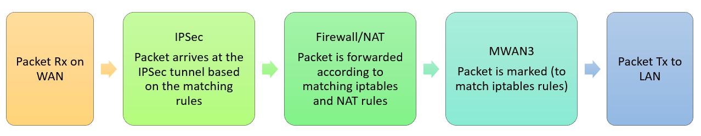
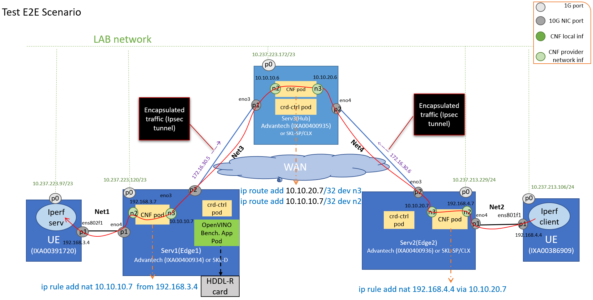
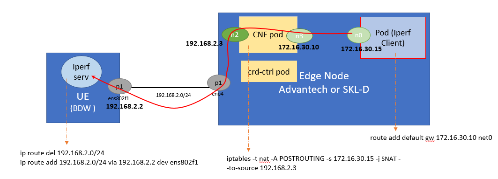
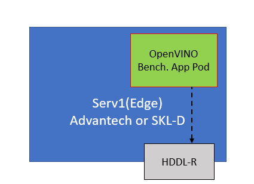

```text
SPDX-License-Identifier: Apache-2.0     
Copyright © 2019 Intel Corporation  
```
<!-- omit in toc -->
# SDWAN in OpenNESS
- [Introduction](#introduction)
- [SD-WAN](#sd-wan)
- [ICN SD-WAN Implementation](#icn-sd-wan-implementation)
  - [SD-WAN CNF](#sd-wan-cnf)
  - [SD-WAN CRD Controller](#sd-wan-crd-controller)
  - [CR Definitions](#cr-definitions)
- [CNF Configuration via OpenWRT Packages](#cnf-configuration-via-openwrt-packages)
  - [Mwan3](#mwan3)
  - [Firewall](#firewall)
  - [IPSec](#ipsec)
- [SD-WAN CNF Packet Flow](#sd-wan-cnf-packet-flow)
- [OpenNESS Integration](#openness-integration)
  - [Goals](#goals)
  - [Networking Implementation](#networing-implementation)
  - [CERA flavors](#cera-flavors)
    - [CERA SDWAN Edge](#cera-sdwan-edge)
    - [CERA SDWAN Hub](#cera-sdwan-hub)
- [Deployment](#deployment)
  - [E2E Scenarios](#e2e-scenarios)
  - [Hardware Specification](#hardware-specification)
  - [Scenario 1](#scenario-1)
  - [Scenario 2](#scenario-2)
  - [Scenario 3](#scenario-3)
  - [Resource Consumption](#resource-consumption)
    - [Methodology](#methodology)
    - [Results](#results)
- [References](#References)
- [Acronyms](#acronyms)

## Introduction
With the growth of global organizations, there has come a rise in the need for connecting branch offices distributed across the world. As the organization applications have been moving from the corporate data centers to the cloud/on-premise edge, their branches require secure and reliable, low latency, and affordable links to access them. One way is to achieve it via leveraging the public Internet (WAN) and enabling secure links that move data across WAN to private edge locations where destined edge applications are running.
The primary role of traditional Wide Area Network (WAN) is to connect clients to applications hosted anywhere on the Internet. The applications are reached based on public TCP/IP addresses, and routing tables configured on routes. Traditionally branch offices were connected to their headquarter data centers also via multiple configurable routers and leased connections. Thus, the connections were complex to manage and expensive. However, with the move of the applications to the cloud and edge, where applications are hosted in private networks without public addresses, accessing these applications from outside the edge cluster is not possible without applying even more complex rules and policies.


Software-defined WAN introduces a new way of management and operation of WAN. First of all, due to its software-defined nature, it decouples policy and rules configuration from the networking hardware (routers) and simplifies the process. SD-WAN applications can now be hosted on a Universal Customer Premise Equipment (uCPE). The configuration and management are centralized, which makes the networks more scalable. Also, leveraging SD-WAN helps to optimize edge applications by reducing packet latency while sending traffic destined for WAN directly to WAN, omitting the data center.
This paper describes how OpenNESS integrates features of uCPE to offer SD-WAN capabilities for Edge optimization and how it leverages SD-WAN functionality to allow edge-to-edge communication via WAN.

## SD-WAN
Universal Customer Premise Equipment (uCPE) is a general-purpose platform that integrates compute, storage and networking to provide network services (such as SD-WAN) to any site on a network. These network services are implemented as virtual functions or cloud-native network functions.

SD-WAN is a set of software applications that enable application-aware, intelligent, and secure routing of traffic across the WAN. The decisions on how to route particular application traffic are based on specific requirements for this application, such as its priority and security policies. One of SD-WAN main features is that it allows for using the public internet as a secure form of WAN. It is possible due to the configuration of secure tunnels on the links connecting local networks across the WAN.

OpenNESS provides a reference solution for SD-WAN consisting of building blocks for cloud-native deployment and also reference Cloundative network functions (CNFs) and Applications.


## ICN SD-WAN Implementation
OpenNESS integrates Akraino ICN [SD-WAN](https://github.com/akraino-edge-stack/icn-sdwan/) solution to offer SD-WAN functionality. SD-WAN project is based on OpenWRT, an open-source project based on Linux operating system. The fact that it has integrated writeable filesystem and package management makes it fully customizable for the user who can choose to install only the packages and configuration they need to build their applications based on OpenWRT operating system. OpenWRT is primarily used as an OS for embedded devices to build applications for routing network traffic. More details about OpenWRT can be found [here](https://openwrt.org/)

SD-WAN application is based on the following set of OpenWRT packages:

  - mwan3 (for Multiple WAN link support)

  - IPTables (for firewall, SNAT, DNAT)

  - strongswan (for IPsec)

With these packages it supports the following functionality:

  - IPsec tunnels across K8s clusters - Supporting multiple types of K8s clusters "K8s clusters having static public IP address", "K8s clusters having dynamic public IP address with static FQDN" and "K8s clusters with no public IP".

  - Stateful inspection firewall (for inbound and outbound connections)

  - Source NAT and Destination NAT for supporting K8s clusters whose POD and ClusterIP subnets are overlapping.

  - Multiple WAN link

SD-WAN is an open-source, OpenWRT based SD-WAN solution, but enhanced and optimized for IA accelerators.

The ICN SD-WAN project is made cloud-native as it’s main functionality is containerized and ready to be deployed in a microservices environment with provided Helm charts. It is targeted for edge locations.

ICN SD-WAN as a platform includes three separate features: CNF,  CRD controller, and CR definitions.

### SD-WAN CNF
The major functionality of SD-WAN is implemented as a Cloud-native Network Function or CNF, and deployable within a Kubernetes cluster/environment. The CNF is based on OpenWRT “x86-generic rootfs” image and runs a set of user-space applications: fw3 for firewall and NAT configuration, mwan3 realizing multi-WAN functionality, and strongswan for implantation of IPSec tunnels. SD-WAN CNF can be deployed as a pod on node with external network connection and arguments for configuration of:

  - LAN interface configuration – to create and connect virtual, local networks within the Edge cluster (local branch) to the CNF

  - WAN interfaces configuration – to initialize interface(s) that connect(s) the CNF and connected LANs to external Internet - WAN (also called a provider network) and to initialize the traffic rules (policy, rules, etc.) for the interfaces

SD-WAN traffic rules and WAN interfaces must be configured at runtime through the Restful API. The CNF implements Luci CGI plugin to provide Restful API. The restful API calls are initiated and passed to the CNF by a CRD Controller described in the next paragraph. Supported restful API provides the capability to list available SD-WAN services (mwan3, firewall, and ipsec), get service status, and execute service operations for adding, viewing, and deleting mwan3, firewall, and IPsec settings.

### SD-WAN CRD Controller
A separate containerized module, CRD Controller (Config Agent) has been implemented to support executing commands in a CNF through Rest API calls. It monitors CRs applied through K8s APIs and translates them into Rest API calls that carry the CNF configuration to the CNF instance.

CRD Controller includes several functions:

  - SD-WAN Controller to monitor/control SD-WAN CRs 

  - Mwan3conf Controller to monitor Mwan3Conf CR

  - FirewallConf Controller to monitor FirewallConf CR 

  - IPSec Controller to monitor IpSec CRs.


### CR Definitions
With the CRD Controller, the user can configure SD-WAN rules by deploying SD-WAN CRs. The rules define how the CNF behaves. CNF supports three classes of rules: mwan3, firewall, ipsec. But each class includes several kinds of rules. Mwan3 has 2 kinds of rules: mwan3_policy and mwan3_rule. The firewall class has 5 kinds of rules: firewall_zone, firewall_snat, firewall_dnat, firewall_forwarding, firewall_rule.  Each kind of SD-WAN rule is defined by a CRD. A CR is an instance of a CRD and carries an actual rule configuration to the CR Controller that passes the configuration to a CNF through a restful API call. The CNF uses OpenWRT applications to apply the configurations onto the CNF WAN interfaces.

SD-WAN rules are required to deploy a CNF. In a Kubernetes namespace, with more than one CNF deployment and many SD-WAN rule CRs, labels are used to correlate a CNF with SD-WAN rule CRs.

## CNF Configuration via OpenWRT Packages
### Mwan3
OpenWRT mwan3 package provides the capabilities for multiple WAN management: WAN interfaces management, outbound traffic rules, traffic load balancing etc. The package allows for connecting the Edge to WANs of different providers and for specifying different rules for the links.
According to the OpenWRT website, the mwan3 package provides the following functionality and capabilities:

  - Provides outbound WAN traffic load balancing or fail-over with multiple WAN interfaces based on a numeric weight assignment

  - Monitors each WAN connection using repeated ping tests and can automatically route outbound traffic to another WAN interface if the first WAN interface loses connectivity

  - Creating outbound traffic rules to customize which outbound connections should use which WAN interface (policy-based routing). This can be customized based on source IP, destination IP, source port(s), destination port(s), type of IP protocol etc.

  - Supports physical and/or logical WAN interfaces

  - Uses firewall mask (default 0x3F00) to mark outgoing traffic which can be configured in the /etc/config/mwan3 globals section and can be mixed with other packages that use the firewall masking feature. This value is also used to set how many interfaces are supported.

Mwan3 is useful for routers with multiple internet connections where users have control over what traffic goes through which specific WAN interface. It can handle multiple levels of primary and backup interfaces, where different sources can have different primary or backup WANs. Mwan3 uses Netfilter mark mask to be compatible with other packages (such as OpenVPN, PPTP VPN, QoS-script, Tunnels, etc) so traffic can be routed also based on the default routing table.
Mwan3 is triggered by a hotplug event when an interface comes up. Then it creates a new custom routing table and iptables rules for this interface. It then sets up iptables rules and uses iptables MARK to mark certain traffic. Based on these rules, the kernel determines which routing table to use. Once all the routes and rules are initially set up, mwan3 exits. The kernel takes care of all the routing decisions. A monitoring script (mwan3track) runs in the background checking if each WAN interface is up using a ping test. If an interface goes down, the script issues a hotplug event to cause mwan3 to adjust routing tables to the interface failure, delete all the rules and routes to that interface.
Another component (mwan3rtmon) which is responsible for keeping the main routing table in sync with the interface routing tables constantly monitors the routing table changes.
OpenWRT MWAN3 configuration includes the below sections:

  - Global: common configuration special used to configure routable loopback address (for OpenWRT 18.06)

  - Interface: define how each WAN interface is tested for up/down status

  - Member: represents an interface with a metric and a weight value

  - Policy: defines how traffic is routed through the different WAN interface(s)

  - Rule: describes what traffic to match and what policy to assign for that traffic.

SD-WAN CNF will be created with Global and Interface sections initialized based on the interfaces allocated to CNF. Once CNF starts SD-WAN MWAN3 CNF API can be used to get/create/update/delete an mwan3 rule and policy per Member.

### Firewall
OpenWrt uses firewall3 (fw3) netfilter/iptable rule builder application. It runs in the user-space to parse a configuration file into a set of iptables rules, sending each of the rules to the kernel netfilter modules. The fw3 application is used by OpenWRT to “safely” construct a rule set while hiding much of the details. The fw3 configuration automatically provides the router with a base set of rules and an understandable configuration file for additional rules.

fw3 similarly to iptables application it is based on libiptc library that is used to communicate with the Netfilter kernel modules. Both fww and iptables applications follow the same steps to apply rules on Netfilter:

  - establishe a socket and read the Netfilter table into the application

  - modify the chains, rules, etc. in the table (all parsing and error checking is done in user-space by libiptc)

  - replace the Netfilter table in the kernel

fw3 is typically managed by invoking the shell script /etc/init.d/firewall that accepts the following set of arguments (start, stop, restart, reload, flush). Behind the scenes, /etc/init.d/firewall then calls fw3, passing the argument to the binary. 

OpenWRT firewall configuration with use of fw3 application includes below sections:

  - Default: declares global firewall settings that do not belong to specific zones

  - Include: used to enable customized firewall scripts

  - Zone: groups one or more interfaces and serves as a source or destination for forwardings, rules, and redirects.

  - Forwarding: control the traffic between zones

  - Redirect: defines port forwarding (NAT) rules

  - Rule: defines basic accept, drop, or reject rules to allow or restrict access to specific ports or hosts.

SD-WAN firewall API provides support to get/create/update/delete Firewall Zone, Redirect, Rule, and Forwardings.

### IPSec
SD-WAN solution leverages IPSec functionality in SD-WAN CNF to setup secure tunnels to enable Edge-to-WAN and Edge-WAN-Edge (to connect Edges via WAN) communication. SD-WAN uses StrongSwan implementation of IPSec. IPsec rules are integrated with OpenWRT firewall that enables custom firewall rules. IPsec uses the default firewall mechanism to update the firewall rules and injects all the additionally required settings according to IPsec configuration stored in /etc/config/ipsec . 

SD-WAN configures the site-to-site tunnels to connect edge networks through a Hub located in the external network. The Hub is a server that acts as a proxy between the two Edges.  The Hub also runs SD-WAN CNF configured in the way that it knows how to access SD-WAN CNFs deployed on both Edges.  In that case, to create the IPsec tunnel the WAN interface on the Edge is treated as one side of the tunnel and the connected  WAN interface on the Hub is configured as the responder. Both Edges are configured as Initiator.

## SD-WAN CNF Packet Flow

Here is the typical packet flow through the SD-WAN CNF for Rx (WAN to LAN) when a packet sent from external network enters the edge cluster:



Here is the typical packet flow through the SD-WAN CNF for Tx (LAN to WAN) when a packet leaves from the edge cluster to the external network:


## OpenNESS Integration
### Goals
Openness leverages SD-WAN project to offer SD-WAN service within on-premise edge to enable secure and optimized inter-edge data transfer. This functionality is sought by global corporations with their branch offices distributed across many geo-locations as it optimizes access to their applications,  simplifying their connections to WAN and other edge locations via WAN.

### Networking Implementation
OpenNESS deployment for SD-WAN implements cluster networking with two CNIs: Calico CNI acts as the primary CNI, whereas ovn4nfv acts as the secondary CNI. Multus is used in order to allow for attaching multiple network interfaces to pods.

[Calico](https://docs.projectcalico.org/about/about-calico) CNI configures default network overlay for the OpenNESS cluster. Calico is considered a lighter solution than Kube-OVN which is OpenNESS preferable CNI plugin for the primary network in OpenNESS clusters, thus Calico has been chosen to connect the management interfaces within the K8s cluster (diagram for calico vs kubeovn to be added)

[ovn4nfv-k8s-plugin](https://github.com/opnfv/ovn4nfv-k8s-plugin) is a CNI plugin based on ovn. It can work together with Multus CNI to add multiple interfaces for the pod. In that case one of the interfaces is the Multus default interface (Calico). The other interfaces are added by ovn4nfv-k8s-plugin according to the pod annotation. With ovn4nfv-k8s-plugin, we can create a virtual network in run-time. Also, we can connect the pod with the provider network, this is important for SDWAN CNF. Ovn4nfv also enables service function chaining.

 SD-WAN CNF in order to work as a proxy for applications running on the Edge and to connect them to them WAN needs to have configured two types of network interfaces. (1) Virtual LAN network that is created on a network interface connecting Edge applications. Ovn4nfv plugin allows for the simplified creation of an OVN network based on the provided configuration and attaching it to a chosen interface on a CNF. 

The same OVN network must be attached to any connecting application pod. (2) Provider Network (WAN interface) must be created to connect to an external network. Provider network plugs into the physical network infrastructure via layer-2(via bridging/switching)
### CERA
OpenNESS has defined two CERA flavors that configure the platform accordingly to act as a uCPE platform for SDWAN CNF. Even though  there is only one flavor of CNF, it can be used for two different purposes:
#### CERA SD-WAN Edge
This flavor is used to deploy SD-WAN CNF on a single node Edge cluster, next to multiple edge applications. The major goal of this flavor is to bring up a K8s based platform that will bust the performance of deployed edge applications and reduce resources used by the K8s systems. This platform needs to be optimized to allow the applications for the best performance. OpenNESS provides support for the deployment of OpenVINO™ applications and workloads acceleration through Intel® Vision Accelerator Design with the Intel® Movidius™ VPU HDDL-R add-in card. That is why this flavor enables HDDL plugin to support the HDDL card inserted into a PCI slot on to the Edge node and provide acceleration to high-performance applications. The flavor also enables Node Feature Discovery service (NFD) on the cluster to provide awareness to the edge applications of the nodes’ features. Finally, the flavor implements ISTIO Service Mesh on the default namespace to connect the edge applications... Service mesh acts as a middleware between the edge applications/services and the OpenNESS platform and it provides abstractions for traffic management, observability, and security of the edge micro-services in the mesh. Istio is a cloud-native service mesh platform that provides the service mesh capabilities such as Traffic Management, Security, and Observability uniformly across a network of services. Openness integrates with Istio service mesh to reduce the complexity of large scale edge applications, services, and network functions. 

To minimalize resource consumption by the cluster, the flavor disables services such as EAA, Edge DNS, and Kafka. Telemetry service stays active for all the K8s deployments.


#### CERA SD-WAN Hub
SDWAN Hub flavor prepares an OpenNESS platform for a single node cluster that will be primarily functioning as an SD-WAN Hub. That means it will only deploy SD-WAN controller and CNF. No customer Edge applications are expected to run on the cluster and no other network functions except SD-WAN CNF. That is why the node does not enable support for acceleration hardware and Network Feature Discovery, either Service Mesh.

The Hub is a server that acts as a proxy between different Edges. The hub is essential to connect the edges through WAN when applications within the Edge have no public IP addresses therefore they cannot be accessed without configuring certain rules. These rules can be configured globally on a device acting as a Hub for the Edge locations. This makes the Hub aware of the Edge locations. 

Hub node is expected for 2 purposes:

 If the edge application wants to access the internet or an external application wants to access service running in the edge node, the hub node can act as a gateway with a security policy applied.

 for communication between edge nodes located at a different location (in different clusters), if either edge node has public IP, then the IP Tunnel will be set up directly between nodes. But if both edge nodes don’t have public IP, the hub node will act as proxy to enable it communication, like: edge node1 <-IPSec tunnel-> Hub node1 <- IPSec Tunnel-> Hub Node2 <-IPSec tunnel-> edge node2.

SD-WAN feature run on hub node needs high performance special for network IO processing.


## Deployment
### E2E Scenarios
There have been three types of tests performed in the lab environment to verify end to end deployment of OpenNESS featuring SD-WAN functionality. The three E2E scenarios are described in the following sections of this whitepaper. 
#### Hardware Specification


| Hardware |                        | UE                                 | Edge & Hub                           |
| ---------|----------------------- | ---------------------------------- | ------------------------------------ |
| CPU      | Model name:            |  Intel(R) Xeon(R)                  | Intel(R) Xeon(R) D-2145NT            |     
|          |                        |  CPU E5-2658 v3 @ 2.20GHz          | CPU @ 1.90GHz                        |
|          | CPU MHz:               |  1478.527                          | CPU MHz: 1900.000                    |
|          | L1d cache:             |  32K                               | 32K                                  | 
|          | L1i cache:             |  32K                               | 32K                                  |
|          | L2 cache:              |  256K                              | 1024K                                |
|          | L3 cache:              |  30720K                            | 1126K                                |
|          | NUMA node0 CPU(s):     |  0-11                              | 0-15                                 |
|          | NUMA node1 CPU(s):     |  12-23                             |                                      |
| NIC      | Ethernet controller:   | Intel Corporation                  | Intel Corporation                    |
|          |                        | 82599ES 10-Gigabit                 | Ethernet Connection                  |
|          |                        | SFI/SFP+ Network Connection        | X722 for 10GbE SFP+                  |
|          |                        | (rev 01)                           | Subsystem: Advantech Co. Ltd         |
|          |                        | Subsystem: Intel Corporation       | Device 301d                          |
|          |                        | Ethernet Server Adapter X520-2     |                                      |

#### Scenario 1

In this scenario, two UEs are connected to two separate edge nodes which are connected to one common hub. It's aim is to showcase that the basic connectivity accross the edge clusters can be achieved with use of SD-WAN. The scenario proves that based on this connectivity traffic can be sent between the edge clusters. To prove it, the traffic flow is initiated on one UE and received on the other UE.  

For this scenario, OpenNESS is deployed on both edges and the hub. On each edge and hub, SD-WAN controller and CNF are set up. Then CRs are used to configre the CNF and set up IPsec tunnels between the edge and the hub and to configure rules on the WAN interfaces connecting edges with the hub. Each CNF is connected to two provider networks. The CNFs on Edge 1 and Edge 2 use provider network n2 to connect to UEs outside the Edge, and the provider network n3 to connect the hub in another edge location. Currently, the UE connects to the CNF directly without the switch. In the picture below, UE1 is in the same network(NET1) as Edge1 port. It is considered a private network.
This scenario verifies that sample traffic can be sent from the UE connected to Edge2 to another UE connected to Edge1 over secure WAN links connecting Edge1 and Edge2 to a hub. To demonstrate this connectivity, traffic from the Iperf-client application running on Edge2 UE is sent towards Edge1 UE running the Iperf server application.

Edge1  node also deploys an OpenVINO app and in this way, this scenario integrates scenario 3 described below.



More detailed description of this E2E test is provided under the link in the OpenNESS documentation for this SD-WAN [scenario](https://github.com/otcshare/edgeapps/blob/master/network-functions/sdewan_cnf/e2e-scenarios/three-single-node-clusters/E2E-Overview.md) 

#### Scenario 2
This scenario demonstrates a simple OpenNESS SD-WAN use case that involves only one single node cluster that deploys SD-WAN CNF and an application pod running Iperf client. CNF pod and Iperf-client pod are attached to one virtual OVN network using n3 and n0 interfaces respectively. CNF has configured a provider network on interface n2 that is attached to a physical interface on the Edge node to work as a bridge to connect the external network. This scenario demonstrates that after a  proper configuration of the CNF the traffic sent from the application pod uses SD-WAN CNF as proxy and arrives at the User Equipment (UE) in the external network.  The E2E traffic from the Iperf3 client application running on the application pod deployed on the Edge node travels to the external UE via 10G NIC port. The UE runs the Iperf3 server application. The OpenNESS cluster consisting of the Edge Node server has is deployed with SD-WAN-edge flavor. The Iperf client traffic is expected to pass through the SDWAN cnf and the attached provider network interface to reach the Iperf server listening on the UE.

Detailed description of the scenarion can be found in this SD-WAN scenario [documentation](https://github.com/otcshare/edgeapps/blob/master/network-functions/sdewan_cnf/e2e-scenarios/one-single-node-cluster/README.md)




#### Scenario 3
This scenario demonstrated execution of sample OpenVINO benchmark application deployed on the OpenNESS edge platform equipped with an HDDL accelerator card. It reflects the use case where high performance OpenVINO application is executed on OpenNESS single node cluster, deployed with CERA sdwan-edge flavor. The CERA flavor enables HDDL plugin to provide the OpenNESS platform with support for workload acceleration through HDDL card inserted on the node. More information on the OpenVINO sample application is provided under the following links:

  - [OpenVINO Sample Application White Paper](https://github.com/otcshare/specs/blob/master/doc/applications/openness_openvino.md)

  - [OpenVINO Sample Application Onboarding](https://github.com/otcshare/specs/blob/master/doc/applications-onboard/network-edge-applications-onboarding.md#onboarding-openvino-application)


Detailed description of this scenarion is available in OpenNESS [documentation](https://github.com/otcshare/edgeapps/blob/master/network-functions/sdewan_cnf/e2e-scenarios/openvino-hddl-cluster/README.md)



## Resource Consumption
### Methodology

The resource consumption of CPU, RAM and disk was measured. 

To  measure the CPU and memory resource consumption by the K8s cluster a “kubctl top pod -A” command was used both on the Edge node and the Hub. 

The resource consumption was measure twice:

  - when no IPerf traffic is transferred through it 

  - when IPerf traffic was being sent from Edge2-UE to Edge1-UE

To measure disk usage command “free -h” was used.

### Results

| Option                 | Resource      | Edge               | Hub                                  |
| ---------------------- | ------------- | ------------------ | ------------------------------------ |
| Without traffic        | CPU           | 339m (0.339 CPU)   |  327m (0.327 CPU)                    |
|                        | RAM           | 2050Mi (2.05G)     |  2162Mi (2.162G)                     |
|                        | Disk          | 3.1G               |  3.1G                                |
| With Iperf traffic     | CPU           | 382m(0.382 CPU)    |  404m(0.404 CPU)                     |
|                        | RAM           | 2071Mi(2.071G)     |  2186Mi(2.186G)                      |
|                        | Disk          | 3.1G               |  3.1                                 |

## References
[ICN SDEWAN documentation](https://wiki.akraino.org/display/AK/ICN+-+SDEWAN)
[ovn4nfv k8s plugin documentation](https://github.com/opnfv/ovn4nfv-k8s-plugin)
[Service Function Chaining (SFC) Setup](https://github.com/opnfv/ovn4nfv-k8s-plugin/blob/master/demo/sfc-setup/README.md)
[Utilizing a Service Mesh for Edge Services in OpenNESS](https://github.com/otcshare/x-specs/blob/master/doc/applications/openness_service_mesh.md)
[Using Intel® Movidius™ Myriad™ X High Density Deep Learning (HDDL) solution in OpenNESS](https://github.com/otcshare/x-specs/blob/master/doc/building-blocks/enhanced-platform-awareness/openness_hddl.md)
[Node Feature Discovery support in OpenNESS](https://github.com/otcshare/x-specs/blob/master/doc/building-blocks/enhanced-platform-awareness/openness-node-feature-discovery.md)
[OpenVINO™ Sample Application in OpenNESS](https://github.com/otcshare/x-specs/blob/78d7797cbe0a21ade2fdc61625c2416d8430df23/doc/applications/openness_openvino.md)

## Acronyms

|             |                                                               |
|-------------|---------------------------------------------------------------|
| API         | Application Programming Interface                             |
| CNF         | Cloud-native Network Function                                 |
| DNAT        | Destination Network Address Translation                       |
| HDDL        | High Density Deep Learning                                    |
| IP          | Internet Protocol                                             |
| NAT         | Network Address Translation                                   |
| NFD         | Network Feature Discovery                                     |
| SM          | Service Mesh                                                  |
| SD-WAN      | Software-Defined Wide Area Network                            |
| SNAT        | Source Network Address Translation                            |
| TCP         | Transmission Control Protocol                                 |
| uCPE        | Universal Customer Premise Equipment                          |

