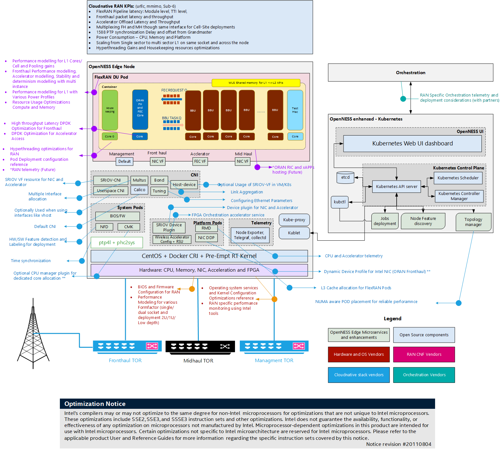

```text
SPDX-License-Identifier: Apache-2.0     
Copyright (c) 2020 Intel Corporation
```
<!-- omit in toc -->
# OpenNESS Radio Access Network (RAN)
- [Introduction](#introduction)
- [Building the FlexRAN image](#building-the-flexran-image)
- [FlexRAN hardware platform configuration](#flexran-hardware-platform-configuration)
  - [BIOS](#bios)
  - [Setting up CPU Uncore frequency](#setting-up-cpu-uncore-frequency)
  - [Host kernel command line](#host-kernel-command-line)
- [Deploying Access Edge CERA for FlexRAN](#deploying-access-edge-cera-for-flexran)
- [Deploying and Running the FlexRAN pod](#deploying-and-running-the-flexran-pod)
- [Setting up 1588 - PTP based Time synchronization](#setting-up-1588---ptp-based-time-synchronization)
  - [Setting up PTP](#setting-up-ptp)
  - [Primary clock](#primary-clock)
  - [Secondary clock](#secondary-clock)
- [BIOS configuration](#bios-configuration)
- [CPU frequency configuration](#cpu-frequency-configuration)
- [References](#references)

# Introduction

Radio Access Network (RAN) is the edge of wireless network. 4G and 5G base stations form the key network function for the edge deployment. In OpenNESS, FlexRAN is used as a reference for 4G and 5G base stations as well as 4G and 5G end-to-end testing.

FlexRAN offers high-density baseband pooling that could run on a distributed Telco\* cloud to provide a smart indoor coverage solution and next-generation fronthaul architecture. This 4G and 5G platform provides the open platform ‘smarts’ for both connectivity and new applications at the edge of the network, along with the developer tools to create these new services. FlexRAN running on the Telco Cloud provides low latency compute, storage, and network offload from the edge. Thus, saving network bandwidth.

FlexRAN 5GNR Reference PHY is a baseband PHY Reference Design for a 4G and 5G base station, using Intel® Xeon® processor family with Intel® architecture. This 5GNR Reference PHY consists of a library of c-callable functions that are validated on several technologies from Intel (Intel® microarchitecture code name Broadwell, Intel® microarchitectures code name Skylake, Cascade Lake, and Intel® microarchitecture Ice Lake) and demonstrates the capabilities of the software running different 5GNR L1 features. The functionality of these library functions is defined by the relevant sections in [3GPP TS 38.211, 212, 213, 214, and 215]. Performance of the Intel 5GNR Reference PHY meets the requirements defined by the base station conformance tests in [3GPP TS 38.141]. This library of functions will be used by Intel partners and end customers as a foundation for their product development. Reference PHY is integrated with third-party L2 and L3 to complete the base station pipeline.

The diagram below shows FlexRAN DU (Real-time L1 and L2) deployed on the OpenNESS platform with the necessary microservices and Kubernetes\* enhancements required for real-time workload deployment.



This document aims to provide the steps involved in deploying FlexRAN 5G (gNb) on the OpenNESS platform.

>**NOTE**: This document covers both FlexRAN 4G and 5G. All the steps mentioned in this document use 5G for reference. Refer to the [FlexRAN 4G Reference Solution L1 User Guide #570228](https://cdrdv2.intel.com/v1/dl/getContent/570228) for minor updates needed to build, deploy, and test FlexRAN 4G.

# Building the FlexRAN image

This section explains the steps involved in building the FlexRAN image. Only L1 and L2-stub will be part of these steps. Real-time L2 (MAC and RLC) and non-real-time L2 and L3 are out of scope as it is a part of the third-party component.  

1. Contact your Intel representative to obtain the package
2. Untar the FlexRAN package.
3. Set the required environmental variables:

   ```shell
   export RTE_SDK=$localPath/dpdk-20.11
   export RTE_TARGET=x86_64-native-linuxapp-icc                         
   export WIRELESS_SDK_TARGET_ISA=avx512                                
   export RPE_DIR=${flexranPath}/libs/ferrybridge
   export ROE_DIR=${flexranPath}/libs/roe
   export XRAN_DIR=${localPath}/flexran_xran
   export WIRELESS_SDK_TOOLCHAIN=icc 
   export DIR_WIRELESS_SDK_ROOT=${localPath}/wireless_sdk 
   export DIR_WIRELESS_FW=${localPath}/wireless_convergence_l1/framework
   export DIR_WIRELESS_TEST_4G=${localPath}/flexran_l1_4g_test 
   export DIR_WIRELESS_TEST_5G=${localPath}/flexran_l1_5g_test 
   export SDK_BUILD=build-${WIRELESS_SDK_TARGET_ISA}-icc 
   export DIR_WIRELESS_SDK=${DIR_WIRELESS_SDK_ROOT}/${SDK_BUILD} 
   export FLEXRAN_SDK=${DIR_WIRELESS_SDK}/install 
   export DIR_WIRELESS_TABLE_5G=${flexranPath}/bin/nr5g/gnb/l1/table    
   ```

   >**NOTE**: The environmental variables path must be updated according to your installation and file/directory names.

4. Build L1, WLS interface between L1, L2, and L2-Stub (testmac):

   ```shell
   # ./flexran_build.sh -r 5gnr_sub6 -m testmac -m wls -m l1app -b -c
   ```

5. Once the build has completed, copy the required binary files to the folder where the Docker\* image is built. This can be done by using a provided example [build-du-dev-image.sh](https://github.com/open-ness/edgeapps/blob/master/network-functions/ran/5G/du-dev/build-du-dev-image.sh) script from Edge Apps OpenNESS repository, it will copy the files from the paths provided as environmental variables in previous step. The script will copy the files into the right directory containing the Dockerfile and commence the docker build.

   ```shell
   # git clone https://github.com/open-ness/edgeapps.git
   # cd edgeapps/network-functions/ran/5G/du-dev
   # ./build-du-dev-image.sh
   ```

   The list of binary files that are used is documented in [dockerfile](https://github.com/open-ness/edgeapps/blob/master/network-functions/ran/5G/du-dev/Dockerfile)
   - ICC, IPP mpi and mkl Runtime
   - DPDK build target directory
   - FlexRAN test vectors (optional)
   - FlexRAN L1 and testmac (L2-stub) binary
   - FlexRAN SDK modules
   - FlexRAN WLS share library
   - FlexRAN CPA libraries

6. The following example reflects the Docker image [expected by Helm chart](https://github.com/open-ness/edgeapps/blob/master/network-functions/ran/charts/du-dev/values.yaml), user needs to adjust the IP address and port of the Harbor registry where Docker image will be pushed:

   ```shell
   image:
     repository: <ip_address>:<port>/intel/flexran5g         # Change Me! - please provide IP address and port 
                                                          # of Harbor registry where FlexRAN docker image is uploaded
     tag: 3.10.0-1160.11.1.rt56                              # The tag identifying the FlexRAN docker   image,
                                                             # the kernel version used to build FlexRAN can be used as tag
   ```

7. Tag the image and push to a local Harbor registry (Harbor registry deployed as part of Converged Edge Experience Kits)

   ```shell
   # docker tag flexran5g <harbor_registry_ip_address>:<port>/intel/flexran5g:3.10.0-1160.11.1.rt56

   # docker push <harbor_registry_ip_address>:<port>/intel/flexran5g:3.10.0-1160.11.1.rt56
   ```

By the end of step 7, the FlexRAN Docker image is created and available in the Harbor registry. This image is copied to the edge node where FlexRAN will be deployed and that is installed with OpenNESS Network edge with all the required EPA features including Intel® FPGA Programmable Acceleration Card (Intel® FPGA PAC) N3000. Please refer to the document [Using FPGA in OpenNESS: Programming, Resource Allocation, and Configuration](../../building-blocks/enhanced-platform-awareness/openness-fpga.md) for details on setting up the Intel® FPGA PAC N3000 with  vRAN FPGA image or alternatively to [Using the Intel vRAN Dedicated Accelerator ACC100 on OpenNESS](https://github.com/open-ness/ido-specs/blob/master/doc/building-blocks/enhanced-platform-awareness/openness-acc100.md#using-the-intel-vran-dedicated-accelerator-acc100-on-openness) for details on setting up the Intel vRAN Dedicated Accelerator ACC100 for FEC acceleration.

# FlexRAN hardware platform configuration

## BIOS

FlexRAN on Intel® microarchitecture code name Skylake, Cascade Lake and Ice Lake, technology from Intel requires a BIOS configuration that disables C-state and enables Config TDP level-2. Refer to the [BIOS configuration](#bios-configuration) section in this document.

## Setting up CPU Uncore frequency

FlexRAN on Intel® microarchitecture code name Skylake, Cascade Lake and Ice Lake, technology from Intel requires that the CPU frequency and uncore frequency are set up for optimal performance. Refer to the [CPU frequency configuration](#cpu-frequency-configuration) section in this document.

## Host kernel command line

```shell
usbcore.autosuspend=-1 selinux=0 enforcing=0 nmi_watchdog=0 softlockup_panic=0 audit=0 intel_pstate=disable cgroup_memory=1 cgroup_enable=memory mce=off idle=poll isolcpus=0-23,25-47,49-71,73-95 rcu_nocbs=0-23,25-47,49-71,73-95 kthread_cpus=0,24,48,72 irqaffinity=0,24,48,72 nohz_full=0-23,25-47,49-71,73-95 hugepagesz=1G hugepages=30 default_hugepagesz=1G intel_iommu=on iommu=pt pci=realloc pci=assign-busses rdt=l3cat
```

> NOTE: CPU ID related variables may vary according to CPU SKU

Host kernel version - 3.10.0-1160.11.1.rt56.1145.el7.x86_64

Instructions on how to configure the kernel command line in OpenNESS can be found in [OpenNESS getting started documentation](../../getting-started/converged-edge-experience-kits.md#customizing-kernel-grub-parameters-and-tuned-profile--variables-per-host)

# Deploying Access Edge CERA for FlexRAN

Information about Access Edge CERA and other CERAs can be found in [flavours.md documentation](https://github.com/open-ness/ido-specs/blob/master/doc/flavors.md#cera-access-edge-flavor). Additionally users are encouraged to familiarize themselves with [converged-edge-experience-kits documentation](https://github.com/open-ness/ido-specs/blob/master/doc/getting-started/converged-edge-experience-kits.md)

1. Fulfill the [pre-conditions for deploying OpenNESS](https://github.com/open-ness/ido-specs/blob/master/doc/getting-started/network-edge/controller-edge-node-setup.md#preconditions)

2. Configure the specification for the Access Edge CERA present under the `flavors/flexran` directory. The following may need to be adjusted.

3. Edit `flavors/flexran/all.yml` as necessary.

   - `fpga_sriov_userspace_enable` can be set to `true` (default) or `false` depending on the type of desired accelerator used by FlexRAN for FEC hardware offload. See [Intel® FPGA PAC N3000](https://github.com/open-ness/ido-specs/blob/master/doc/building-blocks/enhanced-platform-awareness/openness-fpga.md#intelr-fpga-pac-n3000-flexran-host-interface-overview) support in OpenNESS.
   - `fpga_userspace_vf` can be set to `enable: true` (default) or `enabled: false` depending on the type of desired accelerator used by FlexRAN for FEC hardware offload. See [Intel® vRAN Dedicated Accelerator ACC100](https://github.com/open-ness/ido-specs/blob/master/doc/building-blocks/enhanced-platform-awareness/openness-acc100.md) and [Intel® FPGA PAC N3000](https://github.com/open-ness/ido-specs/blob/master/doc/building-blocks/enhanced-platform-awareness/openness-fpga.md#intelr-fpga-pac-n3000-flexran-host-interface-overview) support in OpenNESS.
   - `acc100_sriov_userspace_enable` can be set to `true` or `false` (default) depending on the type of desired accelerator used by FlexRAN for FEC hardware offload. See [Intel® vRAN Dedicated Accelerator ACC100](https://github.com/open-ness/ido-specs/blob/master/doc/building-blocks/enhanced-platform-awareness/openness-acc100.md) support in OpenNESS.
   - `acc100_userspace_vf` can be set to `enable: true` or `enabled: false` (default)  depending on the type of desired accelerator used by FlexRAN for FEC hardware offload. See [Intel® vRAN Dedicated Accelerator ACC100](https://github.com/open-ness/ido-specs/blob/master/doc/building-blocks/enhanced-platform-awareness/openness-acc100.md) and [Intel® FPGA PAC N3000](https://github.com/open-ness/ido-specs/blob/master/doc/building-blocks/enhanced-platform-awareness/openness-fpga.md#intelr-fpga-pac-n3000-flexran-host-interface-overview) support in OpenNESS.
   - `ne_opae_fpga_enable` can be set to `true` (default) or `false` depending on the desire to support [Intel® FPGA PAC N3000](https://github.com/open-ness/ido-specs/blob/master/doc/building-blocks/enhanced-platform-awareness/openness-fpga.md#intelr-fpga-pac-n3000-flexran-host-interface-overview) programming with OPAE within OpenNESS
   - `reserved_cpus` needs to be set up accordingly to the CPU SKU, number of available CPUs and user's desire to [limit the OS and K8s processes only to non-RT CPUs](https://github.com/open-ness/ido-specs/blob/master/doc/building-blocks/enhanced-platform-awareness/openness-topology-manager.md#details---topology-manager-support-in-openness). It is critical that the CPUs selected for `reserved_cpus` do exist on the Edge Node, as forcing K8s processes to a CPU that does not exist will cause a K8s deployment failure. The usual choice (default) of CPUs used for the K8s and OS threads in FlexRAN deployment is a first CPU ID on each NUMA node (ie. on 24 core platform with two NUMA nodes `reserved_cpus: "0,24"`. In case of Hyper-threading enabled CPU, the CPU IDs of both siblings are expected ie. `reserved_cpus: "0,24,48,72`).
   - `e810_driver_enable` (default set to `true`) provides support for installing recommended version of the `ice` and `iavf` kernel drivers for E810 series Intel NICs. This can be disabled if the user does not require this functionality.
   - `rmd_operator_enable` (default set to `true`) provides support for deploying [RMD operator](https://github.com/open-ness/ido-specs/blob/master/doc/building-blocks/enhanced-platform-awareness/openness-rmd.md) enabling configuration od LLC (Last Level Cache) and MBC (Memory Bandwidth Configuration) through RDT.
   > Note: At the time of writing the RMD operator version enabling the 3rd Generation Intel® Xeon® Scalable Processors, code named Ice Lake is not yet available. This may cause a crash of the RMD operator DaemonSet when deployed on Ice Lake.

4. Depending on enabled features provide requested files under correct directories (the directories are to be created by the user).

   - When `ne_biosfw_enable` is enabled, create a `ido-converged-edge-experience-kits/ceek/biosfw` directory and copy the [syscfg_package.zip](https://downloadcenter.intel.com/download/29693?v=t) file into it.
   > Note: At the time of writing the version of SYSCFG utility supporting 3rd Generation Intel® Xeon® Scalable Processors platform is not yet generally available.
   - When `ne_opae_fpga_enable` is enabled, create a `ido-converged-edge-experience-kits/ceek/opae_fpga` directory and copy the [OPAE_SDK_1.3.7-5_el7.zip](https://github.com/open-ness/ido-specs/blob/master/doc/building-blocks/enhanced-platform-awareness/openness-fpga.md#converged-edge-experience-kits) file into it.
   - When `e810_driver_enable` is enabled, create a `ido-converged-edge-experience-kits/ceek/nic_drivers` directory and copy the [ice-1.3.2.tar.gz](https://downloadcenter.intel.com/download/30303/Intel-Network-Adapter-Driver-for-E810-Series-Devices-under-Linux-) and [iavf-4.0.2.tar.gz](https://downloadcenter.intel.com/download/30305/Intel-Network-Adapter-Linux-Virtual-Function-Driver-for-Intel-Ethernet-Controller-700-and-E810-Series) files into it.

5. Edit the [inventory.yml](https://github.com/open-ness/ido-converged-edge-experience-kits/blob/master/inventory.yml) as necessary. For more information see [sample deployment definitions](https://github.com/open-ness/specs/blob/master/doc/getting-started/converged-edge-experience-kits.md#sample-deployment-definitions). Below is an example to deploy OpenNESS on one Edge Controller and one Edge Node, as an `openness` user.

   ```yaml
   all:
   vars:
      cluster_name: flexran_cluster    # NOTE: Use `_` instead of spaces.
      flavor: flexran                  # NOTE: Flavors can be found in `flavors` directory.
      single_node_deployment: false    # Request single node deployment (true/false).
      limit:                           # Limit ansible deployment to certain inventory group or hosts
   controller_group:
   hosts:
      controller:
         ansible_host: <Edge Controller IP>
         ansible_user: openness
   edgenode_group:
   hosts:
      node01:
         ansible_host: <Edge Node IP>
         ansible_user: openness
   edgenode_vca_group:
   hosts:
   ptp_master:
   hosts:
   ptp_slave_group:
   hosts:
   ```

6. Run deployment helper script:

   ```shell
   # sudo scripts/ansible-precheck.sh
   ```

7. Deploy OpenNESS

   ```shell
   # python3 deploy.py
   ```

# Deploying and Running the FlexRAN pod

1. Deploy the OpenNESS cluster with [Access Edge CERA](https://github.com/open-ness/ido-specs/blob/master/doc/flavors.md#cera-access-edge-flavor) enabled.

2. Confirm that there are no FlexRAN pods and the FPGA configuration pods are not deployed using `kubectl get pods`.

3. Confirm that all the EPA microservice and enhancements (part of OpenNESS playbook) are deployed `kubectl get pods --all-namespaces`.

   ```shell
   NAMESPACE     NAME                                                         READY   STATUS             RESTARTS   AGE
   default       intel-rmd-operator-78c8d6b47c-h6hrv                          1/1     Running            0          2h
   default       rmd-node-agent-silpixa00400827                               1/1     Running            0          2h
   default       rmd-silpixa00400827                                          1/1     Running            0          2h
   harbor        harbor-app-harbor-chartmuseum-74fb748c4d-zg96l               1/1     Running            0          2h
   harbor        harbor-app-harbor-clair-779df4555b-z8nmj                     2/2     Running            0          2h
   harbor        harbor-app-harbor-core-69477b9f7c-rkq7m                      1/1     Running            0          2h
   harbor        harbor-app-harbor-database-0                                 1/1     Running            0          2h
   harbor        harbor-app-harbor-jobservice-75bf777dc9-rk2ww                1/1     Running            0          2h
   harbor        harbor-app-harbor-nginx-98b8cc48-5tx4n                       1/1     Running            0          2h
   harbor        harbor-app-harbor-notary-server-7dbbfd5775-rx5zc             1/1     Running            0          2h
   harbor        harbor-app-harbor-notary-signer-64f4879947-q6bgh             1/1     Running            0          2h
   harbor        harbor-app-harbor-portal-fd5ff4bc9-bh2wc                     1/1     Running            0          2h
   harbor        harbor-app-harbor-redis-0                                    1/1     Running            0          2h
   harbor        harbor-app-harbor-registry-68cd7c59c7-fhddp                  2/2     Running            0          2h
   harbor        harbor-app-harbor-trivy-0                                    1/1     Running            0          2h
   kafka         cluster-entity-operator-55894648cb-682ln                     3/3     Running            0          2h
   kafka         cluster-kafka-0                                              2/2     Running            0          2h
   kafka         cluster-zookeeper-0                                          1/1     Running            0          2h
   kafka         strimzi-cluster-operator-68b6d59f74-jj7vf                    1/1     Running            0          2h
   kube-system   calico-kube-controllers-646546699f-wl6rn                     1/1     Running            0          2h
   kube-system   calico-node-hrtn4                                            1/1     Running            0          2h
   kube-system   coredns-74ff55c5b-shpw2                                      1/1     Running            0          2h
   kube-system   coredns-74ff55c5b-w4s7s                                      1/1     Running            0          2h
   kube-system   descheduler-cronjob-1615305120-xrj48                         0/1     Completed          0          2h
   kube-system   etcd-silpixa00400827                                         1/1     Running            0          2h
   kube-system   kube-apiserver-silpixa00400827                               1/1     Running            0          2h
   kube-system   kube-controller-manager-silpixa00400827                      1/1     Running            0          2h
   kube-system   kube-multus-ds-amd64-v2dhr                                   1/1     Running            0          2h
   kube-system   kube-proxy-vg57p                                             1/1     Running            0          2h
   kube-system   kube-scheduler-silpixa00400827                               1/1     Running            0          2h
   kube-system   sriov-release-kube-sriov-cni-ds-amd64-mqfh6                  1/1     Running            0          2h
   kube-system   sriov-release-kube-sriov-device-plugin-amd64-cxx6g           1/1     Running            0          2h
   openness      certsigner-6cb79468b5-q2zhr                                  1/1     Running            0          2h
   openness      eaa-69c7bb7b5d-nqghg                                         1/1     Running            0          2h
   openness      edgedns-xjwpk                                                1/1     Running            0          2h
   openness      nfd-release-node-feature-discovery-master-748fff4b6f-89w2j   1/1     Running            0          2h
   openness      nfd-release-node-feature-discovery-worker-5bnvb              1/1     Running            0          2h
   telemetry     collectd-wgcvw                                               2/2     Running            0          2h
   telemetry     custom-metrics-apiserver-55bdf684ff-tqwwv                    1/1     Running            0          2h
   telemetry     grafana-9db5b9cdb-j652q                                      2/2     Running            0          2h
   telemetry     otel-collector-f9b9d494-h622t                                2/2     Running            0          2h
   telemetry     prometheus-node-exporter-jt2cf                               1/1     Running            0          2h
   telemetry     prometheus-server-8656f6bf98-r2d9q                           3/3     Running            0          2h
   telemetry     telemetry-aware-scheduling-69dbb979f6-n5cz6                  2/2     Running            0          2h
   telemetry     telemetry-collector-certs-5glnn                              0/1     Completed          0          2h
   telemetry     telemetry-node-certs-vw4fh                                   1/1     Running            0          2h
   ```

4. Deploy the Kubernetes job to program the [FPGA](../../building-blocks/enhanced-platform-awareness/openness-fpga.md#fpga-programming-and-telemetry-on-openness-network-edge)

5. Deploy the Kubernetes job to configure the [BIOS](../../building-blocks/enhanced-platform-awareness/openness-bios.md) (note: only works on select Intel development platforms)

6. Deploy the Kubernetes job to configure the [Intel PAC N3000 FPGA](../../building-blocks/enhanced-platform-awareness/openness-fpga.md#fec-vf-configuration-for-openness-network-edge)

7. Deploy the FlexRAN Kubernetes pod using a helm chart provided in Edge Apps repository at `edgeapps/network-functions/ran/charts`:

   ```shell
   helm install flexran-pod du-dev
   ```

8. `exec` into FlexRAN pod `kubectl exec -it flexran -- /bin/bash`

9. Find the PCI Bus function device ID of the FPGA VF assigned to the pod:

   ```shell
   printenv | grep FEC
   ```

10. Edit `phycfg_timer.xml` used for configuration of L1 application with the PCI Bus function device ID from the previous step to offload FEC to this device:

    ```xml
    <!--  DPDK FEC BBDEV to use             [0 - SW, 1 - FPGA, 2 - Both] -->
    <dpdkBasebandFecMode>1</dpdkBasebandFecMode>
    <!--  DPDK BBDev name added to the whitelist. The argument format is <[domain:]bus:devid.func> -->
    <dpdkBasebandDevice>0000:1d:00.1</dpdkBasebandDevice>
    ```

11. Once in the FlexRAN pod L1 and test-L2 (testmac) can be started.

# Setting up 1588 - PTP based Time synchronization

This section provides an overview of setting up PTP-based time synchronization in a cloud-native Kubernetes/docker environment. For FlexRAN specific xRAN fronthaul tests and configurations please refer to the xRAN specific document in the reference section.

>**NOTE**: The PTP-based time synchronization method described here is applicable only for containers. For VMs, methods based on Virtual PTP need to be applied and this is not covered in this document.  

## Setting up PTP

In the environment that needs to be synchronized, install the linuxptp package, which provides ptp4l and phc2sys applications. The PTP setup needs the primary clock and secondary clock setup. The secondary clock will be synchronized to the primary clock. At first, the primary clock will be configured. A supported NIC is required to use Hardware Time Stamps. To check if NIC is supporting Hardware Time Stamps, run the ethtool and a similar output should appear:

```shell
# ethtool -T eno4
Time stamping parameters for eno4:
Capabilities:
        hardware-transmit     (SOF_TIMESTAMPING_TX_HARDWARE)
        software-transmit     (SOF_TIMESTAMPING_TX_SOFTWARE)
        hardware-receive      (SOF_TIMESTAMPING_RX_HARDWARE)
        software-receive      (SOF_TIMESTAMPING_RX_SOFTWARE)
        software-system-clock (SOF_TIMESTAMPING_SOFTWARE)
        hardware-raw-clock    (SOF_TIMESTAMPING_RAW_HARDWARE)
PTP Hardware Clock: 3
Hardware Transmit Timestamp Modes:
        off                   (HWTSTAMP_TX_OFF)
        on                    (HWTSTAMP_TX_ON)
Hardware Receive Filter Modes:
        none                  (HWTSTAMP_FILTER_NONE)
        ptpv1-l4-sync         (HWTSTAMP_FILTER_PTP_V1_L4_SYNC)
        ptpv1-l4-delay-req    (HWTSTAMP_FILTER_PTP_V1_L4_DELAY_REQ)
        ptpv2-event           (HWTSTAMP_FILTER_PTP_V2_EVENT)
```

The time in containers is the same as on the host machine, and so it is enough to synchronize the host to the primary clock.

PTP requires a few kernel configuration options to be enabled:

- CONFIG_PPS
- CONFIG_NETWORK_PHY_TIMESTAMPING
- CONFIG_PTP_1588_CLOCK

## Primary clock

This is an optional step if you already have a primary clock. The below steps explain how to set up a Linux system to behave like ptp GM.

On the primary clock side, take a look at the `/etc/sysconfig/ptp4l` file. It is the `ptp4l` daemon configuration file where starting options will be provided. Its content should look like this:

```shell
OPTIONS=”-f /etc/ptp4l.conf -i <if_name>”
```

`<if_name>` is the interface name used for time stamping and `/etc/ptp4l.conf` is a configuration file for the `ptp4l` instance.

To determine if a primary clock PTP protocol is using BMC algorithm, and it is not obvious which clock will be chosen as primary clock. However, users can set the timer that is preferable to be the primary clock. It can be changed in `/etc/ptp4l.conf`. Set `priority1 property` to `127`.

After that start ptp4l service.

```shell
service ptp4l start
```

Output from the service can be checked at `/var/log/messages`, and for primary clock, it should be like this:

```shell
Mar 16 17:08:57 localhost ptp4l: ptp4l[23627.304]: selected /dev/ptp2 as PTP clock
Mar 16 17:08:57 localhost ptp4l: [23627.304] selected /dev/ptp2 as PTP clock
Mar 16 17:08:57 localhost ptp4l: [23627.306] port 1: INITIALIZING to LISTENING on INITIALIZE
Mar 16 17:08:57 localhost ptp4l: ptp4l[23627.306]: port 1: INITIALIZING to LISTENING on INITIALIZE
Mar 16 17:08:57 localhost ptp4l: [23627.307] port 0: INITIALIZING to LISTENING on INITIALIZE
Mar 16 17:08:57 localhost ptp4l: ptp4l[23627.307]: port 0: INITIALIZING to LISTENING on INITIALIZE
Mar 16 17:08:57 localhost ptp4l: [23627.308] port 1: link up
Mar 16 17:08:57 localhost ptp4l: ptp4l[23627.308]: port 1: link up
Mar 16 17:09:03 localhost ptp4l: [23633.664] port 1: LISTENING to MASTER on ANNOUNCE_RECEIPT_TIMEOUT_EXPIRES
Mar 16 17:09:03 localhost ptp4l: ptp4l[23633.664]: port 1: LISTENING to MASTER on ANNOUNCE_RECEIPT_TIMEOUT_EXPIRES
Mar 16 17:09:03 localhost ptp4l: ptp4l[23633.664]: selected best master clock 001e67.fffe.d2f206
Mar 16 17:09:03 localhost ptp4l: ptp4l[23633.665]: assuming the grand master role
Mar 16 17:09:03 localhost ptp4l: [23633.664] selected best master clock 001e67.fffe.d2f206
Mar 16 17:09:03 localhost ptp4l: [23633.665] assuming the grand master role
```

The next step is to synchronize PHC timer to the system time. To do that `phc2sys` daemon will be used. Firstly edit configuration file at `/etc/sysconfig/phc2sys`.

```shell
OPTIONS="-c <if_name> -s CLOCK_REALTIME -w"
```

Replace `<if_name>` with the interface name. Start the phc2sys service.

```shell
service phc2sys start
```

Logs can be viewed at `/var/log/messages` and it looks like this:

```shell
phc2sys[3656456.969]: Waiting for ptp4l...                                      
phc2sys[3656457.970]: sys offset -6875996252 s0 freq  -22725 delay   1555       
phc2sys[3656458.970]: sys offset -6875996391 s1 freq  -22864 delay   1542       
phc2sys[3656459.970]: sys offset       -52 s2 freq  -22916 delay   1536         
phc2sys[3656460.970]: sys offset       -29 s2 freq  -22909 delay   1548         
phc2sys[3656461.971]: sys offset       -25 s2 freq  -22913 delay   1549         
```

## Secondary clock

The secondary clock configuration will be the same as the primary clock except for `phc2sys` options and priority1 property for `ptp4l`. For secondary clock priority1 property in `/etc/ptp4l.conf` should stay with default value (128). Run `ptp4l` service. To keep the system time synchronized to PHC time, change `phc2sys` options in `/etc/sysconfig/phc2sys` using the following command:

```shell
OPTIONS=”phc2sys -s <if_name> -w"
```

Replace `<if_name>` with the interface name. Logs will be available at `/var/log/messages`.

```shell
phc2sys[28917.406]: Waiting for ptp4l...
phc2sys[28918.406]: phc offset -42928591735 s0 freq  +24545 delay   1046
phc2sys[28919.407]: phc offset -42928611122 s1 freq   +5162 delay    955
phc2sys[28920.407]: phc offset       308 s2 freq   +5470 delay    947
phc2sys[28921.407]: phc offset       408 s2 freq   +5662 delay    947
phc2sys[28922.407]: phc offset       394 s2 freq   +5771 delay    947
```

Since this moment, both clocks should be synchronized. Any Docker container running in a pod is using the same clock as host so its clock will be synchronized as well.

# BIOS configuration

Below is the subset of the BIOS configuration. It contains the list of BIOS features that are recommended to be configured for FlexRAN DU deployment.

2nd Generation Intel® Xeon® Scalable Processors platforms BIOS configuration:

```shell
[BIOS::Advanced]

[BIOS::Advanced::Processor Configuration]
Intel(R) Hyper-Threading Tech=Enabled             
Active Processor Cores=All                         
Intel(R) Virtualization Technology=Enabled         
MLC Streamer=Enabled                               
MLC Spatial Prefetcher=Enabled                     
DCU Data Prefetcher=Enabled                        
DCU Instruction Prefetcher=Enabled                 
LLC Prefetch=Enabled 

[BIOS::Advanced::Power & Performance]
CPU Power and Performance Policy=Performance       
Workload Configuration=I/O Sensitive               

[BIOS::Advanced::Power & Performance::CPU C State Control]
Package C-State=C0/C1 state                        
C1E=Disabled           ; Can be enabled Power savings                             
Processor C6=Disabled          

[BIOS::Advanced::Power & Performance::Hardware P States]
Hardware P-States=Disabled                         

[BIOS::Advanced::Power & Performance::CPU P State Control]
Enhanced Intel SpeedStep(R) Tech=Enabled           
Intel Configurable TDP=Enabled                     
Configurable TDP Level=Level 2                     
Intel(R) Turbo Boost Technology=Enabled            
Energy Efficient Turbo=Disabled                    

[BIOS::Advanced::Power & Performance::Uncore Power Management]
Uncore Frequency Scaling=Enabled                   
Performance P-limit=Enabled        

[BIOS::Advanced::Memory Configuration::Memory RAS and Performance Configuration]
NUMA Optimized=Enabled                             
Sub_NUMA Cluster=Disabled                          

[BIOS::Advanced::PCI Configuration]
Memory Mapped I/O above 4 GB=Enabled               
SR-IOV Support=Enabled     
```

# CPU frequency configuration

Below is a script which configures the CPU frequency and uncore frequency for optimal performance - this needs to be adjusted accordingly to specific CPU SKUs.

To run the script download msr-tools:

```shell
yum install -y msr-tools
```

Example for 2nd Generation Intel® Xeon® Scalable Processor - Intel(R) Xeon(R) Gold 6252N

```shell
#!/bin/bash

cpupower frequency-set -g performance

wrmsr -a 0x199 0x1900

#Set Uncore max frequency
wrmsr -p 0 0x620 0x1e1e
wrmsr -p 35 0x620 0x1e1e
```

# References

- FlexRAN Reference Solution Software Release Notes - Document ID:575822
- FlexRAN Reference Solution LTE eNB L2-L1 API Specification - Document ID:571742
- FlexRAN 5G New Radio Reference Solution L2-L1 API Specification - Document ID:603575
- FlexRAN 4G Reference Solution L1 User Guide - Document ID:570228
- FlexRAN 5G NR Reference Solution L1 User Guide - Document ID:603576
- FlexRAN Reference Solution L1 XML Configuration User Guide - Document ID:571741
- FlexRAN 5G New Radio FPGA User Guide - Document ID:603578
- FlexRAN Reference Solution xRAN FrontHaul SAS - Document ID:611268
