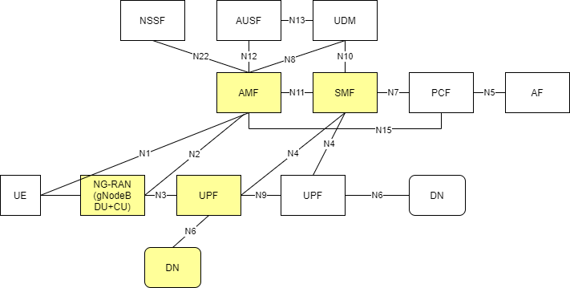
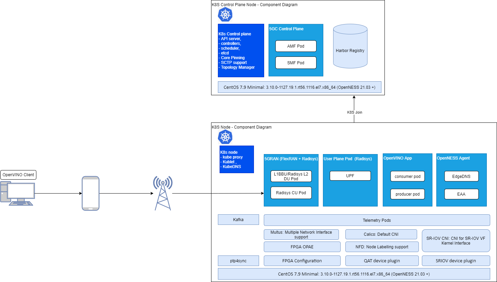
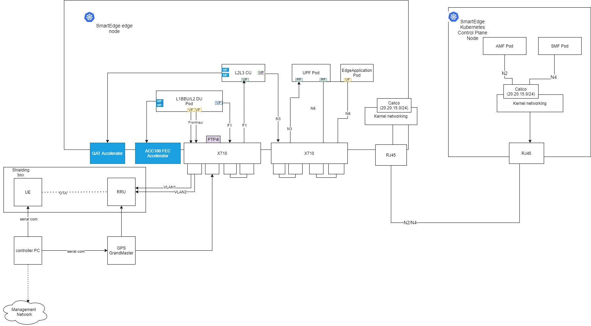
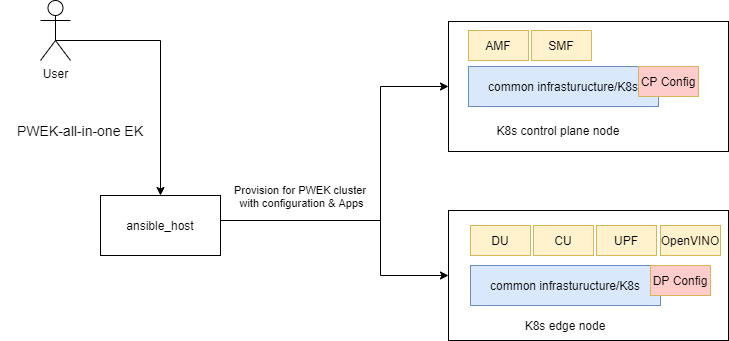

```text
SPDX-License-Identifier: Apache-2.0
Copyright (c) 2021 Intel Corporation
```
<!-- omit in toc -->
# 5G Private Wireless Experience Kit with Integrated RAN
Intel® Smart Edge Open experience kits provide customized infrastructure deployments for common network and on-premises edge use cases. Combining Intel cloud-native technologies, wireless networking, and high-performance compute, experience kits let you deliver AI, video, and other services optimized for performance at the edge.

The 5G Private Wireless Experience Kit with Integrated RAN accelerates the development of edge platforms and architectures for deploying private networks.

- [5G Private Wireless Experience Kit with Integrated RAN](#5g-private-wireless-experience-kit-with-integrated-ran-1)
  - [Experience Kit](#experience-kit)
    - [Building Blocks](#building-blocks)
    - [Architecture](#architecture)
    - [Deployment](#deployment)
    - [CPU Core Allocation](#cpu-cores-allocation)
  - [Supported Edge Applications](#supported-edge-applications)
  - [Hardware Platform](#hardware-platform)
    - [ICX-SP](#icx-sp)
    - [Accelerators](#accelerators)
  - [Setup](#setup)
    - [Hardware Overview](#hardware-overview)
    - [Software Overview](#overview-of-network-functions)
    - [OS Setup](#os-setup)
    - [BIOS Setup](#bios-setup)
    - [Ansible Execution](#ansible-execution)
      - [Setting up Target Platform](#set-up-the-target-platform)
      - [Steps to be performed](#steps-to-be-performed)
- [5G Access Network Functions](#5g-access-network-functions)
  - [gNodeB](#set-up-the-gnodeb-central-unit-cu-and-distributed-unit-du)
    - [Overview](#overview)
    - [Hardware Requirements](#hardware-requirements)
    - [Settings](#settings-gnodeb)
  - [Time synchronization over PTP for node server](#configure-ptp-time-synchronization)
    - [Overview](#overview-1)
    - [Prerequisites](#prerequisites)
    - [Settings](#settings-1)
    - [GMC(Grand Master Clock) configuration](#gmc-configuration)
- [5G Core Network Functions](#5g-core-network-functions)
  - [UPF](#upf)
    - [Overview](#overview-2)
    - [Deployment](#deployment-1)
      - [Prerequisites](#prerequisites-2)
      - [Settings](#settings-2)
      - [Configuration](#configuration)
  - [AMF-SMF](#deploy-the-access-and-mobility-management-function-amf-and-session-management-function-smf)
    - [Overview](#overview-3)
    - [Deployment](#deployment-2)
      - [Prerequisites](#prerequisites-amf-smf)
      - [Configuration](#configuration-1)
- [EdgeApp - Intel® Distribution of OpenVINO™ Toolkit](#onboard-the-intel-distribution-of-openvino-toolkit-to-the-edge-node)
  - [Settings](#setting---openvino)
  - [Deployment](#deploy-the-openvino-application)
  - [Streaming](#start-a-network-stream-in-the-openvino-application)
- [Summary and Next Steps](#summary)
- [Learn more](#learn-more)

## 5G Private Wireless Experience Kit with Integrated RAN
The assumed 3GPP deployment architecture is based on the figure below from 3GPP 23.501 Rel15 which shows the reference point representation for concurrent access to two (e.g. local and central) data networks (single PDU Session option). 

5G Private Wireless with Integrated RAN deploys the following building blocks:

- NG-RAN (gNodeB DU and CU)
- User plane function (UPF)
- Data network (edge applications)
- 5GC control plane functions including the access and mobility management function (AMF) and session management function (SMF)

These are highlighted in yellow in the diagram below.



> Figure 1 - 3GPP Network

> NOTE: The reference solution assumes use of our partner Radisys's simplified 5G core network, so only the AMF and SMF functions are highlighted here. The deployment can be extended to support other control plane functions as well. 
> Please contact Radisys to get 5G core network functions, or contact your local Intel® representative for more information.

### Experience Kit

The 5G Private Wireless Experience Kit with Integrated RAN supports a single orchestration domain, optimizing the edge node to support both network functions, such as DU/CU, AMF, SMF, and UPF, and applications.

#### Building Blocks
The 5G Private Wireless Experience Kit with Integrated RAN includes building blocks for 5G DU/CU and UPF functionality, and for running applications and their associated hardware accelerators. The below diagram shows the logical deployment with the Intel® Smart Edge Open Building Blocks. 



> Figure 2 - Building blocks for 5G Private Wireless with Integrated RAN

#### Architecture



> Figure 3 - 5G Private Wireless with Integrated RAN Architecture

The 5G Private Wireless Experience Kit with Integrated RAN supports 2 Intel® Xeon® Scalable Processor nodes in a single cluster, one serving as an edge node and the second as a Kubernetes control plane node.
- The UPF is deployed using SR-IOV-Device plugin and SRIOV-CNI allowing direct access to the network interfaces used for connection to the CU and back haul. 
- For high throughput workloads such as UPF network function, it is recommended to use single root input/output (SR-IOV) pass-through the physical function (PF) or the virtual function (VF), as required. 
- The 5G Private Wireless Experience Kit with Integrated RAN leverages the simple switching capability in the NIC can be used to send traffic from one application to another, as there is a direct path of communication required between the UPF and the Data plane.

The applications are deployed on the same edge node as the UPF and CU/DU.

The following building blocks are supported in Intel® Smart Edge Open:

- <b>QAT and SR-IOV Device plugin for Kubernetes</b>
- <b>Node Feature Discovery (NFD)</b>: Software that detects hardware features available on each node in a Kubernetes cluster and advertises those features using node labels. 
- <b>Topology Manager</b>: Allows users to align their CPU and peripheral device allocations by NUMA node.
- <b>Kubevirt</b>: Supports running legacy applications in virtual machine (VM) mode and allows SR-IOV Ethernet interfaces to be allocated to VMs. 
- <b>Precision Time Protocol (PTP)</b>: Provides time synchronization between machines connected through Ethernet. The primary clock serves as a reference clock for secondary nodes. A grand master clock (GMC) can be used to precisely set the primary clock.

#### Deployment
The 5G Private Wireless Experience Kit with Integrated RAN hosts the 5G access network and core network functions on a single cluster. 
> NOTE: Experience kits don't include 5G binaries. If you require binaries, Intel can refer you to a partner who can provide them. Contact your local Intel representative for more information. 



> Figure 4 - Cluster provisioning in the 5G Private Wireless Experience Kit with Integrated RAN

> NOTE: You will need privileges to deploy and run the CU/DU for the relevant software version used in the reference architecture. Contact Radisys or your local Intel representative for more information.

####  CPU Cores Allocation

5G network functions such as DU and UPF are real-time, time-sensitive applications that require the allocation of dedicated CPU cores.

The example below shows CPU core allocation using the default CPU configuration with hyper-threading enabled and CPU MADT core enumeration set to linear. See an example configuration below: [Set isolated CPU cores](#set-isolated-CPU-cores)

| NUMA |   0    |    1   |   2    |    3   |    4   |    5   |    6   |    7   |    8   |   9    |   10   |   11   |   12   |   13   |   14   |   15   |   16   |   17   |   18    |   19    |   20    |   21    |   ...   |   31    |
| ---- | ------ | ------ | ------ | ------ | ------ | ------ | ------ | ------ | ------ | ------ | ------ | ------ | ------ | ------ | ------ | ------ | ------ | ------ | ------- | ------- | ------- | ------- | ------- | ------- |
| 0    | OS/K8S |        |        |   CU   |   CU   |   CU   | DU-L1  | DU-L1  |   CU   |   CU   | DU-L2  | DU-L2  | DU-L2  | DU-L2  | DU-L2  | DU-L2  | DU-L2  | DU-L2  | DU-L1   | DU -L2  |  DU-L1  |  DU-L1  |         |         |
| 0    |   64   |   65   |   66   |   67   |   68   |   69   |   70   |   71   |   72   |   73   |   74   |   75   |   76   |   77   |   78   |   79   |   80   |   81   |   82    |    83   |    84   |    85   |   ...   |   95    |
| 0    | OS/K8S |        |        |        |        |        |        |        |        |        |        |        |        |        |        |        |        |        |         |         |         |         |         |         |
| 1    |  32    |   33   |   34   |   35   |   36   |   37   |   38   |   39   |   40   |   41   |   42   |   43   |   44   |   45   |   46   |   47   |   48   |   49   |   50    |   51    |    52   |    53   |   ...   |   63    |
| 1    | OS/K8S |        |        |        |  DU-L2 |        |        |        |        |        |        |  UPF   |  UPF   |  UPF   |        |        |        |        |         |         |         |         |         |         |
| 1    |   96   |   97   |   98   |   99   |  100   |  101   | 102    |  103   |  104   |  105   |  106   |  107   |  108   |  109   |  110   |  111   |  112   |  113   |  114    |  115    |   116   |   117   |   ...   |   127   |
| 1    | OS/K8S |        |        |        |        |        |        |        |        |        |        |        |        |        |        |        |        |        |         |         |         |         |         |         |

> Table 1 - 5G CPU allocation for the Private Wireless Experience Kit with Integrated RAN


### Supported Edge Applications

The 5G Private Wireless Experience Kit with Integrated RAN uses an architectural paradigm that enables convergence of edge services and applications across different market segments. This is demonstrated by taking diverse workloads native to different segments and successfully integrating within a common platform. As a reference, consider the following applications from different market segments.

Smart city: Capture of live camera streams to monitor and measure pedestrian and vehicle movement within a zone.

Industrial: Monitoring of the manufacturing quality of an industrial line, the capture of video streams focuses on manufactured devices on an assembly line and the real-time removal of identified defect parts.

While these use cases are addressing different market segments, they both have similar requirements:

- Capture video either from a live stream from a camera, or streamed from a recorded file.

- Process that video using inference with a trained machine learning model, computer vision filters, etc.

- Trigger business control logic based on the results of the video processing.

Video processing is inherently compute intensive and, in most cases, especially in edge processing, video processing becomes the bottleneck in user applications. This, ultimately, impacts service KPIs such as frames-per-second, number of parallel streams, latency, etc.

Therefore, pre-trained models, performing numerical precision conversions, offloading to video accelerators, heterogeneous processing and asynchronous execution across multiple types of processors all of which increase video throughput are extremely vital in edge video processing. However these requirements can significantly complicate software development, requiring expertise that is rare in engineering teams and increasing the time-to-market.

The 5G Private Wireless Experience Kit with Integrated RAN offers a sample edge application based on OpenVINO (Open Visual Inference and Neural Network Optimization). The Intel® Distribution of OpenVINO™ toolkit helps developers and data scientists speed up computer vision workloads, streamline deep learning inference and deployments, and enable easy, heterogeneous execution across Intel® architecture platforms from edge to cloud. It helps to unleash deep learning inference using a common API, streamlining deep learning inference and deployment using standard or custom layers without the overhead of frameworks.


### Hardware Platform
#### ICX-SP

The 5G Private Wireless with Integrated RAN Experience Kit is designed to run on standard, off-the-shelf servers with with 3rd Generation Intel® Xeon® Scalable Processors. The experience kit has been validated to run on a Dell Server R750. Please refer to Smart Edge Open 21.09 release notes for more detailed Dell R750 configurations.


#### Accelerators

Hardware accelerators can be used to increase the performance of certain workloads. Use the Intel® Smart Edge Open Kubernetes control plane node to assign accelerators to a specific container whose workload you are targeting.

<b>Intel® QAT</b>  
The Intel® QuickAssist Adapter provides customers with a scalable, flexible, and extendable way to offer Intel® QuickAssist Technology (Intel® QAT) crypto acceleration and compression capabilities to their existing product lines. Intel® QuickAssist Technology provides hardware acceleration to assist with the performance demands of securing and routing Internet traffic and other workloads, such as compression and wireless 4G LTE and 5G gNB(g-NodeB) algorithm offload, thereby reserving processor cycles for application and control processing.


<b>Intel® ACC100 eASIC</b>  
The Intel® vRAN Dedicated Accelerator ACC100 Adapter accelerates 4G and 5G virtualized radio access network (vRAN) workloads, which in turn increases the overall compute capacity of commercial, off-the-shelf platforms.
- Reduced platform power, E2E latency and Intel® CPU core count requirements as well as increase in cell capacity than existing programmable accelerator.
- Accelerates both 4G and 5G data concurrently.
- Lowers development cost using commercial off the shelf (COTS) servers.
- Accommodates space-constrained implementations via a low-profile PCIe* card form factor.
For more references, see [<b>smartedge-open-acc100.md</b> Using ACC100 eASIC in Smart Edge Open: Resource Allocation, and Configuration](https://github.com/smart-edge-open/ido-specs/blob/master/doc/building-blocks/enhanced-platform-awareness/smartedge-open-acc100.md)

<b>Intel® FPGA(Field Programmable Gate Array) Programmable Acceleration Card N3000 (Intel® FPGA PAC N3000)</b>  
The Intel® FPGA PAC plays a key role in accelerating certain types of workloads, which in turn increases the overall compute capacity of a commercial, off-the-shelf platform. FPGA benefits include:
- Flexibility - FPGA functionality can change upon every power up of the device.
- Acceleration - Increase your system performance by offload workload from CPU to FPGA.
- Integration - Modern FPGAs include on-die processors, transceiver I/Os at 28 Gbps (or faster), RAM blocks, DSP engines, and more.
- Total Cost of Ownership (TCO) - While ASICs may cost less per unit than an equivalent FPGA, building them requires a non-recurring expense (NRE), expensive software tools, specialized design teams, and long manufacturing cycles. FPGA can help to get products to market faster.

The Intel® FPGA PAC N3000 is a full-duplex, 100 Gbps in-system, re-programmable acceleration card for multi-workload networking application acceleration. It has an optimal memory mixture designed for network functions, with an integrated network interface card (NIC) in a small form factor that enables high throughput, low latency, and low power per bit for a custom networking pipeline.

For more references see [<b>openness-fpga.md:</b> Dedicated FPGA IP resource allocation support for Edge Applications and Network Functions](https://github.com/smart-edge-open/ido-specs/blob/master/doc/building-blocks/enhanced-platform-awareness/openness-fpga.md)

> NOTE: Intel® ACC100 eASIC and Intel® FPGA PAC N3000 are alternative.

### Setup

#### Hardware Overview

| Hardware                                         | Notes                                                        |
| ------------------------------------------------ | :----------------------------------------------------------- |
| Two servers with 3rd Generation Intel® Xeon® Scalable Processors                               | Used to host the Kubernetes edge and control plane nodes. The 5G Private Wireless with Integrated RAN Experience Kit has been validated to run on a Dell EMC PowerEdge R750.               |
| Intel® QuickAssist Adapter 8970              | Need to be inserted into the Edge Node. Verified firmware version is 4.7.0. |
| Two Intel Ethernet Network Adapter X710DA4FH NIC | Need to be inserted into the Edge Node.  Verified firmware version is 8.30 0x8000a49d 1.2960.0. |
| 1588 PTP Grandmaster Clock and GPS Receiver      | gNodeB and RRH needs PTP time syncronization.                                                   |
|Intel® FPGA PAC N3000                             | Need to be inserted into the Edge Node. Need to be programmed with appropriate 5GN FEC vRAN image for 5G (LDPC) encode and decode. |
| Intel® ACC100                                | Need to be inserted into the Edge Node. A Dedicated FEC vRAN Accelerator, it is an alternative to FPGA PAC N3000.|
| Sub6 4x4 RRH                                 | Verified Foxconn Sub6 4x4 RRH - RPQN-7800, 3.3-3.6GHz with firmware version: v1.0.3q 432.        |
| 5G Mobile phone                                  | Please contact your local Intel® representative for more information about mobile phone and USIM card. |

> Table 2 - 5G Private Wireless with Integrated RAN Hardware List

> NOTE: For server, suggest that number of CPU cores is not less than 26, memory size is not less than 100G, and the disk capacity is not less than 300G.

#### Overview of Network Functions

| Software        | Notes                           |
| --------------- | :------------------------------ |
| DU-L1           | Verified FlexRAN BBU v20.11.    |
| DU-L2           | Verified Radisys L2DU v2.2.     |
| CU-L2L3         | Verified Radisys L2L3CU v2.2.   |
| UPF,AMF and SMF | Verified Radisys 5GC v2.2.      |

> Table 3 - 5G Private Wireless with Integrated RAN software list

> NOTE: Please contact your local Intel® representative for more information about 5G network functions.

#### OS Setup

Install CentOS 7.9 Minimal on both the edge node and the controller.


#### BIOS Setup

The BIOS settings on the edge node must be properly set in order for the Intel® Smart Edge Open building blocks to function correctly. They may be set either during deployment of the experience kit, or manually. The settings that must be set are:
* Enable Intel® Hyper-Threading Technology
* Enable Intel® Virtualization Technology
* Enable Intel® Virtualization Technology for Directed I/O
* Enable SR-IOV Support

#### Ansible Execution

##### Set up the Target Platform

Perform the following steps on the target machine before deployment:

1. Ensure the target system gets its IP address automatically on boot.  
   Example command to check IP addresses:  
   `hostname -I`

2. Change the target system's hostname.

  * Edit the `/etc/hostname` file: 
  	* `vi /etc/hostname`
  	* Press the `Insert` key to enter Insert mode
  	* Delete the old hostname and replace it with the new one. The new hostname can be any combination of valid characters, preferably a meaningful name.
  	* Exit the vi editor by pressing the `Esc` key, then typing `:wq` and pressing the `Enter` key. 
  
  * Edit the `/etc/hosts` file: 
  	* `vi /etc/hosts`
  	* Press the `Insert` key to enter Insert mode
  	* Add a space at the end of both lines in the file and write hostname after it. 
  	* Exit the vi editor by pressing the `Esc` key, then typing `:wq` and pressing the `Enter` key.

3. Reboot the target machine.

##### Steps to be performed

These steps are performed on the machine where the Ansible playbook will be run.

1. Copy the SSH key from the machine where the Ansible playbook is going to be run, to the target machine. Example commands:
    > NOTE: Generate ssh key if is not present on the machine: `ssh-keygen -t rsa` (Press enter key to apply default values)

    Repeat for each target machine.
    ```shell
    ssh-copy-id root@TARGET_IP
    ```
    > NOTE: Replace TARGET_IP with the actual IP address of the target machine.

2. Clone the `ido-converged-edge-experience-kits` repo from `github.com/smart-edge-open` using a Git token.
    ```shell
    git clone --recurse-submodules https://<GITHUB_TOKEN>@github.com/smart-edge-open/ido-converged-edge-experience-kits.git
    ```
    > NOTE: Replace <GITHUB_TOKEN> with your GitHub token.

3. Update repositories by running following commands.
    ```shell
    cd ido-converged-edge-experience-kits
    git submodule foreach --recursive git checkout smart-edge-open-21.09
    git submodule update --init --recursive
    ```

4. Provide the target machine's IP addresses for 5G Private Wireless with Integrated RAN deployment in `ido-converged-edge-experience-kits/inventory.yml`. For the cluster setup, set the IP addresses for `controller` and `node01`. In the same file, define the details for 5G Private Wireless with Integrated RAN cluster deployment.
    Example:
    ```yaml
    all:
      vars:
        cluster_name: pwek_all_in_one_cluster
        flavor: pwek-all-in-one
        single_node_deployment: false
        limit:
    controller_group:
      hosts:
        controller:
          ansible_host: 172.16.0.1
          ansible_user: root
    edgenode_group:
      hosts:
        node01:
          ansible_host: 172.16.0.2
          ansible_user: root
    edgenode_vca_group:
      hosts:
    ptp_master:
      hosts:
    ptp_slave_group:
      hosts:
        node01
      
    ```

5. Edit `ido-converged-edge-experience-kits/inventory/default/group_vars/all/10-open.yml` to configure settings for deployment.  

    Git token.
    ```yaml
    git_repo_token: "your git token"
    ```
    Proxy, if required.
    ```yaml
    # Setup proxy on the machine - required if the Internet is accessible via proxy
    proxy_enable: true
    # Clear previous proxy settings
    proxy_remove_old: true
    # Proxy URLs to be used for HTTP, HTTPS and FTP
    proxy_http: "http://proxy.example.org:3128"
    proxy_https: "http://proxy.example.org:3129"
    proxy_ftp: "http://proxy.example.org:3129"
    # Proxy to be used by YUM (/etc/yum.conf)
    proxy_yum: "{{ proxy_http }}"
    # No proxy setting contains addresses and networks that should not be accessed using proxy (e.g. local network, Kubernetes CNI networks)
    proxy_noproxy: "127.0.0.1,localhost,192.168.1.0/24"
    ```

6. Edit `ido-converged-edge-experience-kits/flavors/pwek-all-in-one/all.yml`.

    Set interface name and SRIOV configuration for fronthaul connection to RRU:
    ```yaml
    fronthaul:
      du_side:
        pf: "p5p4"
        vf_num: "2"
        resourceName: "intel_sriov_10G_RRU"
        networkName: "intel-sriov-10g-rru"
    ```
    
    Set the interface name and SRIOV configuration for middlehaul (F1) connection between CU and DU:
    ```yaml
    midhaul:
      cu_side:
        pf: "p7p2"
        vf_num: "4"
        resourceName: "intel_sriov_CU"
        networkName: "intel-sriov-cu"
      du_side:
        pf: "p7p3"
        vf_num: "4"
        resourceName: "intel_sriov_DU"
        networkName: "intel-sriov-du"
    ```
    
    Set the interface name and SR-IOV configuration for the N3 connection between CU and UPF:
    ```yaml
    backhaul:
      cu_side:
        pf: "p5p2"
        vf_num: "2"
        resourceName: "intel_sriov_10G_NGU"
        networkName: "intel-sriov-10g-ngu"
      upf_side:
        pf: "p7p4"        # PF based PCI-passthrough is used 
    ```

    Set the interface name on N6 for UPF data out-side:
    ```yaml
    upf_data:
      pf: "p7p1"
      vf_num: "0"
    ```

    Set the <span id="edgeapp-n6-interface">interface name for N6 on the EdgeApp</span> side:
    ```yaml
    edgeapp:
      pf: "p5p1"
      vf_num: "5"
      resourceName: "intel_sriov_10G_VEDIOSTREAM"
      networkName: "intel-sriov-10g-vediostream"
    ```
    
    <span id="set-isolated-CPU-cores">Set isolated CPU cores </span> for 5G network functions:
    ```yaml
    dedicated_cpu:
      i_upf: "43-45"
      phy_l1:
        timer_thread: "0"
        LDPC_thread: "3"
        BBUpool_worker_thread: "6-7"
        radio_DPDK_master_thread: "18"
        system_thread: "18"
        xran_polling_thread: "20"
        xran_packet_processing_thread: "21"
      cu:
        house_keeping: "3"
        control_plane:
          common: "3"
        user_plane:
          udp_rx_thread: "8"
          udp_rx_dl_thread: "8"
          udp_rx_ul_thread: "5"
          dl_thread: "4"
          ul_thread: "5"
          udp_tx_dl_thread: "5"
          udp_tx_ul_thread: "5"
        dpdk_pool:
          work0: "5"
        fast_crypto_rx: "9"
      du:
        sys:
          house_keeping: "13"
          lower_cl: "11"
          cl_recv: "12"
          udp_rx: "14"
        thread_pool:
          wkr0: "15-16"
        qcom:
          tti_recv: "0"
          l1_send: "0"
        dpdk_pool:
          work0: "17"
          work1: "19"
          work2: "10"
          work3: "36"
    ```
    > NOTE: The CPU ID allocated to xran_polling_thread and xran_packet_processing_thread of phy_l1 should be less than 64.

    Set up the FEC device, which requires that ACC100 (or N3000 optionally) is enabled in `ido-converged-edge-experience-kits/flavors/pwek-all-in-one/all.yml`

    ```yml
    # FPGA SRIOV Userspace
    fpga_sriov_userspace_enable: false

    # FPGA Userspace VF configuration
    fpga_userspace_vf:
    enabled: false
    vendor_id: "8086"
    vf_device_id: "0d90"
    pf_device_id: "0d8f"
    vf_number: "2"
    vf_driver: "vfio-pci"
    # vf_driver: "igb_uio"

    # ACC100 SRIOV Userspace
    acc100_sriov_userspace_enable: true
    acc100_userspace_vf:
    enabled: true
    vendor_id: "8086"
    vf_device_id: "0d5d"
    pf_device_id: "0d5c"
    vf_number: "2"
    vf_driver: "vfio-pci"

    ## OPAE FPGA
    ne_opae_fpga_enable: false
    ```

7. Edit `ido-converged-edge-experience-kits/flavors/pwek-all-in-one/controller_group.yml`. 
    Set up ntp server
    ```yaml
    ntp_servers: ["ccr.corp.intel.com"]
    ```

8. Edit `ido-converged-edge-experience-kits/flavors/pwek-all-in-one/edgenode_group.yml`.

    Set up CPUs isolation according to your hardware
    ```yaml
    # CPUs to be isolated (for RT procesess)
    cpu_isol: "1-31,33-63,65-95,97-127"
    # CPUs not to be isolate (for non-RT processes) - minimum of two OS cores necessary for controller
    cpu_os: "0,32,64,96"
    ```

    Configure the PTP connection with the PTP Grand Master:
    ```yaml
    ptp_port:              "p5p3"          # Interface name for PTP single node setup
    ptp_port_gm:           "p5p3"          # Interface logical name (PF) used for PTP connection
    ptp_network_transport: "-4"            # UDP IPv4 network transport.
    ptp_port_ip:           "192.168.1.160" # Static IP for the server port connected to Grand Master
    ptp_port_cidr:         "24"    
    gm_ip:                 "192.168.1.170" # Grand Master IP.
    ```

    Set up hugepages settings
    ```yaml
    # Size of a single hugepage (2M or 1G)
    hugepage_size: "1G"
    # Amount of hugepages
    hugepage_amount: "60"
    ```

9. Provide Intel® Save and Restore System Configuration Utility (SYSCFG) package:
  - Intel® SYSCFG must be manually downloaded by the user after accepting the license. [Download the utility here](https://downloadcenter.intel.com/download/29693/Save-and-Restore-System-Configuration-Utility-SYSCFG).
  - The SYSCFG package must be downloaded and stored inside Converged Edge Experience Kits `biosfw/` directory as `syscfg_package.zip`: `ido-converged-edge-experience-kits/ceek/biosfw/syscfg_package.zip`
    
    > For more details about BIOS-FW feature please refer to [openness-bios](../building-blocks/enhanced-platform-awareness/smartedge-open-bios.md).

10. Provide OPAE package ( Optional step with FPGA N3000 ):
  - Place `OPAE_SDK_1.3.7-5_el7.zip` inside `ido-converged-edge-experience-kits/ceek/opae_fpga` directory. The package can be obtained as part of Intel® FPGA PAC N3000 OPAE beta release. To obtain the package, contact your Intel representative.
    
    > For more details about FPGA support please refer to [openness-fpga](../building-blocks/enhanced-platform-awareness/smartedge-open-fpga.md).

11. Copy gNodeB and 5GCN images and deployment files

The binaries from gNodeB and 5GCN are required to be copied from the deployment machine so it needs to have atleast 50-60 GB of storage available. 

gNodeB: `/opt/pwek_offline_files/edge_node`
5GCN: `/opt/pwek_offline_files/controller`

12. Deploy the experience kit.

    Silent deployment:
    ```shell
    python3 deploy.py
    ```

## 5G Access Network Functions

This section describes how to build images for the 5G access network function and configure Ansible for deployment.

### Set up the gNodeB Central Unit (CU) and Distributed Unit (DU)

#### Overview

The 5G Private Wireless Experience Kit with Integrated RAN uses a DU/CU separation solution for `gNodeB` deployment.

#### Hardware Requirements

The following are required for `gNodeB` deployment:
- An FEC card (Intel® ACC100 or Intel® FPGA PAC N3000) 
- An Intel® QAT card

#### Settings

1. Edit the `ido-converged-edge-experience-kits/flavors/pwek-all-in-one/all.yml` file.

```yaml
# PWEK All in One
pwek_enable: true

pwek_namespace_enable: true
pwek_namespace_name: pwek-rdc

pwek_5gc_enable: true
pwek_gnodeb_enable: true
```

2. Set the upload path for `GNodeB` prerequisites. 

Edit the `ido-converged-edge-experience-kits/flavors/pwek-all-in-one/all.yml` file to customize the upload path.

```yaml
remote_pwek_path: "/opt/pwek"
# on edge node
pwek_system_studio_license: "{{ remote_pwek_path }}/license"
pwek_flexran_extracted: "{{ remote_pwek_path }}/flexran"
```

### Configure PTP Time Synchronization

#### Overview

Synchronize the edge node using PTP to allow it to connect with the RRH (remote radio head).

#### Prerequisites

Not every NIC supports hardware time stamping. To verify if the NIC supports hardware time stamping, run the `ethtool` command for the interface in use.

Example:

```shell
ethtool -T eno3
```

Sample output:

```shell
Time stamping parameters for eno3:
Capabilities:
	hardware-transmit     (SOF_TIMESTAMPING_TX_HARDWARE)
	software-transmit     (SOF_TIMESTAMPING_TX_SOFTWARE)
	hardware-receive      (SOF_TIMESTAMPING_RX_HARDWARE)
	software-receive      (SOF_TIMESTAMPING_RX_SOFTWARE)
	software-system-clock (SOF_TIMESTAMPING_SOFTWARE)
	hardware-raw-clock    (SOF_TIMESTAMPING_RAW_HARDWARE)
PTP Hardware Clock: 0
Hardware Transmit Timestamp Modes:
	off                   (HWTSTAMP_TX_OFF)
	on                    (HWTSTAMP_TX_ON)
Hardware Receive Filter Modes:
	none                  (HWTSTAMP_FILTER_NONE)
	all                   (HWTSTAMP_FILTER_ALL)
```

For software time stamping support, the parameters list should include:

- SOF_TIMESTAMPING_SOFTWARE
- SOF_TIMESTAMPING_TX_SOFTWARE
- SOF_TIMESTAMPING_RX_SOFTWARE

For hardware time stamping support, the parameters list should include:

- SOF_TIMESTAMPING_RAW_HARDWARE
- SOF_TIMESTAMPING_TX_HARDWARE
- SOF_TIMESTAMPING_RX_HARDWARE

The GMC must be properly configured and connected to the server's ETH port.

#### Settings

Edit the `ido-converged-edge-experience-kits/inventory.yml` file.
- Add `node01` should to the `ptp_slave_group`.
- Comment out any content under `ptp_master`.

```yaml
ptp_master:
  hosts:

ptp_slave_group:
  hosts:
    node01
```

Enable server synchronization in the `ido-converged-edge-experience-kits/flavors/pwek-all-in-one/edgenode_group.yml` file.

```yaml
ptp_sync_enable: true
```

If a GMC is connected and the node server should be synchronized, edit the `ido-converged-edge-experience-kits/flavors/pwek-all-in-one/edgenode_group.yml` file.

For single-node setup, which is the default mode for the experience kit, `ptp_port` keeps the host's interface connected to the grand master clock, e.g.:

```yaml
ptp_port: "eno3"
ptp_port_gm: "eno3"
```

The `ptp_network_transport`variable keeps network transport for ptp. Choose `"-4"` for default CERA setup. The `gm_ip` variable should contain the GMC's IP address. The Ansible scripts set the IP on the interface connected to the GMC, according to the values in the variables `ptp_port_ip` and `ptp_port_cidr`.

```yaml
# Valid options:
# -2 Select the IEEE 802.3 network transport.
# -4 Select the UDP IPv4 network transport.
ptp_network_transport: "-4"
    
# Grand Master IP, e.g.:
#   gm_ip: "169.254.99.9"
gm_ip: "169.254.99.9"

# - ptp_port_ip contains a static IP for the server port connected to GMC, e.g.:
#   ptp_port_ip: "169.254.99.175"
# - ptp_port_cidr - CIDR for IP from, e.g.:
#   ptp_port_cidr: "24"
ptp_port_ip: "169.254.99.175"
ptp_port_cidr: "24"
```

#### GMC configuration

Important settings:

- Port State: Master
- Delay Mechanism: E2E
- Network Protocol: IPv4
- Sync Interval: 0
- Delay Request Interval: 0
- Pdelay Request Interval: 0
- Announce Interval: 3
- Announce Receipt Timeout: 3
- Multicast/Unicast Operation: Unicast
- Negotiation: ON
- DHCP: Enable
- VLAN: Off
- Profile: Default (1588 v2)
- Two step clock: FALSE
- Clock class: 248
- Clock accuracy: 254
- Offset scaled log: 65535
- Priority 1: 128
- Priority 2: 128
- Domain number: 0
- Slave only: FALSE


## 5G Core Network Functions

This section describes in detail how to build 5G core network function images and configure Ansible for deployment.

### UPF
#### Overview

The `User Plane Function (UPF)` is the part of the 5G core network responsible for routing packets. It has two separate interfaces for `N4/N9` and `N6` data lines. The `N4/N9` interface is used for connection with `dUPF` and `AMF/SMF` (locally). The `N6` interface is used for connection with `EDGE-APP`, `dUPF` and `Remote-DN` (locally).

During deployment of the edge cluster, the UPF component is automatically deployed to the edge node as a pod.

#### Deployment
##### Prerequisites

To deploy `UPF` correctly you must provide a Docker image to Docker Repository on target nodes. Ansible only supports `import` of UPF and OAM-UPF docker images released by Radisys. 

```yaml
5gc_docker_image_source: "import"
```

##### Settings

PWEK 5GC path in file `ido-converged-edge-experience-kits/roles/applications/pwek_5gc/defaults/main.yml` used for docker images, shell scripts and helm-charts.

```yaml
# Paths for storing pwek related resources
remote_pwek_path: "/opt/pwek"
pwek_charts_path: "{{ remote_pwek_path }}/charts/"
pwek_images_path: "{{ remote_pwek_path }}/images/"
pwek_scripts_path: "{{ remote_pwek_path }}/scripts/
```

##### Configuration
The UPF is configured automatically during the deployment.


### Deploy the Access and Mobility Management Function (AMF) and Session Management Function (SMF)
#### Overview

AMF-SMF are the 5G core architecture functions responsible for access and mobility management, and session management respectively. Together, the AMF-SMF establishes sessions and manages data plane packages.

The `AMF-SMF` component is deployed on the `PWEK Controller` node. It communicates with the UPF and dUPF, which must be deployed and configured before this step.

#### Deployment
##### Prerequisites

AMF and SMF Docker images must be provided to the Docker repository on the target controller node. 
> NOTE: Contact Radisys get AMF and SMF Docker images.

##### Configuration
The `AMF-SMF` is configured automatically during the deployment.

## Onboard the Intel® Distribution of OpenVINO™ toolkit to the Edge Node

This section describes how to onboard the Intel® Distribution of OpenVINO™ toolkit to the edge node.
  - [Settings](#setting-openvino)
  - [Deployment](#deployment-openvino)
  - [Streaming](#streaming-openvino)

### Setting - OpenVINO

1. Clone the `edgeapps` repository to the edge node.

```shell
[root@node]# git clone https://github.com/smart-edge-open/edgeapps.git
```

2. Build the Docker image.

```shell
[root@node]# cd edgeapps/applications/openvino/producer
[root@node]# bash ./build-image.sh
[root@node]# cd ../consumer
[root@node]# bash ./build-image.sh pwek
```

3. Attach a VF NIC to the OpenVINO pod. 
Make sure the VF number of [PF interface p5p1](#edgeapp-n6-interface) defined for EdgeApp above and that sriov_numvfs is set to a non-zero value.

```shell
[root@node]# cat /sys/class/net/p5p1/device/sriov_numvfs
5
```

4. Verify `sriov-net-openvino` configuration.
`sriov-net-openvino` is a resource of type NetworkAttachmentDefinition. Ensure it is defined in the default namespace with the subnet set to 6.6.6.0/24.

```shell
[root@controller]# get net-attach-def sriov-net-openvino -o yaml
apiVersion: k8s.cni.cncf.io/v1
kind: NetworkAttachmentDefinition
metadata:
  annotations:
    k8s.v1.cni.cncf.io/resourceName: intel.com/intel_sriov_10G_VEDIOSTREAM
  creationTimestamp: "2021-09-07T11:39:58Z"
  generation: 4
  managedFields:
  - apiVersion: k8s.cni.cncf.io/v1
    fieldsType: FieldsV1
    fieldsV1:
      f:metadata:
        f:annotations:
          .: {}
          f:k8s.v1.cni.cncf.io/resourceName: {}
      f:spec: {}
    manager: Go-http-client
    operation: Update
    time: "2021-09-07T11:39:58Z"
  - apiVersion: k8s.cni.cncf.io/v1
    fieldsType: FieldsV1
    fieldsV1:
      f:spec:
        f:config: {}
    manager: kubectl-edit
    operation: Update
    time: "2021-09-10T05:48:00Z"
  name: sriov-net-openvino
  namespace: default
  resourceVersion: "718200"
  uid: 10fab096-26af-463e-82ff-25ceec8017b5
spec:
  config: '{ "type": "sriov", "ipam": { "type": "host-local", "subnet": "6.6.6.0/24",
    "rangeStart": "6.6.6.7", "rangeEnd": "6.6.6.30", "routes": [{ "dst": "0.0.0.0/0"}],
    "gateway": "6.6.6.1" } }'
```

### Deploy the OpenVINO Application

1. Apply the yaml file on the controller node.

```shell
[root@controller]# kubectl apply -f openvino-prod-app.yaml
[root@controller]# kubectl apply -f openvino-cons-sriov-app.yaml
[root@controller]# kubectl kubectl certificate approve openvino-prod-app
[root@controller]# kubectl kubectl certificate approve openvino-cons-app
[root@controller]# kubectl get po
NAME                                 READY   STATUS    RESTARTS   AGE
openvino-cons-app-7bbd7c665c-5kf5q   1/1     Running   0          146m
openvino-prod-app-79d5756d76-hhmjg   1/1     Running   0          3d8h
```

2. To apply a new NetworkPolicy for the OpenVINO application, please refer the [document](https://github.com/smart-edge-open/ido-specs/blob/mainline/doc/applications-onboard/network-edge-applications-onboarding.md#applying-kubernetes-network-policies-1). Or delete the block-all NetworkPolicy in the default namespace.

```shell
[root@controller]# kubectl delete networkpolicy block-all-ingress
```

### Start a Network Stream in the OpenVINO Application

1. Login the edge node, and add an additional route rule for the OpenVINO consumer application.
```shell
[root@node]# docker ps | grep k8s_openvino-cons-app | awk '{print $1}'
2a808c0b24a7
[root@node]# docker inspect -f {{.State.Pid}} 2a808c0b24a7
63011
[root@node]# nsenter -n -t 63011
Revert complete!
[root@node]# route add -net 195.168.1.0 netmask 255.255.255.0 gw 6.6.6.1
[root@node]# route
Kernel IP routing table
Destination     Gateway         Genmask         Flags Metric Ref    Use Iface
default         gateway         0.0.0.0         UG    0      0        0 eth0
6.6.6.0         0.0.0.0         255.255.255.0   U     0      0        0 net1
gateway         0.0.0.0         255.255.255.255 UH    0      0        0 eth0
195.168.1.0     6.6.6.1         255.255.255.0   UG    0      0        0 net1
```
 > NOTE: The subnet 195.168.1.0/24 is the UE (User Equipment) network segment allocated by 5GC network functions.

2. Install [VLC apk](https://m.apkpure.com/vlc-for-android/org.videolan.vlc) on the UE.
- Get the IP address of the SR-IOV interface attached to OpenVINO consumer pod by running the `ip a` command in the consumer pod. The ip address is in 6.6.6.0/24 subnet.
- Select the "Open Network Stream" option.
- Input the address "rtmp://<openvino_consumer_pod_sriov_ip>:5000/live/out.flv". Here, the openvino_consumer_pod_sriov_ip is the address get by `ip a`.
- The video will load after one second.

## Summary
This guide walked you through deploying the 5G Private Wireless Experience Kit with Integrated RAN. The reference implementation of Intel® Smart Edge Open created by this process can be used to efficiently deploy, manage, and optimize network functions and applications specifically for an on-premises private wireless network. You can continue to customize this deployment to meet your own use cases. 

## Learn More
* [Edge Software Hub](https://software.intel.com/content/www/us/en/develop/topics/iot/edge-solutions.html)
* [Solution Brief: Converged Edge Reference Architecture (CERA) for On-Premise/Outdoor](https://networkbuilders.intel.com/solutionslibrary/converged-edge-reference-architecture-cera-for-on-premise-outdoor#.XffY5ut7kfI)
